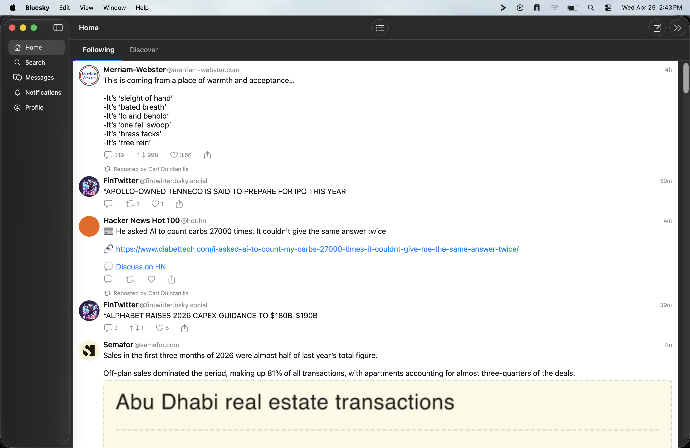

# 0004 — Reply button not functional on post cells

| | |
|---|---|
| **Status** | open |
| **Module** | BlueskyFeed |
| **Platform** | All |
| **First seen** | 2026-04-29 |

## Description

The reply (speech bubble) button below each post in the feed has no effect when tapped or clicked.

## Steps to reproduce

1. Launch the app and sign in.
2. Navigate to any feed (Home, Search results, etc.).
3. Tap or click the reply/speech-bubble button on any post.

## Expected behavior

A compose sheet or reply view opens, pre-filled with the parent post context, allowing the user to write and submit a reply.

## Actual behavior

Nothing happens. No sheet, no navigation, no console error.

## Attachments

## Notes

Check whether the button's action closure is wired up in the post cell view (e.g. `PostActionBar` or equivalent). The handler may be a no-op stub, or the required callback/binding from the parent view may not be passed in. Also verify that the compose/reply sheet view exists and is being presented correctly.
