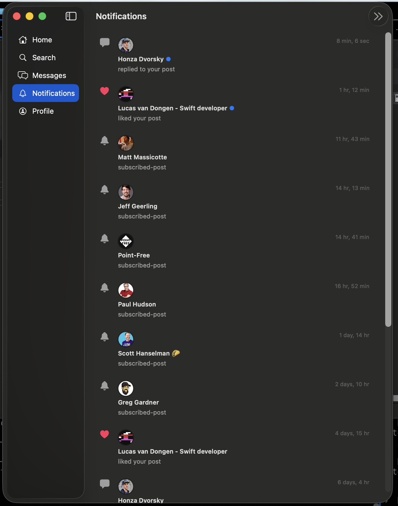
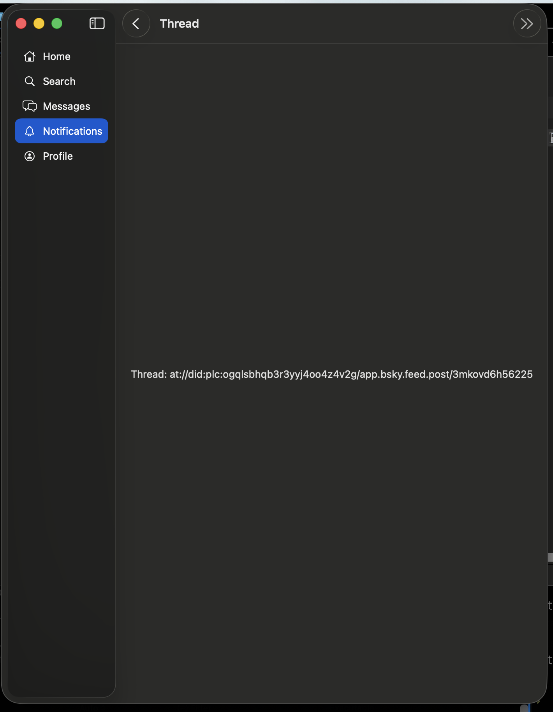
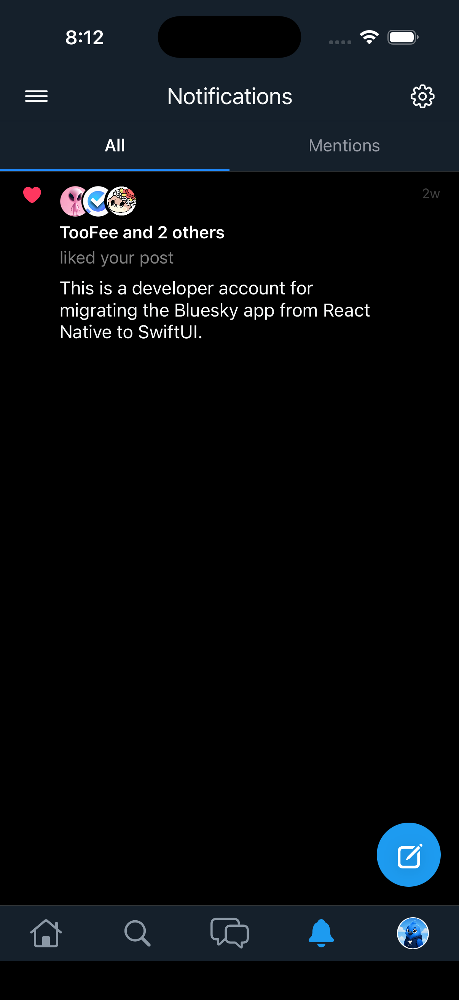
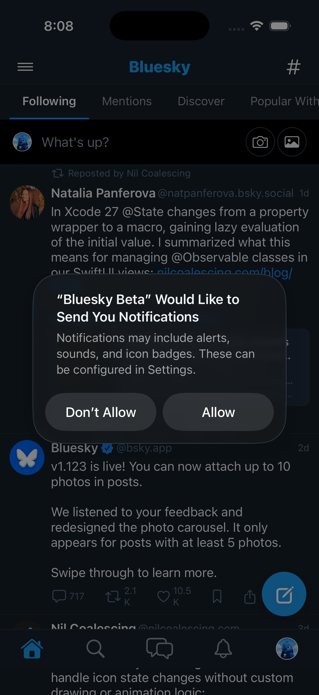

# 0031 — Module 10 gate: notifications live validation

| | |
|---|---|
| **Status** | open |
| **Module** | BlueskyNotifications |
| **Platform** | All |
| **First seen** | 2026-04-29 |

## Description

The Module 10 gate — confirm the notifications list loads and updates, the unread badge on the tab clears when the screen is opened, and pull-to-refresh works — has not been validated.

## Steps to reproduce

1. Have another account perform a like/follow/reply action on your account.
2. Open the Notifications tab and confirm the new notification appears.
3. Confirm the badge count on the tab icon clears after viewing.
4. Pull to refresh and confirm the list updates.

## Expected behavior

Notifications load, the unread badge updates, and `updateSeen` is called when the screen is opened.

## Actual behavior

Not validated against the live API.

## Live testing observations (2026-04-30)

**Notifications list loads** — notifications appear with avatar, actor name, reason text (liked, replied, subscribed-post), and relative timestamp. Dark mode renders correctly. ✓

**Tapping a notification is broken** — tapping a notification shows raw text `"Thread: at://did:plc:…/app.bsky.feed.post/…"` instead of navigating to the thread view. This is a separate bug to fix.

**subscribed-post reason** — several notifications show `"subscribed-post"` as the reason label. This is an unrecognized notification reason that should be mapped to a human-readable label.

**Unread badge and pull-to-refresh** — not yet confirmed.

## Attachments





## Incomplete reason

Validation gate — requires running the live app to confirm notification list updates and badge clears on open. Cannot be validated by code analysis alone.

## Notes

**2026-05-05 — bailed from auto-resolve:** This is a Module 10 validation gate that requires hands-on testing on a live device against the live API. It cannot be auto-validated by code analysis or build commands. Status remains `open`.

What this gate requires (manual steps the user must run):

1. **Notifications list updates with new activity.** Have a second account perform a like, follow, and reply against the test account. Open the Notifications tab in the running app and confirm each new notification appears with correct avatar, actor name, reason text, and relative timestamp. (Already partially confirmed 2026-04-30 — list loads and renders, see existing observations.)
2. **Unread badge clears on view.** Before opening the Notifications tab, confirm the tab icon shows an unread count (badge). Open the Notifications tab. Confirm the badge clears (server-side `app.bsky.notification.updateSeen` is called, and the local count goes to zero on next refresh of any other surface).
3. **Pull-to-refresh.** With the Notifications screen open, pull down to refresh. Confirm the list re-fetches and any new notifications since last load appear at the top.

What is NOT in scope for this gate (these are separate bugs already noted in the issue body and should be tracked as their own issues if not already filed):

- Tapping a notification renders raw `at://` URI text instead of navigating to the thread.
- The `subscribed-post` reason is shown verbatim instead of being mapped to a human-readable label.

Suggested next step for the user: run the app on macOS or a device, perform the three checks above, and either tick the gate in `Migrate-ReactNative-to-SwiftUI.md` Module 10 plus `Progress.md` (and mark this issue resolved) or file follow-up issues for any failure observed. The two known sub-bugs above should be filed as separate issues so they don't block the gate from closing on their own.

## Live testing observations (2026-06-10)

Validated on the booted iPhone 17 simulator (iOS 26.5), `co.sstools.Bluesky.beta`,
signed-in live session. macOS was **not** validated (UI automation on the host
Mac is unavailable — signing/TCC, see #0186); the Platform for this gate is All,
so the macOS half remains outstanding. No second account was available, so no
*new* notifications could be generated; checks ran against the account's
existing 3 notifications (one grouped "liked your post" row).

To make the store's network calls observable, `NotificationsStore` gained
os_log lines (`#0031` commit in BlueskyKit): `loadInitial` / `refresh` log
fetched + unread counts, `markSeen` / `fetchUnreadCount` log success/failure
(both previously swallowed errors silently). Evidence below comes from
`xcrun simctl spawn booted log stream --level debug --style compact
--predicate 'subsystem == "co.sstools.Bluesky.beta"'`.

**1. Notifications list loads — PASS.** Launching with
`SIMCTL_CHILD_BLUESKY_UI_TEST_SCRIPT='[{"intent":"selectTab","tab":"notifications"}]'`
lands on the Notifications screen; the grouped row renders avatars (3), actor
line ("TooFee and 2 others"), reason ("liked your post"), relative timestamp
(2w), and the subject post preview; All/Mentions strip present; dark mode
correct. Log: `notifications loadInitial: fetched 3 (unread 0)`.
"Updates with new activity" could not be exercised end-to-end (no way to
generate a new notification), but the refresh path refetches from the live API
(see check 3).

**2. Unread badge clears on view / `updateSeen` — PARTIAL.**
- `updateSeen` **is called and succeeds** every time the screen opens: the
  screen's `.task` runs `loadInitial()` then `markSeen()`, and the log shows
  `notifications markSeen: updateSeen posted, badge zeroed` (observed on three
  separate launches, no error). The POST hits the live
  `app.bsky.notification.updateSeen` endpoint.
- The badge half of the check **cannot pass**: the unread badge is never
  populated in the first place. `fetchUnreadCount()` /
  `app.bsky.notification.getUnreadCount` has **no call sites** anywhere, and
  `NotificationsScreen` (the only thing wired to `onUnreadCountChange`) is only
  mounted after the tab is opened, so a pre-open badge is impossible by
  construction. Filed as **#0196**. The account's unread count was also already
  0 at validation time, so there was no unread state to exercise visually.

**3. Pull-to-refresh — PASS.** New UI test
`NotificationsUITests.testPullToRefreshKeepsListPopulated` (`#0031` commit in
Bluesky-SwiftUI; runs credential-less against the simulator's existing session)
drags the list past its top edge to trigger `.refreshable`:

```
cd /Users/brennan/Developer/Bluesky/Bluesky-SwiftUI
xcodebuild test -workspace Bluesky.xcworkspace -scheme "Bluesky (Beta)" \
  -destination 'id=25FCA843-F98D-48C8-A679-CFABCBA96A78' \
  -only-testing:Bluesky-SwiftUIUITests/NotificationsUITests/testPullToRefreshKeepsListPopulated
```

Result: **TEST SUCCEEDED** (1 test, 0 failures). During the gesture the app
logged `notifications refresh: fetched 3 (unread 0)` — a fresh
`listNotifications` page from the live API; the screen stayed mounted and the
list re-populated.

**Verdict: gate stays open.** Checks 1 and 3 pass on iOS; check 2's badge half
is blocked on defect #0196 (badge never populated), and macOS validation is
blocked on #0186. Re-run check 2 on iOS once #0196 is fixed (ideally with a
fresh unread notification), and mirror all three checks on macOS when its UI
automation lands.

Gotcha: the first launch of a fresh install raises the system push-permission
alert, which intercepts synthesized drag gestures; the new UI test declines it
via Springboard ("Don't Allow"). The simulator's permission state for the beta
app is now "denied" — flip it in Settings if push testing is needed later
(`simctl privacy` cannot reset notification permission).





### 2026-05-05 — user answers

1. **Sub-bugs split out:** the two non-gate bugs are now their own issues:
   - #0062 — Tapping a notification shows raw at:// URI text instead of navigating to the thread.
   - #0063 — Notification reason labels incomplete (`subscribed-post` etc. render verbatim).
   This issue can now close on its own once the three live checks pass.
2. **Test surface:** macOS build can be used for live testing. Note that pull-to-refresh works differently on macOS than on iOS — the macOS check is "drag the list past its top edge and confirm it re-fetches" rather than the rubber-band gesture. iOS validation is parked behind #0061 (iOS build) and should be re-run on iPhone once that's green.
