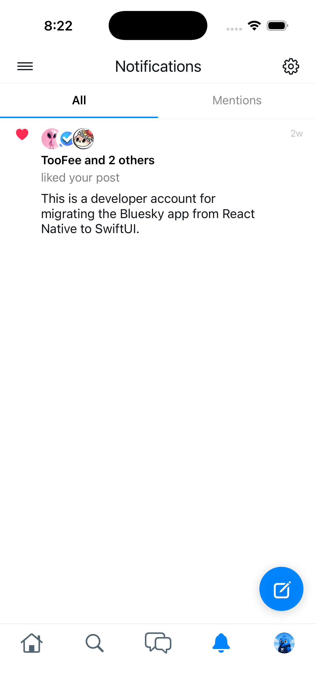
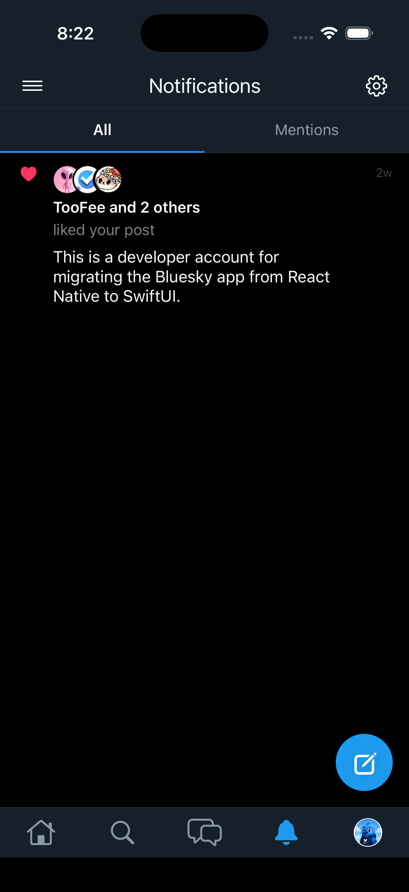
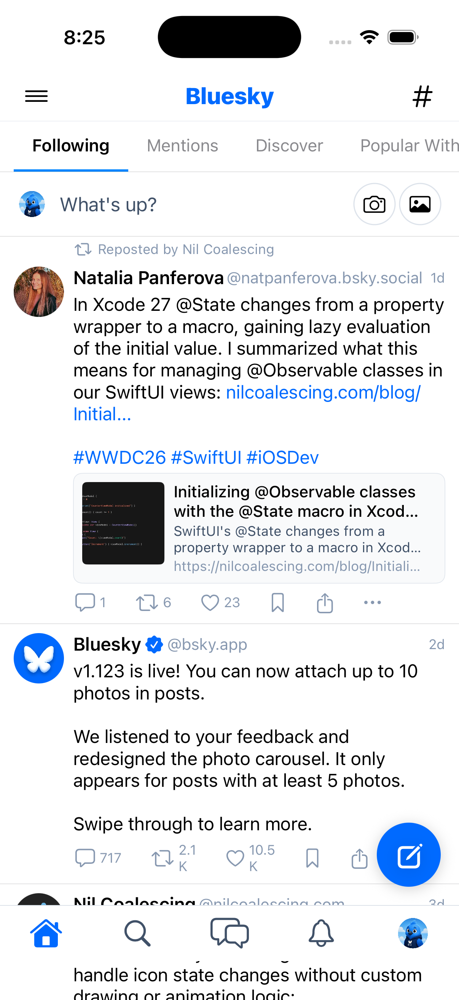
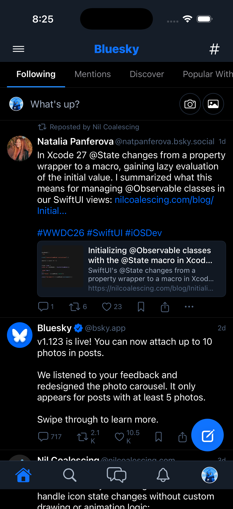

# 0040 — Design refinement: revisit app color palette

| | |
|---|---|
| **Status** | resolved |
| **Module** | BlueskyUI |
| **Platform** | All |
| **First seen** | 2026-04-29 |
| **Closed** | 2026-06-10 |
| **Commit** | BlueskyKit `384c3f3` |

## Description

The current color palette in `BlueskyTheme` is functional but has not been reviewed for design quality. Colors should be revisited to ensure they align with the Bluesky brand, look polished across light and dark modes, and feel cohesive throughout the app.

## Expected behavior

The app's color palette is intentional and refined — backgrounds, surfaces, text, accent colors, and interactive states are all consistent and visually appealing in both light and dark modes.

## Actual behavior

Colors are working but have not been reviewed or refined for design quality.

## Notes

Areas to review:

- Primary accent / brand color (the Bluesky blue)
- Background and surface colors in light vs. dark vs. dim modes
- Text colors (primary, secondary, tertiary)
- Interactive state colors (pressed, highlighted, selected)
- Destructive and warning colors
- Semantic colors for likes, reposts, mentions

Reference: the Bluesky React Native app (`../Bluesky-ReactNative`) uses Palette and theme tokens in `src/alf/` — use these as the design reference. The macOS app should feel native while staying on-brand.

Defer until core functionality is stable.

## Notes

2026-05-05 — Investigated and bailed: this is a vague design-refinement issue and would benefit from a discussion before code changes. Current state and concrete proposals follow.

### Current state

- All theme colors are hand-rolled hex values in a single file: `../BlueskyKit/Sources/BlueskyUI/Theme.swift`
- Three variants exist: `.light`, `.dark`, `.dim` — chosen by `AdaptiveBlueskyThemeModifier` (only switches between light/dark from `colorScheme`; dim is never auto-selected)
- The token surface is small — 11 named roles: `background`, `backgroundSecondary`, `textPrimary/Secondary/Tertiary`, `link`, `like`, `border`, `borderSubtle`, `error`, `success`
- No asset catalog colors are used; everything is `Color(.sRGB, …)` literals
- The RN reference (`Bluesky-ReactNative/src/alf/themes.ts`) imports `DEFAULT_PALETTE` from the external `@bsky.app/alf` package, which is not vendored in this checkout, so the authoritative token values aren't directly inspectable here

### Concrete proposals (pick one or combine)

1. **Token expansion to match ALF.** Grow `Colors` from 11 roles to the full ALF set: positive/negative/warning hierarchies (lvl 1–3), contrast tints (25/50/100/200/…/975), brand primary scale, and dedicated semantic tokens for `repost` (green) and `mention`. This unlocks future feature work (status pills, contrast borders, interactive pressed states) without per-site `.opacity()` hacks.
2. **Move palette into `Assets.xcassets`.** Define each token as a Color Set with Light/Dark/Any-Appearance variants. Lets designers iterate in Xcode without a code change, and enables `Color("textPrimary", bundle: .module)` use across previews. Requires a small bundle helper since BlueskyUI ships from a Swift package.
3. **Pull authoritative hex values from `@bsky.app/alf`.** Either install the npm package locally to dump the token JSON, or transcribe from upstream's published `tokens.ts` so our `.light/.dark/.dim` values exactly match the web/RN apps rather than approximating.
4. **Add interactive-state tokens.** Today there's no `pressed` / `hover` / `selected` token — buttons compute these inline. Add `linkPressed`, `surfacePressed`, `surfaceSelected` so macOS hover states (relevant on the desktop target) are theme-driven.
5. **Re-expose `dim` via Settings.** The `.dim` variant exists but is unreachable at runtime. Either wire it into the Settings appearance picker (matches RN) or drop it.

### Questions for the user before coding

- Which of the proposals above should I pursue, and in what order?
- Should the macOS app use `NSColor` system colors (`.windowBackgroundColor`, `.controlAccentColor`) where it makes sense — i.e. lean native — or stay strictly on the Bluesky brand palette to match iOS/web?
- Is matching the web/RN ALF tokens exactly a hard requirement, or is "looks like Bluesky, feels native on Mac" sufficient?
- Should the user-visible Settings appearance picker offer Light / Dark / Dim / System (4 options like RN), or just Light / Dark / System?
- Any specific screens that already feel off (low contrast, wrong accent, etc.) that should drive the refinement?

Once a direction is chosen this can be implemented in one focused pass.

### 2026-05-05 — direction locked

User answers narrow the scope to a single, focused implementation pass:

1. **Asset catalog migration is the chosen approach.** Move every color out of hand-rolled `Color(.sRGB, …)` literals in `BlueskyKit/Sources/BlueskyUI/Theme.swift` into `Assets.xcassets` Color Sets (one Color Set per token, with explicit Light and Dark Appearance variants). Each token gets a clear, role-named identifier (e.g. `text/primary`, `bg/canvas`, `accent/brand`).
2. **Strict ALF parity.** Import the authoritative hex values from the upstream `@bsky.app/alf` npm package and transcribe them into the Asset catalog. The package is *not* currently installed in `Bluesky-ReactNative/node_modules` — implementation step zero is to install it (or fetch from npm registry) and dump `@bsky.app/alf/dist/tokens` so we have a complete token list with light/dark variants. RN's local `src/alf/tokens.ts` already imports `tokens` from `@bsky.app/alf` and re-exports `dist/tokens`, so that file plus the npm package contents are the single source of truth.
3. **No `NSColor` system colors.** macOS does not use `.windowBackgroundColor` / `.controlAccentColor` / `.labelColor` — every color is defined in the Asset catalog using ALF values. This keeps the macOS app on-brand and identical in palette to iOS/web rather than matching the system accent.
4. **No in-app appearance picker.** The app follows the system Light/Dark setting only. The `.dim` variant is dropped (proposal #5) — it is not exposed in any UI and the `BlueskyTheme.Variant.dim` case can be deleted along with all `.dim` token sets.
5. **SwiftUI previews are the iteration surface.** Every refactored component should ship with `#Preview { ... }` blocks for both `.light` and `.dark` (covered already by #0050). After the migration, the user will tweak by viewing previews side-by-side and adjusting individual Color Sets.

#### Implementation plan

1. **Install / fetch ALF.** Either `npm install @bsky.app/alf` in a temporary scratch dir, or `curl https://registry.npmjs.org/@bsky.app/alf/-/alf-<version>.tgz` and inspect the tarball. Capture `dist/tokens.js` (or `.d.ts` for the typed shape) so we have authoritative hex values for every role plus the light/dark theme mappings (`themes.ts`).
2. **Inventory current usages.** Grep `BlueskyKit/Sources/` for every `Color(.sRGB, …)`, `Color.theme.…`, and ad-hoc `Color(red:…)` literal. Build a token-to-usage table so the migration covers everything.
3. **Define Color Sets in `Bluesky-SwiftUI/Bluesky-SwiftUI/Assets.xcassets`.** One Color Set per ALF role with explicit Any/Light + Dark variants populated from the ALF JSON. Group with folders (`text/`, `bg/`, `border/`, `interactive/`, `semantic/`).
4. **Replace `Theme.swift` lookups with Asset catalog references.** `Color("text/primary", bundle: .module)` style, with a small helper enum so call sites stay readable. Bundle accessor needed because BlueskyUI ships from a Swift package — verify `Bundle.module` works for a SwiftPM resource bundle of `xcassets`, or copy the assets into a target-bundled `xcassets`.
5. **Delete `BlueskyTheme.Variant.dim` and `.dim` references.** Drop the unreachable third case so the API is `light | dark` only.
6. **Add interactive-state tokens (proposal #4).** While we're touching every call site, add `interactive/pressed`, `interactive/hover`, `interactive/selected` from ALF if they exist; otherwise compute consistently from the base accent.
7. **Verify with previews.** Open every component's `#Preview` in Xcode in both Light and Dark, compare against the bsky.app web app side-by-side, file follow-ups for any color that looks off after migration.
8. **Build:** `swift build` in BlueskyKit and `xcodebuild -workspace Bluesky.xcworkspace -scheme Bluesky-SwiftUI -destination 'platform=macOS' build` must both pass.

This issue stays `open` until the migration is complete and the user has signed off via SwiftUI previews.

### 2026-06-10 — scope narrowed to value parity

The local `../Bluesky-ReactNative` checkout is missing from disk, so the authoritative
tokens were fetched from upstream instead: `bluesky-social/social-app` at the migration
baseline commit `46b8a5819b446c5d837aecd3f4f4bc89a9d356ab` pins `@bsky.app/alf@^0.1.7`
(yarn.lock resolves 0.1.7), and that npm package's `src/palette.ts` / `src/themes.ts`
contain the complete palette. Scope for this pass: fix the palette *values* in
`Theme.swift` to exact ALF parity, keeping the existing 11-token `BlueskyTheme` API.
The earlier asset-catalog/token-expansion plan is deferred (the app already exposes the
Light/Dark/System picker with a Dim/Dark dark-variant — RN parity — via `AppearanceStore`,
so the "dim is unreachable" note above is stale).

## Root cause

The hand-rolled palettes in `BlueskyKit/Sources/BlueskyUI/Theme.swift` were never
transcribed from Bluesky's ALF design system — most values were actually **Twitter's
palette** (light text `#0F1419`/`#536471`, dim link `#1D9BF0`, dim like `#F91880`,
dim bg `#15202B` are Twitter colors). ALF builds its three themes from one scale:
light = `DEFAULT_PALETTE`, dark = `invertPalette(DEFAULT_PALETTE)` (true-black),
dim = `invertPalette(DEFAULT_SUBDUED_PALETTE)`. Every theme drifted:

| Token (ALF slot) | Light cur → ALF | Dark cur → ALF | Dim cur → ALF |
|---|---|---|---|
| background (`contrast_0`) | `#FFFFFF` ✓ | `#161E27` → `#000000` | `#15202B` → `#151D28` |
| backgroundSecondary (`contrast_25`) | `#F1F3F5` → `#F9FAFB` | `#1E2D3D` → `#111822` | `#1E2D3D` → `#1C2736` |
| textPrimary (`contrast_1000`) | `#0F1419` → `#000000` | `#F1F3F5` → `#FFFFFF` | `#F7F9F9` → `#FFFFFF` |
| textSecondary (`contrast_700`) | `#536471` → `#405168` | `#8B98A5` → `#A5B2C5` | `#8B98A5` → `#ABB8C9` |
| textTertiary (`contrast_400`) | `#8B98A5` → `#8798B0` | `#59708A` → `#526580` | `#59708A` → `#586C89` |
| link (`primary_500`) | `#0085FF` → `#006AFF` | `#208BFE` → `#006AFF` | `#1D9BF0` → `#0F73FF` |
| like (`pink`, static) | `#EC4899` ✓ | `#EC4899` ✓ | `#F91880` → `#EC4899` |
| border (`contrast_100`) | `#E7ECF0` → `#DCE2EA` | `#2A3A4A` → `#232E3E` | `#2F3336` → `#2C3A4E` |
| borderSubtle (`contrast_50`) | `#F1F3F5` → `#EFF2F6` | `#1E2D3D` → `#19222E` | `#1E2D3D` → `#222E3F` |
| error (`negative_500`) | `#E53935` → `#E91646` | `#EF5350` → `#E91646` | `#FF6060` → `#EB2452` |
| success (`positive_500`) | `#20BC07` → `#09B35E` | `#20BC07` → `#09B35E` | `#00BA7C` → `#0AC266` |

Token → ALF mapping follows `createTheme` in alf `themes.ts`: `background` = `atoms.bg`
(`contrast_0`), `backgroundSecondary` = `bg_contrast_25`, `textPrimary` = `atoms.text`
(`contrast_1000`), `textSecondary` = `text_contrast_medium` (`contrast_700`),
`textTertiary` = `text_contrast_low` (`contrast_400`), `border` = `border_contrast_low`
(`contrast_100`), `borderSubtle` = `contrast_50` (one step subtler, preserving the
existing role split), `link` = `primary_500` (RN `RichText`/`Link` use
`t.palette.primary_500`), `like` = static `pink`, `error`/`success` =
`negative_500`/`positive_500`.

## Fix

Replaced all 33 color literals in `BlueskyTheme.light/.dark/.dim` with the exact
ALF 0.1.7 hex values above and documented the token-to-ALF mapping inline. No API
changes — same 11 `Colors` roles, same three variants, no call-site edits.

## Verification

- `swift build` in `BlueskyKit` — `Build complete!`
- `swift test` in `BlueskyKit` — `Test run with 87 tests in 16 suites passed`
- `xcodebuild build -workspace Bluesky.xcworkspace -scheme "Bluesky (Beta)" -destination 'generic/platform=iOS Simulator' CODE_SIGNING_ALLOWED=NO` — `BUILD SUCCEEDED`
- Installed the rebuilt app on the booted iPhone 17 simulator (`25FCA843`),
  launched with the existing live session, screenshotted the home feed via
  `xcrun simctl io booted screenshot` after `xcrun simctl ui booted appearance light|dark`.
  Pixel-sampled the screenshots: light background `#FFFFFF`, dark background `#000000` —
  exact ALF values. Text, links, and separators readable in both modes; no regressions.

## Files changed

- `BlueskyKit/Sources/BlueskyUI/Theme.swift` — all three palette definitions + mapping comment

## Gotchas

- A `CODE_SIGNING_ALLOWED=NO` build installed over the previously dev-signed app lost
  keychain access (sign-in screen appeared). Rebuilding with default simulator signing
  and reinstalling restored the session.
- The dark "after" screenshot shows true black because this simulator's persisted dark
  variant is `.dark`; the app default (`AppearanceStore.darkVariant = .dim`) matches RN's
  `darkTheme ?? 'dim'` fallback.
- RN's dark theme is intentionally true-black (`invertPalette` maps `contrast_0` → `#000000`);
  the dim theme is the blue-gray one. Both now match upstream exactly.

## Attachments

