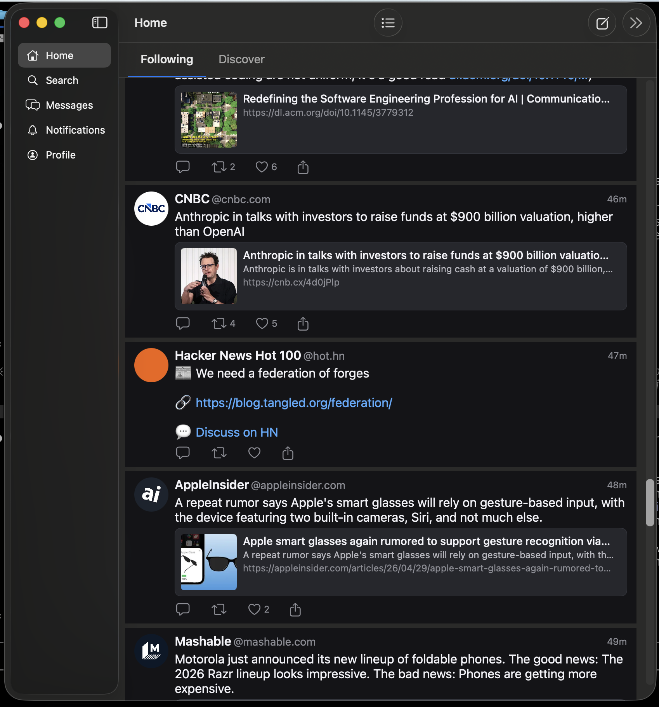

# 0042 — Toolbar list button is centered instead of right-aligned

| | |
|---|---|
| **Status** | in-progress |
| **Module** | BlueskyFeed |
| **Platform** | macOS |
| **First seen** | 2026-04-29 |

## Description

The list/feed-switcher button (≡) in the Home screen navigation bar is positioned in the center of the toolbar rather than being grouped with the other trailing toolbar buttons (compose and >>). This leaves an odd gap and breaks the expected right-aligned button cluster.

## Steps to reproduce

1. Launch the app on macOS.
2. Navigate to the Home tab.
3. Observe the navigation bar — the ≡ button sits in the center, while the compose and >> buttons are on the right.

## Expected behavior

All three toolbar buttons (≡, compose, >>) should be right-aligned as a group in the trailing position of the navigation bar.

## Actual behavior

The ≡ button is centered in the toolbar; the compose and >> buttons are right-aligned. They are not grouped together.

## Attachments

## Notes

Likely a `toolbar` placement issue in the SwiftUI navigation view — the ≡ button is probably placed with `.principal` or no explicit placement instead of `.navigationBarTrailing` / `.topBarTrailing`. Check the toolbar modifier in the Home/Feed screen's navigation stack.
