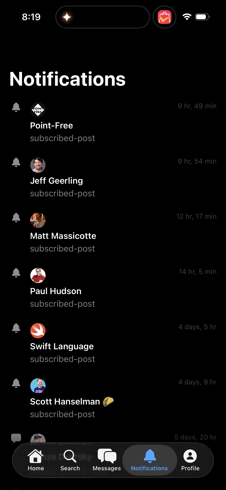

# 0069 — iOS Notifications screen diverges significantly from the React Native reference

| | |
|---|---|
| **Status** | open |
| **Module** | BlueskyNotifications / Bluesky-SwiftUI |
| **Platform** | iOS |
| **First seen** | 2026-05-05 |

## Description

Live testing of the SwiftUI iOS Notifications tab against the official Bluesky React Native app shows broad divergence. The SwiftUI screen is a flat list of "row per notification" with the actor name and a raw reason string ("subscribed-post"), while RN renders rich grouped cards with stacked avatars, an inline post-content preview, expandable groups, segmented "All / Mentions" tabs, and a settings entry point. Most importantly, the SwiftUI rows are not tappable — a user can see *that* something happened but cannot read the post or jump to the actor's profile.

This overlaps with #0062 (tap routes to raw at:// instead of the thread) and #0063 (reason labels render verbatim), but the broader UX gap (post preview, multi-avatar grouping, segmented tabs, inline reply indicator, settings entry) is bigger than either of those alone and warrants its own audit.

## Attachments

## Side-by-side gap audit

### Top chrome

| Area | SwiftUI (current) | RN (reference) |
|---|---|---|
| Title | Large "Notifications" headline left-aligned, takes ~25% of the screen | Compact centered "Notifications" title in the slim top bar |
| Left action | None | Hamburger / drawer-menu button |
| Right action | None | Gear icon → notification settings |

### Tab strip

- **SwiftUI**: No tabs. Single flat list.
- **RN**: Two segmented tabs at the top: **All** · **Mentions**. The "Mentions" tab is a critical filter so users can jump straight to direct interactions.

### Notification grouping and content

| Area | SwiftUI | RN |
|---|---|---|
| Avatar | One avatar per row | Up to 5 stacked actor avatars per group, with a chevron to expand the rest |
| Group label | "Point-Free" + "subscribed-post" (raw reason on its own line) | "New posts from **Point-Free** and **3 others** · 9h" — group label folds the actor count and time into the headline |
| Post content preview | Not shown | Inline text excerpt of the post (multi-line, bullets supported, link cards possible) |
| Reply indicator | Not shown | "↳ Replied to you" prefix on reply rows, with the responder's avatar on the left side of the row |
| Reason coverage | `subscribed-post` rendered verbatim (also #0063) | Mapped to "New posts from {actor}" |

### Tap behavior

- **SwiftUI**: Tapping a row does nothing useful — placeholder navigation just shows the raw at:// URI as text (#0062).
- **RN**: Tapping a row navigates to the relevant destination — thread for likes/replies/quotes, profile for follows, activity view for `subscribed-post`, etc. Tapping an avatar in the avatar stack jumps to that actor's profile.

### Visual state

- **Unread bell icon**: RN uses a filled, branded-blue bell when the group is unread; the bell is greyed once viewed. SwiftUI shows a static grey outlined bell for every row regardless of state.
- **Time format**: SwiftUI is verbose ("9 hr, 49 min", "12 hr, 17 min", "4 days, 5 hr"); RN is concise ("9h", "2d", "4d") and matches the feed convention.

### Bottom tab bar and compose entry

These match the gaps already documented in #0068 (icon-only tab labels, profile tab uses user avatar, floating compose FAB). No need to duplicate the fix work — track under #0068, not here.

## Suggested follow-up issues

1. Replace the "Notifications" headline with a slim compact top bar (hamburger left, centered title, gear right). Wire the gear to notification settings.
2. Add segmented **All / Mentions** tabs at the top.
3. Render an inline post-content preview on each notification row when the reason is post-related (reply, mention, quote, like, repost, subscribed-post). Use a stripped-down post body view (text + first link card, no images at full size).
4. Render up to N stacked actor avatars per group with an expand chevron. Tapping any avatar opens that actor's profile.
5. Switch the time-ago format to the concise "9h / 2d / 4d" form used elsewhere.
6. Add a filled blue bell icon when the group has unread items; revert to outline when seen.
7. Add the "↳ Replied to you" affordance on reply notifications, plus the responder avatar leading the row.

## Notes

- Reference: `Bluesky-ReactNative/src/view/com/notifications/NotificationFeedItem.tsx` and `src/view/screens/Notifications.tsx`. The RN code groups by `(reason, subjectUri)` and pulls the post body via the same query path the feed uses — the SwiftUI client should follow the same shape rather than re-shaping the data.
- Existing related issues:
  - #0062 — tap navigation routes to placeholder text instead of the real thread/profile/feed/activity destination.
  - #0063 — `subscribed-post` and other reason strings render verbatim.
  - #0031 — Module 10 macOS gate (will be unblocked once this audit and #0062 / #0063 land).
- These items are intentionally broken out so they can be tackled in priority order (suggested: 3 + 4 first since they're the biggest UX wins; then 2; then 1; then 5–7 as polish).

## Related

- Builds on #0061 (iOS build green) and the iOS audit pattern from #0068.
- Bottom-tab and compose-FAB items live in #0068 (don't duplicate here).
