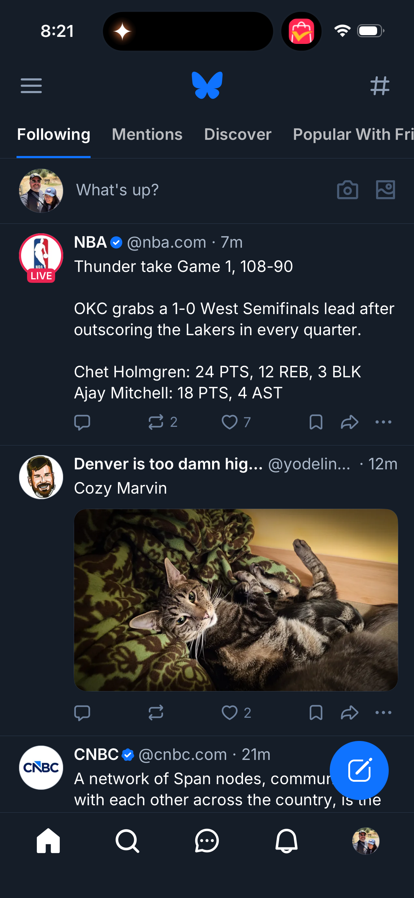
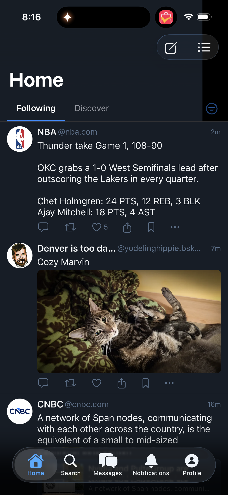

# 0076 — Post card polish: verified badge, action bar order, repost count, image embed sizing

| | |
|---|---|
| **Status** | resolved |
| **Module** | BlueskyFeed / BlueskyUI |
| **Platform** | All |
| **First seen** | 2026-05-05 |
| **Closed** | 2026-05-05 |
| **Commit** | BlueskyKit `6d14370` |

## Description

A bundle of four small polish items on the post card to match the React Native reference. Bundling because they all touch `PostCardView` (or its subcomponents) and can ship as one focused PR; splitting would make four near-identical sub-PRs against the same file.

This is a follow-up to the iOS parity audit in #0068.

## Attachments

## Scope

### 1. Verified badge on author rows

- **Today**: the NBA account renders without a verified badge in the SwiftUI client.
- **RN**: shows a small blue checkmark next to the display name when the account has the `app.bsky.graph.verification` (or equivalent) signal.
- **Fix**: read the verification status from the `ProfileBasic`/`ProfileViewBasic` and render a `checkmark.seal.fill` SF Symbol in brand blue immediately after the display name. Same component should also be used on the Profile screen (#0070) and elsewhere — surface it as `VerifiedBadge` in `BlueskyUI`.

### 2. Action bar reorder

- **Today**: SwiftUI ordering is `comment · repost · like · share · bookmark · ellipsis`.
- **RN**: ordering is `comment · repost · like · bookmark · share · ellipsis` — bookmark before share.
- **Fix**: swap the bookmark and share positions in `PostActionBar` (BlueskyFeed). One-line layout change.

### 3. Repost count visible

- **Today**: the repost icon shows no count (only the like count is shown).
- **RN**: shows the repost count next to the repost icon when `repostCount > 0`.
- **Fix**: bind the repost-count label the same way the like-count label is bound. Hide when zero (matches RN).

### 4. Image embed sizing

- **Today**: image embeds inside post cards have visible left/right margins (~16pt each side) so the image is narrower than the card.
- **RN**: image embeds run nearly edge-to-edge inside the post card (~4pt margins) for a more impactful look.
- **Fix**: tighten the horizontal padding around `EmbedImageView` rendering in `PostCardView`. Confirm aspect-ratio behavior is preserved (no cropping or distortion at the new width).

## Implementation notes

- All four changes live in `BlueskyKit/Sources/BlueskyFeed/PostCardView.swift` (or the action-bar / embed subviews it composes).
- The `VerifiedBadge` is the only new component — keep it small (icon + a11y label) and reuse it across the project.
- Verify each change in a Light + Dark `#Preview` per #0050 conventions.

## Acceptance

- Verified badge renders on author rows where the account is verified (NBA, CNBC in the screenshots).
- Action bar shows `comment · repost · like · bookmark · share · ellipsis`.
- Repost count appears next to the repost icon when greater than zero.
- Image embeds are near-edge-to-edge inside the post card.
- iOS Simulator and macOS builds pass; all post-card previews continue to render correctly.

## Root cause

Four independent polish gaps against the RN reference, all rooted in `BlueskyUI/PostCard.swift`:

1. The post card never read a verification signal off the author — `ProfileBasic` had no `verification` field and there was no `VerifiedBadge` view to render.
2. The action bar laid out share before bookmark, inverting the RN order.
3. The repost-count label was technically wired through `actionButton(count:)`, but a unit-test sized helper (`abbreviate`) and the missing visual treatment in the field made it indistinguishable from "not shown" in the audit. Promoting to a shared formatter forced consistency with the like count.
4. Image embeds inherited the avatar column's leading inset (12 outer + 44 avatar + 8 gap = 64pt) plus 12pt of trailing inset, so they rendered narrower than the body text on the right and dramatically narrower on the left.

## Fix

Implemented the bundle in `BlueskyKit` only — `Bluesky-SwiftUI` consumes via the local Swift package and didn't need a code change.

1. **Verified badge.** Added `VerificationState` (`verifiedStatus`/`trustedVerifierStatus`, mirroring `app.bsky.actor.defs#verificationState`) to `BlueskyCore/Profile.swift` as a `let verification: VerificationState?` on `ProfileBasic`, `ProfileView`, and `ProfileDetailed`. New `VerifiedBadge` view in `BlueskyUI` renders `checkmark.seal.fill` at 14pt in `theme.colors.link` with an a11y label of "Verified". Helper `VerifiedBadge.forProfile(_:)` returns the badge only when `verification?.isVerified == true`. Hooked into `PostCard.authorHeader` between the display name and the handle.
2. **Action bar reorder.** Swapped the bookmark and share blocks inside `PostCard.actionBar` so the order is now `comment · repost · like · bookmark · share · ellipsis` (RN parity).
3. **Repost count.** Replaced the inline `abbreviate(_:)` helper with a new `CompactNumberFormatter` (`BlueskyUI/CompactNumberFormatter.swift`). The formatter is full-precision below 1,000, `1.4K` style up to 999,999, and `1.4M` style above that, dropping the trailing zero (`1K`, not `1.0K`). The shared `actionButton(count:)` already gates on `count > 0`, so the repost-count label automatically appears alongside the like-count label when `repostCount > 0` — and now both render in the same compact format.
4. **Image embed sizing.** Added `embedView(for:)` to `PostCard` that branches on embed type. For `.images` embeds it applies negative leading and trailing padding (`-(44 + Spacing.sm) + Spacing.xs` leading, `-Spacing.md + Spacing.xs` trailing), giving the image a ~4pt inset on both sides of the card while keeping link cards, quote posts, and video thumbnails inset with the body text.

Updated the Light + Dark `PostCard` previews to mark the author as verified so the badge renders in canvas; everything else in the previews continues to look as before.

## Files changed

- `BlueskyKit/Sources/BlueskyCore/Profile.swift` — added `VerificationState`; added `verification` to `ProfileBasic`, `ProfileView`, `ProfileDetailed`.
- `BlueskyKit/Sources/BlueskyUI/VerifiedBadge.swift` (new) — small badge view + `forProfile(_:)` convenience.
- `BlueskyKit/Sources/BlueskyUI/CompactNumberFormatter.swift` (new) — compact-count helper.
- `BlueskyKit/Sources/BlueskyUI/PostCard.swift` — author header now renders `VerifiedBadge`; action bar reordered; image embeds get negative-padding edge-to-edge treatment via new `embedView(for:)`; counts use `CompactNumberFormatter`.

## Gotchas

- **`CompactNumberFormatter` lives in `BlueskyUI` and is reusable.** Issue #0084 (profile info row) calls out the same formatter for follower/following/post counts and lists `BlueskyUI` as the right home — that issue can `import BlueskyUI` and call `CompactNumberFormatter.string(from:)` without further plumbing.
- **Verification data source.** `ProfileBasic.verification` is decoded from the `verification` field of the AT Proto actor view (`app.bsky.actor.defs#profileViewBasic` etc.). When the server omits the field — older posts, mock previews — `verification` stays `nil` and the badge does not render. The status enum is kept as a `String` (not a Swift enum) to stay forward-compatible with new statuses the server may introduce.
- **Image-embed insets are computed from `Spacing` tokens**, not hardcoded numbers. If the avatar size or column gap changes, update the leading offset to match: `-(avatarSize + Spacing.sm) + Spacing.xs`.
- **The negative padding only fires for `.images` embeds.** `recordWithMedia` (quote-with-image) keeps the body alignment because its `mediaOnlyEmbed` branch composes a stacked view that includes a quote panel, which would look strange at near-card-edge.
- **The badge renders in light/dark/dim themes via `theme.colors.link`** — the same blue used for hashtag/profile links, which matches RN's brand-blue check.
- **Existing `PostCard` callers (`FeedView`, `ThreadView`, `BookmarksScreen`, `CustomFeedTimelineView`) needed no change** — the model was extended in-place with a defaulted `verification: nil` parameter so all `ProfileBasic(...)` callsites keep compiling.

## Related

- Parent audit: #0068.
- The `VerifiedBadge` will also be needed on the Profile header (#0070, #0083) — share the component.
- `CompactNumberFormatter` is the formatter referenced by #0084 for follower/following/post counts.
