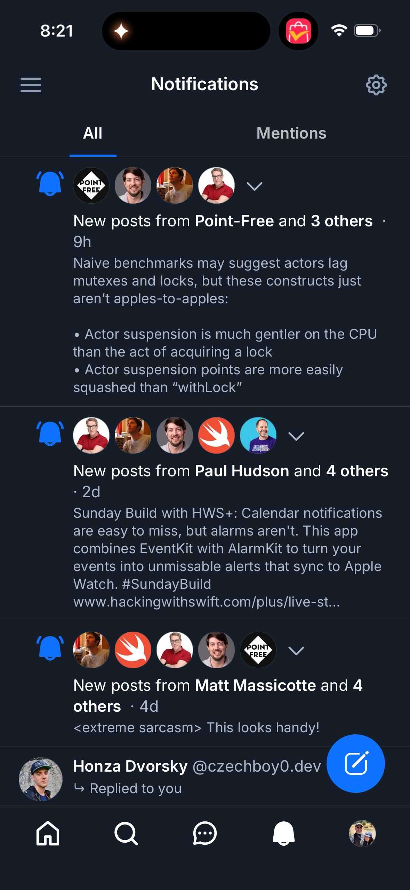

# 0081 — Notifications: add "Replied to you" affordance on reply rows

| | |
|---|---|
| **Status** | resolved |
| **Module** | BlueskyNotifications |
| **Platform** | All |
| **First seen** | 2026-05-05 |
| **Closed** | 2026-05-06 |
| **Commit** | BlueskyKit `b1bdd5b` |

## Description

When the notification reason is `reply`, the React Native client renders the row in a slightly different shape: the responder's avatar leads at the left edge (instead of being part of the bell+avatar-stack region), and a small "↳ Replied to you" prefix appears above the post text. This makes reply notifications visually distinct from likes/reposts/follows so the user can spot direct interactions at a glance.

This is a follow-up to the iOS Notifications parity audit in #0069.

## Attachments

## Scope

- **Detect `reason == "reply"`** in `GroupedNotificationRow` and render the row in a distinct layout:
  - **Leading**: responder's avatar at full size (~40pt), at the left edge of the row.
  - **Body**:
    - First line: small "↳ Replied to you" indicator (use a return-arrow SF Symbol or a `↳` glyph) — `.caption2` font, secondary color.
    - Second line: responder name + handle + timestamp.
    - Body text below: the reply post text (rendered inline per #0079).
- **Drop the bell icon and avatar-stack** for replies — RN doesn't show them on this row variant.
- **Tap navigates to the reply thread** (handled by #0062).

## Implementation notes

- `GroupedNotificationRow` should branch on reason at the top: `if group.reason == "reply" { ReplyRow } else { DefaultGroupedRow }`. Keeps each layout simple.
- Quotes (`reason == "quote"`) and mentions (`reason == "mention"`) may benefit from a similar variant — confirm against RN before generalizing.
- Reuse `PostBodyView` (extracted in #0079) to render the reply text.

## Acceptance

- Reply notifications render in a distinct layout with the responder's avatar leading and a "↳ Replied to you" indicator.
- Other reasons (like, repost, follow, etc.) continue to use the existing grouped layout.
- Tap behavior routes correctly via #0062.
- iOS Simulator and macOS builds pass.

## Related

- Parent audit: #0069.
- Depends on #0079 (post body rendering) for the reply text.
- Routes via #0062 (tap navigation).

## Root cause

`GroupedNotificationRow` rendered every reason — likes, reposts,
follows, mentions, replies, quotes — through the same chrome: a bell-
style reason icon, the stacked avatar row, the actor summary, a
one-line reason label ("replied to your post"), and (after #0079) the
inline post body. Replies were visually indistinguishable from likes or
reposts at a glance, even though they're the most engagement-worthy
notification kind. The RN client treats replies specially: the
responder's avatar leads at the row's left edge and a small "↳ Replied
to you" caption sits above the reply body, dropping the bell + stack
chrome that makes sense for grouped likes but reads as noise on a
single-author reply.

## Fix

Branched `GroupedNotificationRow.body` on the reason at the top so each
layout stays simple, then added a reply-specific variant.

- **Branch at the top**: `if group.reason == "reply" { replyRow } else
  { defaultGroupedRow }`. The existing layout was renamed
  `defaultGroupedRow` and otherwise left untouched — likes, reposts,
  follows, mentions, and quotes still render exactly as they did after
  #0080.
- **`replyRow` layout**:
  - Leading: full-size 40pt avatar of the responder, wrapped in a
    `Button` that fires `onAuthorTap` so it routes to the actor's
    profile (mirrors the avatar-stack tap behavior on the default
    layout).
  - First line in the body column: `Text("↳ Replied to you")` at
    `.caption2`, secondary color, with the unread blue dot trailing
    when applicable. Used the literal `↳` glyph rather than an SF
    Symbol so the row matches the RN reference exactly.
  - Second line: responder display name (subheadline semibold) +
    `@handle` (subheadline secondary) + a `·` separator + relative
    timestamp (subheadline tertiary). Single-line each so a long
    handle doesn't wrap the row.
  - Body: `postPreview` reused unchanged — it already renders
    `PostBodyView` with `lineLimit: 4` and the compact link card per
    #0079 conventions.
- **Dropped chrome**: no bell icon, no avatar stack, no expand chevron
  on the reply variant. Reply groups have always been single-actor
  after #0079's grouping change (each reply is keyed by its own
  notification `uri`), so there was no actor list to collapse anyway.
- **Tap behavior**: the row's `onTapGesture` falls through to the
  existing `onTap(group.previewPostURI ?? group.reasonSubject)` path,
  which routes to the reply thread via #0062. Inner `Button`s (the
  avatar) consume their own taps so they don't navigate the row.

## Files changed

- `BlueskyKit/Sources/BlueskyNotifications/NotificationsScreen.swift`
  — split `GroupedNotificationRow.body` into a reason switch:
  `replyRow` for `reason == "reply"` and `defaultGroupedRow`
  (renamed-from-the-prior-body) for everything else. Added
  `replyRow` with the leading 40pt avatar button, the "↳ Replied to
  you" caption line, the name/handle/timestamp line, and a reuse of
  the existing `postPreview` block. No changes to `actorAvatarRow`,
  `expandedActorList`, `reasonIcon`, `reasonText`, `actorSummary`, or
  the loading/missing post handling.

## Gotchas

- **Quote and mention deliberately stay on the default layout.** The
  issue spec said "If RN renders these in the same Reply-style
  variant, extend; otherwise leave them on the default layout." RN's
  `NotificationFeedItem.tsx` does group reply / mention / quote
  together (they all early-return to a full `<Post>` component), but
  the layout RN uses there is a complete post card — not the
  simplified "↳ Replied to you" affordance this issue describes. The
  "Replied to you" wording only reads correctly for replies, and the
  RN-style full-post variant is a separate, larger piece of work.
  Quote and mention rows continue to use `defaultGroupedRow` until a
  follow-up issue extends a richer variant.
- **Reply groups are always single-actor.** After #0079 keyed
  reply / mention / quote rows by their notification `uri` instead of
  `(reason, reasonSubject)`, every reply notification gets its own
  row. The reply variant therefore reads `group.actors.first` and
  doesn't need an avatar stack or a chevron. If a future change
  re-groups replies (e.g. "5 replies on this thread"), the variant
  will need to grow back the stack — keep the branch shallow so it
  stays easy to tweak.
- **Literal `↳` glyph instead of an SF Symbol.** The issue allows
  either `arrowshape.turn.up.left.fill` or the `↳` glyph; the literal
  glyph matches the RN reference more cleanly (RN uses a Unicode
  arrow, not a custom icon), renders identically across iOS and
  macOS at `.caption2`, and avoids the symbol's heavier visual weight
  inside a small caption line.
- **Inner avatar `Button` doesn't break the row tap.** The row's
  outer `onTapGesture` is attached to the `HStack`'s `contentShape`,
  not to a `Button`, so the inner `Button` consumes only its own
  rectangle and the rest of the row still routes to the thread via
  the existing `previewPostURI ?? reasonSubject` path. Same pattern
  the default layout already uses for the avatar stack.
