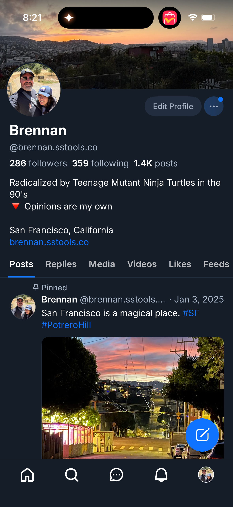

# 0085 — Bug: "Followed by …" known-followers chip shows on the user's own profile

| | |
|---|---|
| **Status** | resolved |
| **Module** | BlueskyProfile |
| **Platform** | All |
| **First seen** | 2026-05-05 |
| **Closed** | 2026-05-06 |
| **Commit (BlueskyKit)** | 9be1ed7 |

## Description

The "Followed by @ibrews.bsky.social, @martinp7r.com, and others you follow" chip is rendered on the signed-in user's **own** profile. This is meaningless — the known-followers context exists to tell the viewer "here are mutuals you both follow" when they look at *another* user. On your own profile, every follower of yours is by definition someone *you* follow back (or don't), and the chip's framing doesn't apply.

The React Native reference suppresses this chip on the viewer's own profile. The SwiftUI client doesn't.

This is a follow-up to the iOS Profile parity audit in #0070.

## Attachments

## Steps to reproduce

1. Sign in with any account.
2. Open the Profile tab (the user's own profile).
3. Observe the "Followed by …" chip below the bio.

## Expected behavior

The known-followers chip is not rendered on the viewer's own profile. It only appears when the viewed profile is *not* the signed-in user.

## Actual behavior

The chip renders unconditionally, including on the user's own profile.

## Steps to fix

- In the profile-header view, gate the known-followers chip behind a check: `if profile.did != session.viewerDID { … }`.
- Confirm there are no other surfaces where the chip might leak (Profile from a different navigation entry point, e.g. tapping your own avatar from a post).
- Verify on iOS and macOS.

## Implementation notes

- The session manager already exposes the viewer's DID. Compare `ProfileView.did` against it before rendering the chip.
- This is one conditional, no API changes needed. Tiny PR.

## Acceptance

- Own profile: no known-followers chip.
- Other-user profile: chip renders as today.
- iOS Simulator and macOS builds pass.

## Root cause

`ProfileHeaderView` rendered the known-followers chip whenever the
`knownFollowers` array was non-empty, with no own-profile gate. The
`ProfileStore` populates `knownFollowers` from the first three entries of the
viewer's followers list — which on your own profile is "people who follow you",
i.e. anyone, including yourself if you follow yourself. The chip's framing
("Followed by @x, @y, and others you follow") only makes sense on someone
else's profile. RN's `ProfileHeaderStandard.tsx` gates this with
`!isMe && shouldShowKnownFollowers(...)`; the SwiftUI port had only ever shipped
the second half of that check, so the suppression for own-profile was missing
from the start (#0024 introduced the chip without the `isMe` guard).

## Fix

`ProfileHeaderView` already takes `isOwnProfile: Bool` from `ProfileScreen`, so
the gate is local and free. The `if !knownFollowers.isEmpty` body is now
`if !isOwnProfile, !knownFollowers.isEmpty`. The chip's only render site in the
codebase is `ProfileHeaderView.knownFollowersChip`; nothing else surfaces it,
so the single conditional is enough.

## Files changed

- `BlueskyKit/Sources/BlueskyProfile/ProfileHeaderView.swift` — gate
  `knownFollowersChip` behind `!isOwnProfile` alongside the existing
  non-empty check.

## Related

- Parent audit: #0070.
- Adjacent: #0024 ("known followers chip on profiles") was the issue that introduced the chip — the own-profile suppression must have been dropped along the way.
