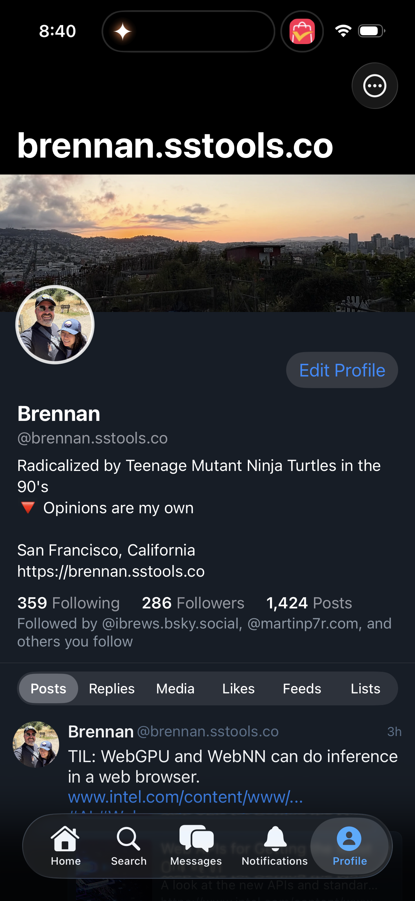

# 0086 — Profile tab strip: add Videos tab and drop pill capsule background

| | |
|---|---|
| **Status** | resolved |
| **Module** | BlueskyProfile / BlueskyUI |
| **Platform** | All |
| **First seen** | 2026-05-05 |
| **Closed** | 2026-05-06 |
| **Commit (BlueskyKit)** | ca4b947 |

## Description

Two coordinated changes to the profile-page tab strip (the segmented selector for Posts / Replies / Media / Likes / Feeds / Lists). First, the Videos tab — present in the React Native reference between Media and Likes — is missing. Second, the SwiftUI strip uses a pill-shaped capsule background around the entire tab strip, while RN renders the tabs inline with just an underline on the selected tab.

This is a follow-up to the iOS Profile parity audit in #0070.

## Attachments

## Scope

### 1. Add Videos tab

- **Insert** a `Videos` tab between `Media` and `Likes` in the tab order.
- **Tab content**: filter the user's posts to only those containing video embeds (`app.bsky.embed.video`).
- **Backend**: `app.bsky.feed.getAuthorFeed` accepts a `filter` parameter (`posts_no_replies`, `posts_with_media`, `posts_with_video`, etc.). Use `posts_with_video` if available; otherwise client-side filter on `posts_with_media` results.
- **Empty state**: if the user has no videos, show a friendly empty-state matching the other tabs.
- **Final tab order**: `Posts · Replies · Media · Videos · Likes · Feeds · Lists`.

### 2. Drop pill capsule background

- **Today**: the entire tab strip is wrapped in a pill-shaped capsule with a subtle background.
- **Fix**: render tabs inline (no surrounding capsule) with a 2pt brand-color underline on the selected tab and no underline on others. Same visual treatment as the feed tab strip in #0074.

## Implementation notes

- Code: `BlueskyKit/Sources/BlueskyProfile/ProfileScreen.swift` (or the tab-strip subview).
- Confirm the `posts_with_video` filter parameter against the AT Proto lexicon.
- The underline style is a horizontal `Rectangle().frame(height: 2)` aligned to the bottom of the selected tab button.

## Acceptance

- Profile tab strip shows seven tabs in order: Posts · Replies · Media · Videos · Likes · Feeds · Lists.
- The strip has no surrounding pill capsule; the selected tab has a brand-color underline.
- Tapping Videos shows the user's video posts; empty state shown when none.
- iOS Simulator and macOS builds pass.

## Related

- Parent audit: #0070.
- Same visual style as the feed tab strip in #0074 — share the underline component if practical.

## Root cause

Two coordinated gaps against the React Native reference, both rooted in
`ProfileScreen.tabStrip` and `ProfileStore`. (1) `ProfileTab` only enumerated
six cases — `posts, replies, media, likes, feeds, lists` — with no `videos`
case and no `posts_with_video` filter wired into `fetchTab`, so there was no
way to render a Videos tab even though the AT Proto `app.bsky.feed.getAuthorFeed`
lexicon and the RN `state/queries/post-feed.ts` whitelist both support the
filter value. (2) The strip itself rendered as a SwiftUI `Picker` with
`.pickerStyle(.segmented)`, which produces the iOS pill-shaped capsule
background the issue calls out — completely different from RN's inline
underline-only style and from the Home feed strip already shipped in #0074.

## Fix

`ProfileTab` gains a `.videos` case in RN order between `.media` and `.likes`.
`ProfileStore.fetchTab` adds a matching branch that calls
`app.bsky.feed.getAuthorFeed` with `filter=posts_with_video` — the
**server-side filter** matching RN exactly, with no client-side fallback
needed. The decision was easy: `posts_with_video` is on RN's whitelisted
filter list (`PostsCtx.filter` union in `state/queries/post-feed.ts`) and the
PDS recognizes it; client-side filtering on `posts_with_media` results would
be wasteful and would lose pagination correctness once the user scrolled past
the first batch.

The strip itself now renders via a new shared `UnderlineTabStrip` component
extracted into `BlueskyUI`. The component takes a list of `UnderlineTab`
(id + label), a `Binding<String>` selectedID, and an optional onTap — wraps
them in a horizontal `ScrollView` with a `LazyHStack`, draws a 2pt
`Color.accentColor` underline on the selected tab, and auto-scrolls to keep
the active tab centered via `ScrollViewReader.scrollTo(_:anchor:.center)`.
**The component is shared with #0074**: `FeedSwitcherView` was refactored to
delegate to `UnderlineTabStrip` (mapping its `HomeFeedTab` array down to
`UnderlineTab`) so the Home and Profile strips render identically. Empty
states are now tab-specific ("No videos yet" for the new tab, "No replies",
"No media", etc.) via a small `emptyMessage(for:)` helper on `ProfileScreen`.

## Files changed

- `BlueskyKit/Sources/BlueskyUI/UnderlineTabStrip.swift` (new) — shared
  horizontally-scrollable tab strip with 2pt brand-color underline. Used by
  both the Home (#0074) and Profile (#0086) tab strips. Carries Light/Dark
  previews seeded with the seven Profile tabs.
- `BlueskyKit/Sources/BlueskyProfile/ProfileStore.swift` — adds `.videos`
  case to `ProfileTab` between `.media` and `.likes`; adds the
  `posts_with_video` branch in `fetchTab`.
- `BlueskyKit/Sources/BlueskyProfile/ProfileScreen.swift` — replaces the
  `Picker(.segmented)` tab strip with `UnderlineTabStrip`; adds
  `emptyMessage(for:)` so the empty state matches each tab.
- `BlueskyKit/Sources/BlueskyFeed/FeedSwitcherView.swift` — refactored to
  delegate to `UnderlineTabStrip` rather than duplicate the underline +
  scroll logic. Public API of `FeedSwitcherView` unchanged so `FeedView`
  call sites are untouched.

## Gotchas

- **Server-side `posts_with_video` is the right call, not client-side.** The
  AT Proto `getAuthorFeed` lexicon accepts the value and RN uses it directly
  (`Profile.tsx` builds the videos feed key as
  `author|<did>|posts_with_video`); falling back to client-side filtering on
  `posts_with_media` would have broken pagination — the cursor advances per
  *fetched* batch, so a video-light page would surface zero items even if the
  user has plenty of videos farther back. If a future PDS rejects the value
  the request returns empty rather than erroring, and the existing empty-state
  ("No videos yet") covers it gracefully.
- **The underline component lives in BlueskyUI, not BlueskyFeed.** The
  natural home was BlueskyFeed (where the original underline shipped in
  #0074), but Profile depends on BlueskyUI not BlueskyFeed. Hoisting the
  component up one layer keeps Profile out of any cross-feature dependency.
- **`FeedSwitcherView` is now a thin adapter.** It still exists as a
  feature-typed public API (takes `[HomeFeedTab]` and a tap callback that
  receives the typed tab) so call sites in `FeedView` don't need to know
  about `UnderlineTab`. The implementation just maps and delegates.
- **The strip's auto-scroll-to-center triggers on every selection change.**
  That's the right behavior on first tap and on swipe (#0074), but be aware
  that any external mutation of the binding will animate the strip — pre-set
  `selectedTab` on screen open and there's a tiny scroll animation before the
  first frame. The `.onAppear` warm-up call uses a non-animated
  `proxy.scrollTo(...)` so the initial position lands without that animation.
- **iOS / macOS visual treatment is now identical** for both Profile and
  Home tab strips. Previously macOS got the iOS pill-style segmented control
  on Profile via SwiftUI's `Picker(.segmented)`. The new strip renders the
  same on both platforms — confirm with the user if the macOS look needs
  divergence.
