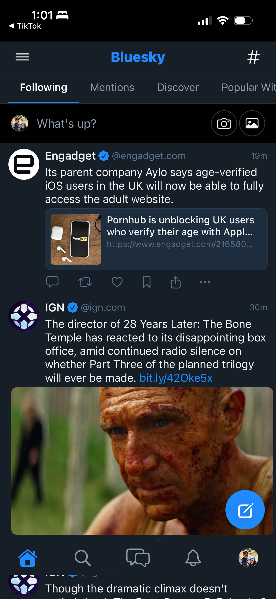
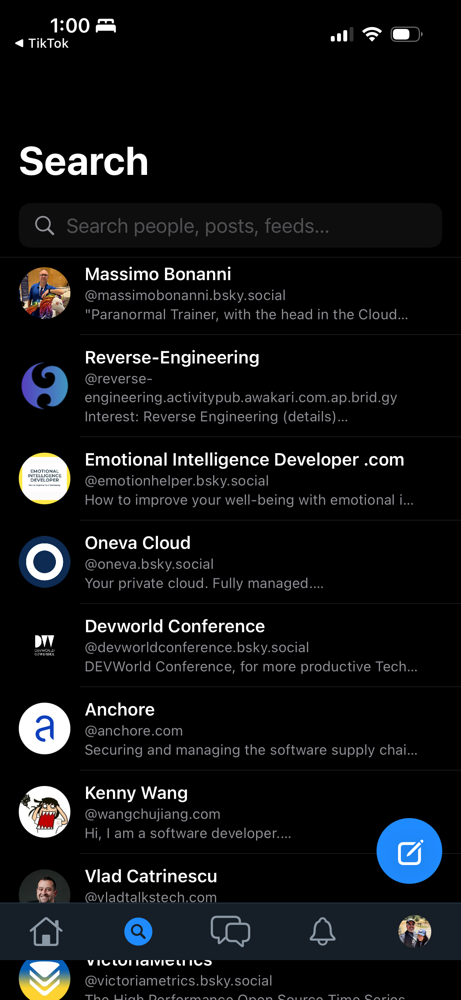

# 0088 — iOS top safe-area gap on every screen

| | |
|---|---|
| **Status** | open |
| **Module** | Bluesky-SwiftUI / BlueskyUI |
| **Platform** | iOS |
| **First seen** | 2026-05-06 |

## Description

A black gap sits between the iOS status bar and the top of the app's chrome on every screen — Home, Notifications, Search, and Profile. The status bar is rendered against a black backing rather than the screen's background, so the slim top bars (#0072, #0077) and the Profile banner (#0083) appear to "float" with a dead band above them. The React Native reference has no such gap — the app fills behind the status bar.

The user's diagnosis is on the nose: the screens are respecting the top safe-area inset where they should be ignoring it (banner / top bar should extend behind the status bar, with the *content* respecting the safe area).

## Attachments

## Steps to reproduce

1. Run the SwiftUI iOS app on an iPhone with a notch (any post-iPhone X).
2. Open any of Home, Notifications, Search, or Profile.
3. Observe the dark band between the status-bar elements (time, signal, battery) and the app's top bar / banner.

## Expected behavior

The app's surface fills the entire screen vertically. The status bar's content (time / battery / signal) sits over the same color as the rest of the top bar (Home: dark chrome; Profile: the banner image). RN parity.

## Actual behavior

A solid black band runs across the top above every screen's chrome.

## Steps to fix

The fix is almost certainly in the app shell, not in each screen:

- Apply `.ignoresSafeArea(edges: .top)` to the top-bar background **only** (`BlueskyTopBar`'s background fill, the banner image in `ProfileHeaderView`), keeping the bar's *content* (hamburger, title, gear) inside the safe area via padding.
- For `MainTabView`'s compact iOS layout, audit the outer container — currently a `VStack` likely respects safe area at the top; the chrome row needs to render behind the status bar while the scrollable feed below stays inside the safe area.
- Verify with a fresh iPhone 17 Simulator screenshot on each of Home / Notifications / Search / Profile. The dead band should disappear and the status-bar glyphs should sit over the bar's color.

## Implementation notes

- This may be a single-line fix at the right level of the view hierarchy — apply `.background(theme.colors.surface, ignoresSafeArea(.top))` on the top-bar wrapper, or use `.safeAreaInset(.top)` to mount the bar with its background extending to the device edge.
- For Profile (#0083), the banner already has `.ignoresSafeArea(edges: .top)`, but the gap is still visible — suggests the parent `NavigationStack` or `ScrollView` is constraining the banner rather than letting it bleed up. Check the order of modifiers and whether `.toolbar(.hidden)` is actually hiding the bar's container.
- Search screen has a giant "Search" headline (separate concern, tracked in #0090) but the safe-area gap above it is the same root cause.

## Acceptance

- All four screens (Home / Notifications / Search / Profile) render their top chrome behind the status bar.
- macOS unchanged.
- iOS Simulator and macOS builds clean.

## Related

- #0072 (Home top bar) — the top bar should fill behind the status bar.
- #0077 (Notifications top bar) — same.
- #0083 (Profile banner edge-to-edge) — banner is supposed to be edge-to-edge already, but the gap persists, so something at a higher level is constraining it.
- #0090 (Search needs slim top bar) — separate but adjacent.
