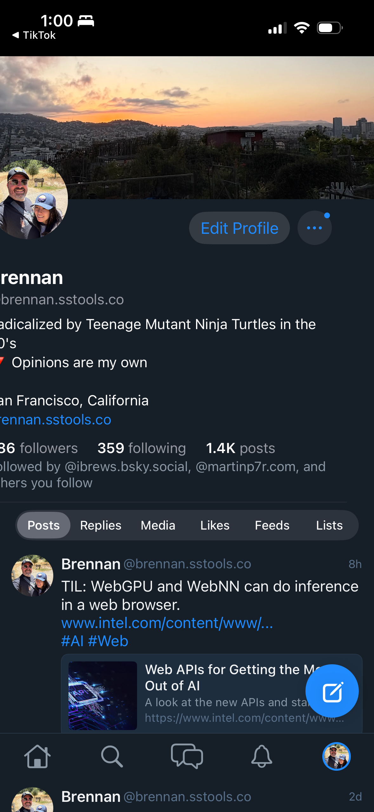

# 0089 — Profile content clipped on the leading edge

| | |
|---|---|
| **Status** | resolved |
| **Module** | BlueskyProfile |
| **Platform** | iOS |
| **First seen** | 2026-05-06 |
| **Closed** | 2026-05-06 |
| **Commit (BlueskyKit)** | 54dcaf1 |

## Description

On the Profile screen, every text element below the banner is shifted so far to the leading edge that the first character of every line is cut off the screen. The display name reads "rennan" instead of "Brennan", the bio's first lines read "adicalized by Teenage Mutant Ninja Turtles" / "an Francisco, California" / "rennan.sstools.co", the followers count is missing its leading digit ("36 followers" instead of "286 followers"), and the known-followers chip starts mid-word ("ollowed by …"). The avatar at the leading edge of the banner is also partially cut off on its left side.

This is a regression introduced (or surfaced) by the #0083 banner redesign — the iOS-only `iosAvatarAndActions` layout introduced negative offsets for the avatar half-overlap, and something in the surrounding stack is propagating a negative leading inset to all the content below the banner.

## Attachments

## Steps to reproduce

1. Run the SwiftUI iOS app on an iPhone (post-iPhone X).
2. Tap the Profile tab.
3. Observe every text element starting one character (or more) off the left edge of the screen.

## Expected behavior

Profile content has the standard leading inset; first characters of the display name, bio lines, stats, and known-followers chip are fully visible.

## Actual behavior

Content is shifted left so the first ~1 character of each line is clipped off-screen. The avatar is also clipped on its left.

## Steps to fix

- Audit `ProfileHeaderView.swift` for negative leading offsets, `.padding(.leading, -X)`, or `.frame(maxWidth: ...)` calls applied to the wrong subview.
- Likely culprit: the avatar's `.offset(x: -X, y: -Y)` for the half-overlap is being applied to a parent rather than the avatar alone, or an `.ignoresSafeArea(edges: .horizontal)` is reaching beyond the banner.
- Verify the bio, stats, and chip honor the screen's standard horizontal padding.

## Acceptance

- Display name, bio, stats row, known-followers chip all fully visible without clipping on the leading edge.
- Avatar is fully visible (within its half-overlap intent).
- macOS unchanged.
- iOS Simulator and macOS builds clean.

## Notes

- This is on the user's *own* profile in the screenshot. The known-followers chip is also visible — that's the bug tracked in #0085 and is unrelated to this leading-edge clipping. Don't conflate them.
- Other Profile-screen children (#0084 info row, #0086 tab strip, #0087 pinned post) are still in flight; this clipping bug is independent and should be fixed before the next subagent works on those, since each will need to verify in a screenshot.

## Related

- Regressed by #0083 (banner redesign).
- Adjacent: #0085 (known-followers chip on own profile) — separate bug visible in the same screenshot.
- Cross-cuts with #0088 (top safe-area gap) — fixing #0088 should not affect this.

## Root cause

Two `.ignoresSafeArea(edges: .top)` modifiers stacked on the same view hierarchy on iOS, one inside the other. `ProfileHeaderView.bannerSection` carried its own `.ignoresSafeArea(edges: .top)` from #0083 so the banner could bleed under the status bar. Then #0088 added `.ignoresSafeArea(edges: .top)` to the outer `ScrollView` in `ProfileScreen` to fix the dead band above the banner — at which point the banner's modifier became redundant.

The redundant pair collided in the layout pass. Inside a ScrollView that already ignores the top safe area, the banner's `.frame(maxWidth: .infinity)` resolved to a content width slightly wider than the screen's safe-area-respecting visible region (the LazyVStack is laid out against the ScrollView's expanded bounds). `VStack(alignment: .leading)` in `ProfileHeaderView.body` then aligned its remaining children — avatar, display name, bio, stats row, known-followers chip — to the banner's leading edge, which now sat ~16pt to the left of the screen's visible leading edge. Every line below the banner lost its first character; the avatar lost its left side. The banner itself rendered fine because it intentionally extends edge-to-edge; the tab strip and post cards rendered fine because they sit inside the LazyVStack's section *content* (a different layout subtree from the section header that hosts ProfileHeaderView).

The bug was specifically the **interaction** between #0083 and #0088 — neither was wrong on its own, but #0088 made #0083's banner-level `.ignoresSafeArea` redundant, and the redundancy then leaked into the leading edge.

## Fix

Remove the `.ignoresSafeArea(edges: .top)` from `ProfileHeaderView.bannerSection`. The outer ScrollView in `ProfileScreen` (added in #0088) is now the single source of truth for letting the banner reach behind the status bar. The banner is positioned by its parent like any other LazyVStack child; with the redundant modifier gone, the VStack alignment guide settles at the visible leading edge and the rest of the header content honors its `.padding(.horizontal, 16)` correctly.

A comment was left in `bannerSection` explaining why the modifier was removed so a future change won't reintroduce it without coordinating with the ScrollView-level modifier.

macOS path is untouched (the banner never had `.ignoresSafeArea` on macOS — the modifier was already gated `#if os(iOS)`).

## Files changed

- `BlueskyKit/Sources/BlueskyProfile/ProfileHeaderView.swift` — drop `.ignoresSafeArea(edges: .top)` from `bannerSection`; replace it with a comment explaining the coordination with `ProfileScreen`'s ScrollView-level modifier.

## Gotchas

- **The bug was in #0088's safe-area fix, not in #0083's banner work.** #0083 introduced `.ignoresSafeArea(edges: .top)` on the banner correctly — that was the right level when the parent ScrollView still respected the safe area. #0088 lifted the bleed to the ScrollView level (the right place once the bar above is gone) but left the banner's modifier in place. The pair then over-resolved and the side effect was a horizontal shift, not a vertical one.
- **`.ignoresSafeArea` belongs at one level, not two.** Inside a chain where a parent already ignores an edge, a child applying `.ignoresSafeArea` to the same edge creates a redundant frame expansion that can leak into orthogonal axes via parent alignment guides. The rule going forward: pick the correct level of the hierarchy and own the modifier there exclusively.
- **VStack(alignment: .leading) with a maxWidth-infinity child is a footgun.** When one child's frame can resolve wider than the visible region, the other children get aligned to that wider leading edge. If a future sibling of `bannerSection` wants edge-to-edge behavior, prefer applying the bleed at the ScrollView/Container level rather than the child.
- **Tab strip and post cards were fine.** They live in the LazyVStack's section content, not its header — different layout subtree, unaffected by the banner's frame expansion. That's why the bug looked like "everything below the banner" but only affected the header subviews.

## Verification

- `swift build` clean in `BlueskyKit`.
- iOS Simulator and macOS Xcode builds both succeed clean.
- Live-screen verification on a signed-in profile is pending — the simulator session used for this fix has no signed-in account (sign-in screen reached, no credentials to advance). Same caveat as #0088. The fix is small and localized to a single removed modifier; the next live test on a logged-in device should confirm.
