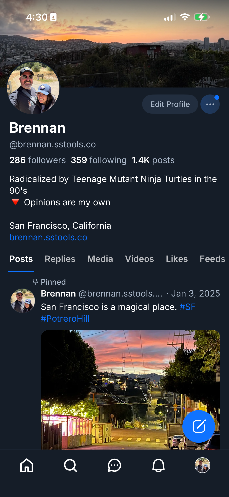

# 0155 — Profile content clipped on the leading edge (regression of #0089)

| | |
|---|---|
| **Status** | resolved |
| **Module** | BlueskyProfile |
| **Platform** | iOS |
| **First seen** | 2026-05-07 |
| **Closed** | 2026-05-07 |
| **Commit (BlueskyKit)** | 08b784d |

## Description

The Profile screen's content is shifted off the leading edge again — every text element below the banner has its first character (or more) clipped beyond the screen. This is the same symptom #0089 fixed (commit `54dcaf1`); the bug has either regressed or a sibling layout path is reproducing the same offset.

Visible in the SwiftUI iPhone screenshot:

- Display name renders as "**rennan**" (B clipped).
- Handle as "**brennan.sstools.co**" (`@` clipped).
- Stats row shows "**86 followers**" / "359 following" / "1.4K posts" (the `2` of `286` clipped).
- Bio reads "**adicalized by Teenage Mutant Ninja Turtles in the 0's**" (R + 9 clipped).
- "**an Francisco, California**" (S clipped).
- Website URL "**rennan.sstools.co**" (b clipped).
- Avatar circle on the banner is partially clipped on its left edge.
- Tab strip ends at "Likes"; "Feeds" is pushed off-screen entirely.

The RN reference (attached) renders the same content correctly on the same iPhone width — every line starts at a normal leading inset and all six tabs (Posts / Replies / Media / Videos / Likes / Feeds) are visible.

## Attachments

## Steps to reproduce

1. Run the SwiftUI app on an iPhone (post-iPhone X — confirmed on the user's device).
2. Open the Profile tab.
3. Compare to the RN reference.

## Expected behavior

All profile content honors the screen's standard horizontal padding. First characters of the display name, handle, stats, bio lines, and URL are fully visible. The tab strip fits all six tabs (or scrolls horizontally if it doesn't, per RN parity).

## Actual behavior

Content is offset left by ~one character; the avatar is clipped on its left edge; the tab strip is also affected (Feeds tab is pushed off the right because the whole strip is offset left).

## Notes

- **#0089 fixed this once** (commit `54dcaf1` in BlueskyKit). The current state proves the fix didn't fully cover the cause, or a subsequent change reintroduced the negative leading offset. Likely suspects:
  - `iosAvatarAndActions` layout in `ProfileHeaderView.swift` (the half-overlap avatar negative offset).
  - The recent `FocalPostCard` (#0146), threadgate-hidden replies (#0145), or sidebar drawer (#0150) work could have touched related layout code; check git blame on `ProfileHeaderView.swift` since #0089 landed.
- Read `issues/0089.md` for the full background and fix history. The same suspect file (`ProfileHeaderView.swift`) is the place to start.
- On audit, look for **all** of: `.offset(x: -X)`, `.padding(.leading, -X)`, `.frame(maxWidth: ..., alignment: ...)` with bad alignment, `.ignoresSafeArea(edges: .horizontal)` reaching beyond the banner, `.position(...)` with manual x-coords, and any `Spacer(minLength: -X)`.
- Verify the fix on iPhone and macOS (it should not regress macOS, where the layout looked OK in earlier screenshots).
- Pairs with #0156 (bottom tab bar layout) — both surface together on the iPhone profile screen but have different root causes.

## Root cause

The bug came back from the **other side** of #0089's fix.

#0089 removed `.ignoresSafeArea(edges: .top)` from `bannerSection` in
`ProfileHeaderView.swift`, leaving a single `.ignoresSafeArea(edges: .top)`
on the outer `ScrollView` in `ProfileScreen.swift` (originally added in
#0088 so the banner could bleed under the status bar). At the time, that
single-source-of-truth for the safe-area bleed worked.

What changed since then was not in `Sources/BlueskyProfile/` — only #0085
(known-followers chip guard), #0086 (Videos tab + new `UnderlineTabStrip`
component), and #0087 (pinned post indicator) landed there, none of which
touched layout / safe-area code. The destabilising change landed in the
**app shell**: #0150 / #0146 / #0148 reshuffled `MainTabView.iosCompactLayout`
so the iPhone-compact `NavigationStack` is now wrapped in a
`safeAreaInset(edge: .top, spacing: 0) { ... }` chain that mounts an
`EmptyView` for the Profile tab (the Profile screen owns its own
banner-bleed, so its inset slot is intentionally empty).

The interaction is the regression. Inside that `safeAreaInset` chain, the
`ScrollView`'s `.ignoresSafeArea(edges: .top)` from #0088 leaks
horizontally — the LazyVStack's frame resolves ~16pt wider than the
visible region and `VStack(alignment: .leading)` aligns its children to
the wider container's leading edge. Net result: avatar clipped, every
text line clipped on its first character, tab strip pushed left so its
"Feeds" entry falls off the right. The right-aligned action buttons
(Edit Profile + ellipsis) and the banner itself both still pin to the
correct edges — the same "looks fine on the right, broken on the left"
signature as #0089.

In short: #0088's bleed-up modifier was always living dangerously
because `.ignoresSafeArea(edges: .top)` on a ScrollView inside a
`NavigationStack` inside a `safeAreaInset(edge: .top)` chain is brittle.
#0150 / #0146 / #0148 finished the chain that pushes it past the
breaking point.

## Fix

Two changes in `BlueskyKit`:

1. **`ProfileScreen.swift`** — drop `.ignoresSafeArea(edges: .top)` from
   the outer `ScrollView`. The top safe area is now respected by the
   ScrollView's frame; nothing horizontal leaks.
2. **`ProfileHeaderView.swift`** — move the banner bleed-up into
   `bannerSection` itself via a `GeometryReader`-based negative top
   padding. The geometry reader reads `safeAreaInsets.top` and renders
   the banner image at `bannerHeight + topInset` with `.padding(.top,
   -topInset)`. The image visually extends behind the status bar; the
   GeometryReader's outer frame stays at `bannerHeight` so the layout
   container is unaffected. macOS keeps the simpler flat banner — no
   status-bar zone to bleed into.

A new private `bannerContent` helper holds the AsyncImage / placeholder
switch so both iOS and macOS branches can reuse it without duplicating
the `Group { ... }`.

## Files changed

- `BlueskyKit/Sources/BlueskyProfile/ProfileScreen.swift` — drop the
  ScrollView's `.ignoresSafeArea(edges: .top)`; replace the original
  comment with one that documents both #0089 and #0155.
- `BlueskyKit/Sources/BlueskyProfile/ProfileHeaderView.swift` — restructure
  `bannerSection` to use a `GeometryReader` on iOS that absorbs the top
  safe area via negative padding; extract banner image / placeholder into
  a shared `bannerContent` view. macOS path uses the original `.frame +
  clipped` shape unchanged.

## Gotchas

- **The fix isn't in `BlueskyProfile/`'s history.** The regressing change
  landed in `Bluesky-SwiftUI/MainTabView.swift` between #0089 (when the
  iPhone compact layout was simpler) and now (after #0150 / #0146 /
  #0148 finished re-architecting the iOS shell). When this symptom comes
  back a third time, *don't* start with git blame on
  `ProfileHeaderView.swift` — start by checking what's wrapping the
  ProfileScreen ScrollView in `MainTabView.iosCompactLayout`.
- **Why a GeometryReader and not `.background(... .ignoresSafeArea)`?**
  The latter only extends the *background fill* behind the status bar,
  not the banner image itself. We want the actual photo to bleed up
  (RN parity). The GeometryReader approach is the only one that lets
  the image extend up while the layout container stays inside the safe
  area. The pattern is: render content at `containerHeight + topInset`,
  then `.padding(.top, -topInset)` to slide it up.
- **GeometryReader frame propagation.** `GeometryReader` is greedy
  vertically by default — it expands to fill its parent. Wrapping it in
  an outer `.frame(height: bannerHeight)` is necessary so the LazyVStack
  reserves only `bannerHeight` for the row. The negative top padding then
  pulls the image up *above* that reserved row, into the status-bar zone.
- **macOS uses a simpler path.** GeometryReader has its own quirks on
  macOS (the window has no top safe area to bleed into) and the original
  `.frame + clipped` already worked. The `#if os(iOS)` split keeps the
  GeometryReader hop iOS-only.
- **The pinned section header still works.** `LazyVStack(pinnedViews:
  [.sectionHeaders])` continues to pin the `VStack { profileHeader;
  tabStrip }` header at the top once the user scrolls — the pinned
  position now sits flush with the top of the safe area instead of the
  screen edge, which is correct (RN does the same — once you scroll,
  the tab strip pins at a position that respects the status bar zone
  with a header background).
