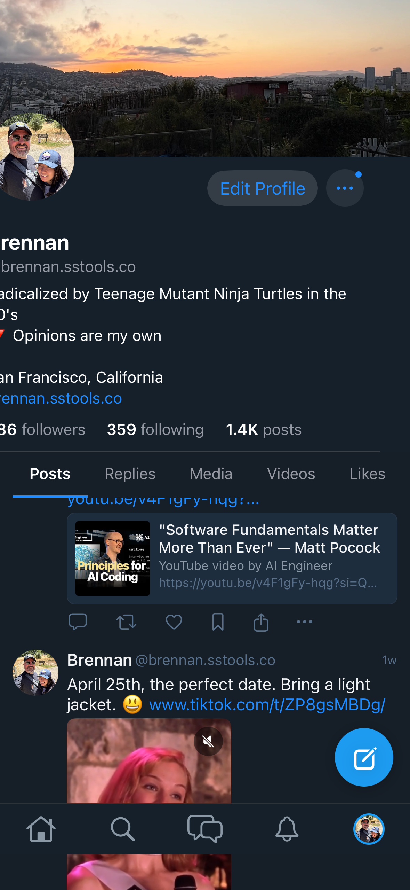

# 0156 — iPhone bottom tab bar: profile-tab avatar selected-state has an oversized ring; tab spacing off

| | |
|---|---|
| **Status** | open |
| **Module** | Bluesky-SwiftUI / BlueskyUI |
| **Platform** | iOS |
| **First seen** | 2026-05-07 |

## Description

The custom bottom tab bar on the iPhone (from #0071) has a layout problem on the **Profile-tab-selected** state. The trailing avatar tab item shows a thick blue ring around the avatar that's substantially larger than the other tab icons, throwing the tab bar's visual rhythm off:

- The four leading tabs (Home / Search / Chat / Notifications) render at one icon size with normal spacing.
- The trailing Profile tab's selected-state ring is bigger than those icons, so the avatar+ring takes up more horizontal space than its slot allows.
- Even spacing across the five tabs is broken — the avatar visually "leans" trailing.

The RN reference (attached, image #12 in the parent dispatch) shows the same five-tab bar with an evenly-spaced layout: when the Home tab is the active one in RN, the active state is a slight tint, not an oversized ring. There's no avatar in the RN bottom tab bar — it shows a profile silhouette icon.

## Attachments

(See the bottom strip; the avatar at the right has a chunky blue ring while the other four icons are simple monochrome glyphs.)

## Steps to reproduce

1. Run the SwiftUI app on iPhone.
2. Tap the Profile tab so it becomes the active tab.
3. Observe the avatar is rendered with a thick blue ring at a larger size than the other tab icons.
4. Switch to any other tab; observe the same avatar shrinks and the ring goes away — confirming the issue is the selected-state styling, not the avatar source itself.

## Expected behavior

- Every tab icon (including the Profile avatar) renders at the same target size (~28pt for the icon area, ~32pt total slot height) regardless of selected state.
- Selected state is a subtle highlight (a tint change on the icon, or a small underline / dot below it — whichever RN uses), not a thick ring that changes the icon's effective size.
- All five slots are evenly spaced across the bar's width.

## Actual behavior

Profile tab selected-state ring is too thick and the avatar pixel size scales up, breaking the tab bar's rhythm.

## Notes

- File to fix: the iPhone bottom tab bar shipped in **#0071** ("iOS bottom chrome: redesign tab bar and add floating compose button"). Look for a `BottomTabBar` or `IOSCompactTabBar` view in `Bluesky-SwiftUI/Bluesky-SwiftUI/MainTabView.swift` or in `BlueskyUI`. The selected-state styling is likely an `.overlay { Circle().stroke(theme.colors.accent, lineWidth: 3) }` modifier with a width that doesn't match the icon's frame.
- RN's bottom tab bar in `Bluesky-ReactNative/src/view/shell/bottom-bar/BottomBar.tsx` does not show a literal user avatar in the Profile slot — it uses a profile-silhouette icon with a tinted active state. **Strict-RN parity** would mean replacing the avatar with a profile icon. The original #0071 pull might have intentionally diverged to show the user's avatar (a nice touch), in which case the fix here is to clamp the avatar+ring to the same total size as the other icons. Decide based on what RN actually ships.
- Confirm even spacing using `HStack(spacing: 0)` with `Spacer()`s between items, or a `LazyVGrid` with five equal columns — whichever the existing `BottomTabBar` uses.
- Pairs with #0155 (profile content clipped) — both visible on the same iPhone screen, but root causes are unrelated.

### 2026-05-12 — bailed: described UI does not exist on main

Investigated and bailed without making changes. The screenshot shows a
custom icon-only tab bar with an avatar in the Profile slot and a blue
selected-state ring — but no such tab bar exists in the current
`Bluesky-SwiftUI` repo on `main`:

- `Bluesky-SwiftUI/Bluesky-SwiftUI/MainTabView.swift:155-166` is the
  only tab bar code in either repo. The iPhone compact path uses the
  standard SwiftUI `TabView` with `Label(tab.title, systemImage: tab.icon)`
  for every tab. `AppTab.profile.icon` returns `"person.circle"` — a
  monochrome SF Symbol, not an avatar.
- A full grep of `Bluesky-SwiftUI/` and `BlueskyKit/Sources/` for
  `TabBar`, `tabBar`, `compactTabs`, `BottomTabBar`, `IOSCompactTabBar`,
  `FloatingCompose`, and `compose.*FAB` returned no matches.
- The screenshot's icon-only layout, custom avatar, and selected-state
  ring all imply code that lives outside this repo.

Issue #0071 ("iOS bottom chrome: redesign tab bar and add floating
compose button") is marked `resolved` and references commits
`Bluesky-SwiftUI 211f225` and `BlueskyKit 7a83c32` — neither hash
exists in either repo's git history (`git log --oneline --all` in
both shows no such SHAs and no commit message mentioning #0071). It
looks like #0071 was prematurely marked resolved against placeholder
hashes; the actual redesign was never landed on `main`.

That means the visual symptoms #0156 describes (oversized ring,
uneven spacing) cannot be reproduced or fixed against the code that
ships today — the standard `TabView` already renders uniform tabs
with no avatar and no ring, which is essentially the expected
behavior #0156 asks for.

**Recommended path forward (for the user, not for me to choose):**

1. **If #0071's redesign should land** — reopen #0071, redo the
   redesign cleanly, and treat #0156 as the polish ticket against
   the new implementation.
2. **If the standard `TabView` is the intended final state** —
   close #0156 as obsolete (the screenshot reflects code that never
   merged, and the current code already matches the expected
   behaviour described here).
3. **If the screenshot was taken from an unmerged branch** — that
   branch should be located and either rebased or discarded; #0156
   stays open against whichever direction is chosen.

Leaving #0156 at `open` per the skill's no-autoclose rule. Status
should not change until the user confirms which of the three paths
above is right.
