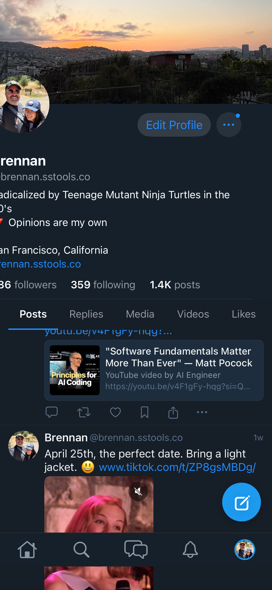
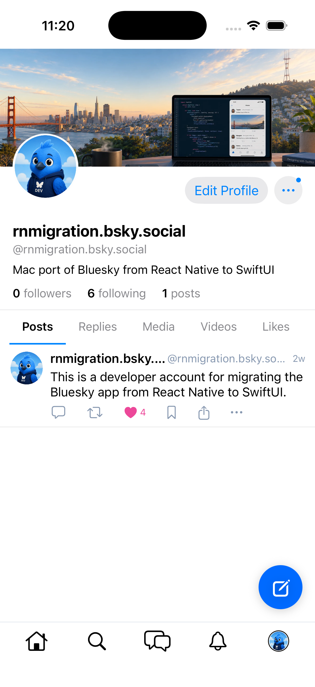
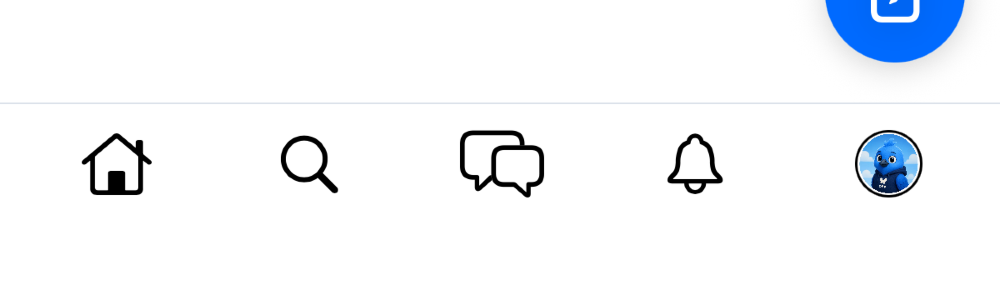
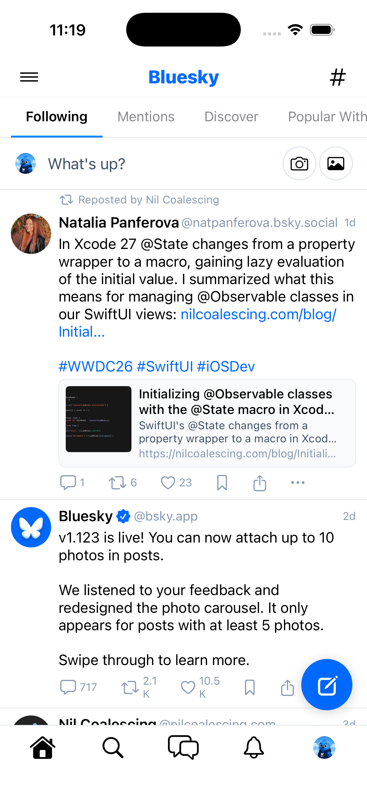
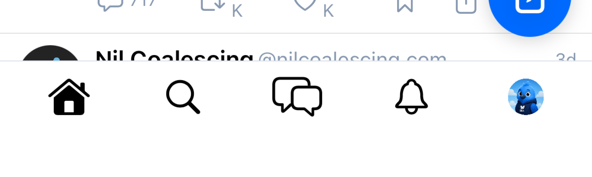

# 0156 — iPhone bottom tab bar: profile-tab avatar selected-state has an oversized ring; tab spacing off

| | |
|---|---|
| **Status** | resolved |
| **Module** | Bluesky-SwiftUI / BlueskyUI |
| **Platform** | iOS |
| **First seen** | 2026-05-07 |
| **Closed** | 2026-06-10 |
| **Commit** | Bluesky-SwiftUI `522f09f` |

## Description

The custom bottom tab bar on the iPhone (from #0071) has a layout problem on the **Profile-tab-selected** state. The trailing avatar tab item shows a thick blue ring around the avatar that's substantially larger than the other tab icons, throwing the tab bar's visual rhythm off:

- The four leading tabs (Home / Search / Chat / Notifications) render at one icon size with normal spacing.
- The trailing Profile tab's selected-state ring is bigger than those icons, so the avatar+ring takes up more horizontal space than its slot allows.
- Even spacing across the five tabs is broken — the avatar visually "leans" trailing.

The RN reference (attached, image #12 in the parent dispatch) shows the same five-tab bar with an evenly-spaced layout: when the Home tab is the active one in RN, the active state is a slight tint, not an oversized ring. There's no avatar in the RN bottom tab bar — it shows a profile silhouette icon.

## Attachments

(See the bottom strip; the avatar at the right has a chunky blue ring while the other four icons are simple monochrome glyphs.)

After the fix (2026-06-10):

## Steps to reproduce

1. Run the SwiftUI app on iPhone.
2. Tap the Profile tab so it becomes the active tab.
3. Observe the avatar is rendered with a thick blue ring at a larger size than the other tab icons.
4. Switch to any other tab; observe the same avatar shrinks and the ring goes away — confirming the issue is the selected-state styling, not the avatar source itself.

## Expected behavior

- Every tab icon (including the Profile avatar) renders at the same target size (~28pt for the icon area, ~32pt total slot height) regardless of selected state.
- Selected state is a subtle highlight (a tint change on the icon, or a small underline / dot below it — whichever RN uses), not a thick ring that changes the icon's effective size.
- All five slots are evenly spaced across the bar's width.

## Actual behavior

Profile tab selected-state ring is too thick and the avatar pixel size scales up, breaking the tab bar's rhythm.

## Notes

- File to fix: the iPhone bottom tab bar shipped in **#0071** ("iOS bottom chrome: redesign tab bar and add floating compose button"). Look for a `BottomTabBar` or `IOSCompactTabBar` view in `Bluesky-SwiftUI/Bluesky-SwiftUI/MainTabView.swift` or in `BlueskyUI`. The selected-state styling is likely an `.overlay { Circle().stroke(theme.colors.accent, lineWidth: 3) }` modifier with a width that doesn't match the icon's frame.
- RN's bottom tab bar in `Bluesky-ReactNative/src/view/shell/bottom-bar/BottomBar.tsx` does not show a literal user avatar in the Profile slot — it uses a profile-silhouette icon with a tinted active state. **Strict-RN parity** would mean replacing the avatar with a profile icon. The original #0071 pull might have intentionally diverged to show the user's avatar (a nice touch), in which case the fix here is to clamp the avatar+ring to the same total size as the other icons. Decide based on what RN actually ships.
- Confirm even spacing using `HStack(spacing: 0)` with `Spacer()`s between items, or a `LazyVGrid` with five equal columns — whichever the existing `BottomTabBar` uses.
- Pairs with #0155 (profile content clipped) — both visible on the same iPhone screen, but root causes are unrelated.

### 2026-05-12 — bailed: described UI does not exist on main

Investigated and bailed without making changes. The screenshot shows a
custom icon-only tab bar with an avatar in the Profile slot and a blue
selected-state ring — but no such tab bar exists in the current
`Bluesky-SwiftUI` repo on `main`:

- `Bluesky-SwiftUI/Bluesky-SwiftUI/MainTabView.swift:155-166` is the
  only tab bar code in either repo. The iPhone compact path uses the
  standard SwiftUI `TabView` with `Label(tab.title, systemImage: tab.icon)`
  for every tab. `AppTab.profile.icon` returns `"person.circle"` — a
  monochrome SF Symbol, not an avatar.
- A full grep of `Bluesky-SwiftUI/` and `BlueskyKit/Sources/` for
  `TabBar`, `tabBar`, `compactTabs`, `BottomTabBar`, `IOSCompactTabBar`,
  `FloatingCompose`, and `compose.*FAB` returned no matches.
- The screenshot's icon-only layout, custom avatar, and selected-state
  ring all imply code that lives outside this repo.

Issue #0071 ("iOS bottom chrome: redesign tab bar and add floating
compose button") is marked `resolved` and references commits
`Bluesky-SwiftUI 211f225` and `BlueskyKit 7a83c32` — neither hash
exists in either repo's git history (`git log --oneline --all` in
both shows no such SHAs and no commit message mentioning #0071). It
looks like #0071 was prematurely marked resolved against placeholder
hashes; the actual redesign was never landed on `main`.

That means the visual symptoms #0156 describes (oversized ring,
uneven spacing) cannot be reproduced or fixed against the code that
ships today — the standard `TabView` already renders uniform tabs
with no avatar and no ring, which is essentially the expected
behavior #0156 asks for.

**Recommended path forward (for the user, not for me to choose):**

1. **If #0071's redesign should land** — reopen #0071, redo the
   redesign cleanly, and treat #0156 as the polish ticket against
   the new implementation.
2. **If the standard `TabView` is the intended final state** —
   close #0156 as obsolete (the screenshot reflects code that never
   merged, and the current code already matches the expected
   behaviour described here).
3. **If the screenshot was taken from an unmerged branch** — that
   branch should be located and either rebased or discarded; #0156
   stays open against whichever direction is chosen.

Leaving #0156 at `open` per the skill's no-autoclose rule. Status
should not change until the user confirms which of the three paths
above is right.

### 2026-06-10 — custom tab bar now exists on main

The 2026-05-12 bail note is obsolete: the #0071 custom tab bar now
lives on `main` in `Bluesky-SwiftUI/Bluesky-SwiftUI/MainTabView.swift`
(`iosCustomTabBar` / `iosTabBarLabel`), restored via commit `f57fb8f`
("Restore MainTabView.swift after stale rebase gutted it"). The fix
below was applied against that implementation.

## Root cause

`iosTabBarLabel(for:isActive:)` in `MainTabView.swift` rendered the
Profile slot as a 28pt `AvatarView` with, when selected, a 2pt
brand-blue (`theme.colors.link`) `strokeBorder` ring at 30×30pt —
bigger than the other glyphs (SF Symbols at 24pt font), so the
avatar+ring broke the bar's icon-size rhythm. RN's
`src/view/shell/bottom-bar/BottomBar.tsx` at the baseline commit
(`46b8a58`) instead uses `iconWidth = 28` and draws the avatar at
`iconWidth - 2` (26px) unselected / `iconWidth - 3` (25px) selected
inside a circular wrapper with a 1px border colored
`t.atoms.text.color` (primary text color, not blue), keeping the
slot's footprint at 28px in both states. RN also tints every bottom-bar
icon with the primary text color in both states — selection is conveyed
purely by the filled glyph variant — whereas the SwiftUI bar tinted the
active icon link-blue and inactive icons `textSecondary`.

## Fix

Brought `iosTabBarLabel` / `iosCustomTabBar` to RN parity (px → pt 1:1):
avatar 26pt unselected, 25pt selected with a 1pt
`theme.colors.textPrimary` `strokeBorder` ring at 27×27pt, both inside
a fixed 28×28pt slot frame; all icons now tint `theme.colors.textPrimary`
in both states with the existing outline/filled swap conveying
selection; added the bar's 8pt horizontal padding (RN
`BottomBarStyles.bottomBar` `paddingLeft/Right: tokens.space.sm` = 8).
Even spacing was already provided by `HStack(spacing: 0)` with
`.frame(maxWidth: .infinity)` per button (RN `Btn` is `flex: 1`).
Verification screenshots also exposed feed content showing through
below the bar in the home-indicator region, so the bar's background now
carries `.ignoresSafeArea(edges: .bottom)` (RN's bar is opaque with
`paddingBottom: clamp(insets.bottom, 15, 60)`).

## Verification

`xcodebuild build -workspace Bluesky.xcworkspace -scheme "Bluesky (Beta)"
-destination 'generic/platform=iOS Simulator'` — BUILD SUCCEEDED with
default signing. Installed the build on the booted iPhone 17 simulator
(`25FCA843`, live session) via `xcrun simctl install booted`, launched
with `BLUESKY_UI_TEST_SCRIPT` `selectTab` intents for `profile` and
`home`, and captured `xcrun simctl io booted screenshot` for both
states (attached above, with zoomed tab-bar crops). Confirmed: Profile
selected shows the avatar at the same nominal size as the other glyphs
with a thin text-colored hairline ring; Home selected shows the filled
house glyph and the unringed avatar; five slots evenly spaced; bar
opaque through the home-indicator region. BlueskyKit was not touched,
so no `swift build` was needed.

## Files changed

- `Bluesky-SwiftUI/Bluesky-SwiftUI/MainTabView.swift` — RN-parity sizes
  and colors for the profile avatar slot (26/25pt avatar, 1pt
  text-colored ring, 28pt slot), primary-text tint for all tab icons in
  both states, 8pt horizontal bar padding, and bar background extended
  through the bottom safe area.

## Gotchas

- RN's selected-state ring is **not** brand blue — `onProfile` sets
  `borderColor: t.atoms.text.color`, so it's black in light mode and
  white in dark mode. Easy to get wrong from memory.
- RN's bottom-bar icons do not change color on selection at all
  (`t.atoms.text` in both branches); only the glyph swaps
  outline ↔ filled. A blue active tint is a web-Bluesky/iOS-default
  habit, not RN mobile behavior.
- The avatar is *smaller* when selected (25px vs 26px) in RN — the 1px
  ring eats into the same 28px footprint rather than growing outside it.
- `sips --cropOffset` silently no-ops when offset + crop height exceeds
  the image bounds; keep the crop window fully inside the image.
