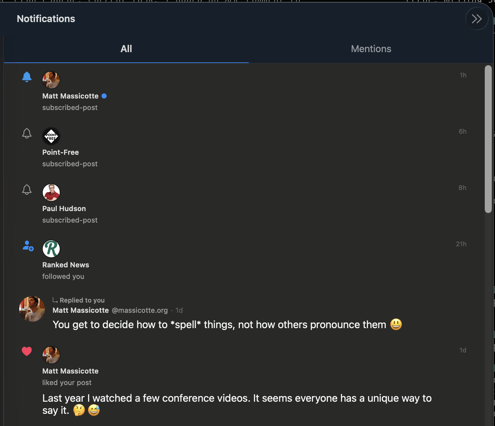

# 0158 — Notification rows omit the post content for `subscribed-post` (and any reason where the post is the point of the row)

| | |
|---|---|
| **Status** | open |
| **Module** | BlueskyNotifications |
| **Platform** | All |
| **First seen** | 2026-05-11 |

## Description

Notification rows for `subscribed-post` reasons (and possibly other variants) render only the actor's name and a raw label — `Matt Massicotte / subscribed-post`, `Point-Free / subscribed-post`, `Paul Hudson / subscribed-post` — with no preview of the post itself. The whole point of a "new post from someone you subscribe to" notification is to surface the post; rendering only the reason name makes the row useless.

The reply and like rows further down in the same screenshot **do** render the post text correctly ("You get to decide how to *spell* things…", "Last year I watched a few conference videos…"), so the post-preview rendering path works for some reasons but not others.

This regresses #0079 ("Notifications: render inline post-content preview on each row"), which was resolved 2026-05-05. Either the `subscribed-post` reason was never wired into that path, or a subsequent change broke the routing. Pairs with #0063 which already noted that the **label** `subscribed-post` renders verbatim instead of friendlier copy ("Subscribed: …" / "New post from …").

## Attachments

## Steps to reproduce

1. Subscribe to an account's posts (use the bell on a profile in RN if needed).
2. Wait for that account to post.
3. Open Notifications.
4. Observe the row shows only `<actor> / subscribed-post` with no post preview.

## Expected behavior

The row layout for `subscribed-post` matches the reply / like / quote rows: actor avatar + actor name, the friendly reason copy ("New post from @actor"), and a 2-line preview of the post text below — same `PostBodyView` (or compact equivalent) used by the reply/like rows. Tapping the row navigates to the thread for that post (covered by #0062 / #0160).

## Actual behavior

Bare `<actor> / subscribed-post` two-line cell. No post text, no embed thumbnail, no link card.

## Notes

- File to edit: `BlueskyKit/Sources/BlueskyNotifications/NotificationsScreen.swift` (or wherever the row renderer landed for #0079 — search for `subjectPostPreview` / the reason switch). The fix likely needs the `subscribed-post` case to fetch the subject post the same way `reply` / `like` / `quote` do — via `getPosts` keyed off the notification's `reasonSubject` URI.
- The `reasonSubject` field on `app.bsky.notification.defs#notification` is what the row needs to resolve. For replies/likes the value is the post the actor reacted to; for `subscribed-post` it should be the post the actor just published. Confirm against RN's `state/queries/notifications/feed.ts` reason mapping.
- Cross-cuts:
  - **#0063** — reason label "subscribed-post" still renders verbatim; both fixes can land in one pass since they touch the same row builder.
  - **#0079** — original post-preview-on-row work; this issue is a follow-on for the missed reason.
  - **#0080** — stacked-actor avatars; orthogonal but in the same file.
- Verify on macOS and iPhone — the screenshot is macOS, but the same renderer powers both.
