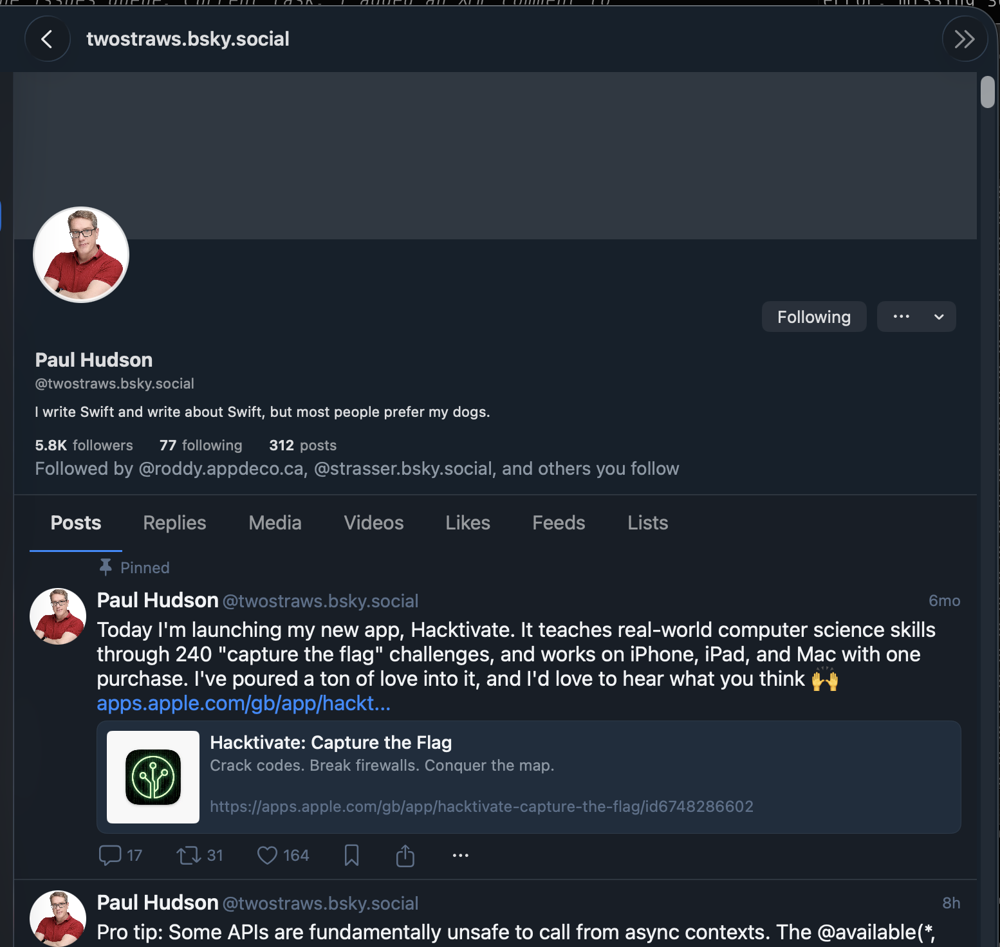

# 0159 — Profile screen reached from a notification: like / repost / bookmark / share buttons are unresponsive on the post rows

| | |
|---|---|
| **Module** | BlueskyProfile / BlueskyFeed / Bluesky-SwiftUI |
| **Status** | resolved |
| **Platform** | All |
| **First seen** | 2026-05-11 |
| **Closed** | 2026-05-12 |
| **Commit (BlueskyKit)** | 0f61fe3e6e77b91af90b8eaeed285a39e9c5a7c8 |

## Description

Tapping an actor's avatar in a notification row navigates to that user's Profile screen (in this case `@twostraws.bsky.social` / Paul Hudson). The Profile screen renders correctly — header, bio, stats, tab strip, and a list of the user's posts. But the action-bar buttons on each post row (reply / repost / like / bookmark / share / ellipsis) are **dead**: tapping them produces no response — no like state flip, no compose sheet, no toast, no error.

The same actions on post rows in the Home feed work as expected. The breakage is specific to the Profile screen reached via the notifications navigation path.

## Attachments

## Steps to reproduce

1. Open Notifications.
2. Tap any actor's avatar to navigate to their profile (e.g. Paul Hudson).
3. On any post row in the Posts tab, tap the heart / repost / bookmark / share / ellipsis buttons.
4. Observe nothing happens.

## Expected behavior

Each button on the post action bar fires the same handler used by the Home feed:
- **Reply** opens the composer with reply context.
- **Repost** toggles repost state with optimistic UI.
- **Like** toggles like state with optimistic UI.
- **Bookmark** toggles bookmark state.
- **Share** presents the system share sheet.
- **Ellipsis** opens the post menu (Copy / Translate / Mute / Report / Copy link / Open in browser).

Same behavior as the Home feed — the Profile screen shouldn't be a degraded variant.

## Actual behavior

All action buttons on post rows are no-ops. No state change, no animation, no error.

## Notes

- Most likely cause: `ProfileScreen`'s post rows construct `PostCard` without wiring the `Actions` callbacks. The Home feed path (`FeedView.actions(for:vm:)`) explicitly assigns `onReply` / `onRepost` / `onLike` / `onBookmark` / `onShare` / `onEllipsis` to a `FeedViewModel` instance; the Profile path likely passes a default-initialized `Actions` struct where every closure is a no-op.
- File to inspect: `BlueskyKit/Sources/BlueskyProfile/ProfileScreen.swift` — find the per-post row builder (probably in the Posts tab of the segmented selector) and confirm whether it threads through an actions wirer.
- The simplest fix is to share `FeedViewModel`'s mutation surface (`like(_:)` / `repost(_:)` / `unbookmark(_:)` / etc.) by either:
  - Constructing a `FeedViewModel` internally for the Profile screen's Posts tab and routing the actions through it (mirrors what the home feed does), or
  - Hoisting the action wiring into a shared helper in `BlueskyUI` so `PostCard` always gets functional callbacks regardless of which screen owns it.
- Profile-tab navigation lands here from #0046 (avatar tap → profile, resolved). The notification → profile path likely uses the same destination, so this fix should also benefit profile entry points from feed / thread / composer mention chips.
- Verify on iPhone too — the screenshot is macOS.

## Root cause

`ProfileScreen.postActions(for:)` constructed `PostCard.Actions()` with only
`onTap` set — every other closure (`onReply`, `onRepost`, `onLike`,
`onBookmark`) was left `nil`, so the corresponding action-bar buttons
silently no-op'd inside `PostCard`. The home feed wires these via
`FeedView.actions(for:vm:)` against a `FeedViewModel` mutation surface, but
that class lives in `BlueskyFeed` and `BlueskyProfile` cannot import it
(both are Layer-3 feature modules — adding the edge would create a
cross-feature dependency that the architecture explicitly forbids; the
existing `ThreadPlaceholder` in `ProfileScreen.swift` also exists for the
same reason).

Share and the ellipsis menu were not actually broken — `PostCard` owns
both via the system `ShareLink` and a self-contained `Menu`, neither of
which needs an external callback. The visible "everything is dead"
behavior on rows that include those controls came from the four buttons
above being unresponsive at the same time.

## Fix

- Extended `ProfileStore` with `toggleLike(post:)` / `toggleRepost(post:)` /
  `bookmark(post:)` / `unbookmark(post:)` (plus `repost(post:)`) using the
  same optimistic-update + in-flight-guard pattern as `FeedStore`. In-flight
  state is tracked per AT-URI; the create/delete record requests go through
  `network.post` against `com.atproto.repo.{create,delete}Record` for likes
  and reposts, and `app.bsky.bookmark.{create,delete}Bookmark` for
  bookmarks. Optimistic UI updates flow through a private
  `updatePost(uri:transform:)` that walks every per-tab posts array and
  rewrites every matching row, so the same post appearing in both Posts
  and Media tabs stays consistent. Mutation helpers `withLike` /
  `withRepost` / `withBookmarked` are duplicated as private extensions on
  `PostView` (they already exist as file-private extensions in
  `BlueskyFeed/FeedViewModel.swift`).
- Surfaced these methods on `ProfileViewModel`.
- In `ProfileScreen`, populated `PostCard.Actions` with `onReply`,
  `onLike`, `onRepost`, `onBookmark`, and `isBookmarked`. Reply opens a
  `ComposerSheet` via a new `replyTarget` `@State`. Repost shows a
  Repost / Quote chooser via a `confirmationDialog` when the post is not
  yet reposted (toggling straight to unrepost otherwise) — matches
  `FeedView`'s behavior and the RN reference. Quote opens the
  `ComposerSheet` with `quotedPost` set.
- Added `BlueskyComposer` as a dependency of `BlueskyProfile` in
  `Package.swift` so `ComposerSheet` is reachable from `ProfileScreen`.
  This is a Layer-3 → Layer-3 edge but acyclic — `BlueskyComposer` does
  not depend on `BlueskyProfile`. `BlueskyFeed` already takes the same
  edge.

## Files changed

- `BlueskyKit/Package.swift` — `BlueskyProfile` now depends on
  `BlueskyComposer`.
- `BlueskyKit/Sources/BlueskyProfile/ProfileStore.swift` — added per-post
  interaction protocol requirements, in-flight tracking sets, the
  `toggleLike` / `toggleRepost` / `bookmark` / `unbookmark` /
  `performLike` / `performUnlike` / `performRepost` / `performUnrepost`
  methods, `currentPost(for:)` / `updatePost(uri:transform:)` helpers, a
  `loadCurrentDID()` wrapper, and private `PostView` extensions
  (`withLike`, `withRepost`, `withBookmarked`).
- `BlueskyKit/Sources/BlueskyProfile/ProfileViewModel.swift` — exposed
  `toggleLike` / `toggleRepost` / `bookmark` (auto-routes to bookmark vs
  unbookmark by viewer state).
- `BlueskyKit/Sources/BlueskyProfile/ProfileScreen.swift` — added
  `import BlueskyComposer`, new `@State` for `replyTarget` /
  `repostMenuTarget` / `quoteTarget`, populated `postActions(for:)` with
  functional callbacks, added reply `.sheet`, quote `.sheet`, and
  Repost / Quote `.confirmationDialog` modifiers.

## Gotchas

- The Profile-side mutation methods do **not** call `freshenedPost` before
  toggling — that helper lives in `FeedStore` and lifting it to a shared
  location wasn't worth the surface-area cost for this bug. Profile tabs
  re-fetch on tab switch which usually keeps the cache fresh enough; if
  the staleness-revert behavior tracked in #0041 starts surfacing on
  Profile rows, lift `freshenedPost` into a shared protocol/extension and
  call it here too.
- Decision: `BlueskyFeed` was **not** added as a dep of `BlueskyProfile`.
  The two are Layer-3 sibling feature modules and the rule against
  cross-feature edges (and against the cycle that would form once
  BlueskyFeed needs to navigate into BlueskyProfile, which the
  `ThreadPlaceholder` workaround already anticipates) ruled it out.
  Duplicating the small mutation surface inside `BlueskyProfile` was the
  cheaper option — under 200 lines, all clearly attributed back to the
  `FeedStore` original via `#0159` comments.
- `BlueskyComposer` was added as a dep instead. That edge is also Layer-3
  → Layer-3 but is unambiguously acyclic and matches the existing
  `BlueskyFeed → BlueskyComposer` precedent.
