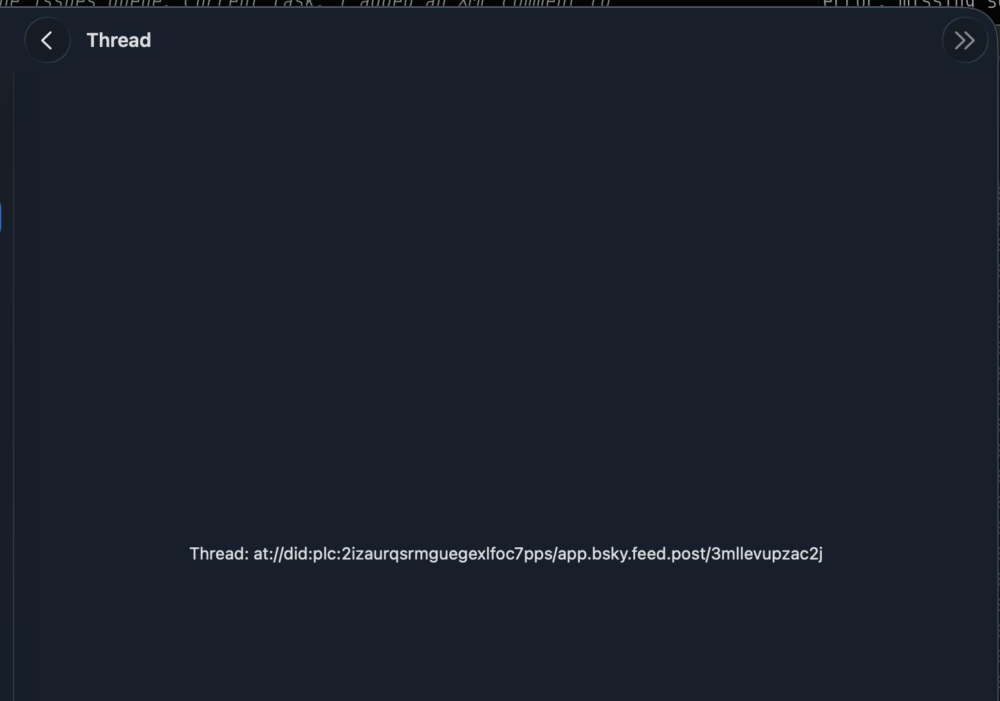

# 0160 — Tapping a notification opens a Thread placeholder showing only the AT-URI text instead of the actual thread

| | |
|---|---|
| **Status** | open |
| **Module** | BlueskyNotifications / BlueskyFeed / Bluesky-SwiftUI |
| **Platform** | All |
| **First seen** | 2026-05-11 |

## Description

Tapping a notification row (a like, reply, mention, quote, or subscribed-post) navigates to a screen titled "Thread" whose entire body is a single centered line of debug text:

> Thread: at://did:plc:2izaurqsrmguegexlfoc7pps/app.bsky.feed.post/3mllevupzac2j

There is no post, no parent chain, no replies, no compose bar — just the raw AT-URI rendered as a label. The placeholder is what `BlueskyProfile.ThreadPlaceholder` (or an equivalent stub view) renders when `BlueskyProfile` was scaffolded with a stand-in for the real `ThreadView` to avoid a circular `BlueskyProfile → BlueskyFeed` dependency (see Progress.md notes from 2026-04-24 — "ThreadView in the profile context uses a `ThreadPlaceholder` stub to avoid a circular dependency").

The notifications tab is hitting the same stub. The real `ThreadView` from `BlueskyFeed` exists and works (the Home feed → tap a post → see thread path is functional per #0039 / #0045 / #0054). The notifications tab's `navigationDestination` for thread URIs is wired to the placeholder, not the real view.

This regresses / extends #0062 ("Tapping a notification shows raw at:// URI text instead of navigating to the thread") which is already filed and `open`. The screenshot here makes the symptom concrete: the user sees the AT-URI verbatim because the placeholder's body literally renders the URI as text.

## Attachments

## Steps to reproduce

1. Open Notifications.
2. Tap any row (a like, reply, mention, quote, or subscribed-post).
3. Observe a screen titled "Thread" whose body is the AT-URI rendered as a centered string.

## Expected behavior

Tapping a notification navigates to the **real** `ThreadView` from `BlueskyFeed`, with the focal post (the one the notification refers to), parent chain above, and reply tree below — same surface the Home feed → post tap path produces.

## Actual behavior

The placeholder ThreadView renders only the AT-URI string. No post, no replies, no actions.

## Notes

- The fix is in the **app target** (`Bluesky-SwiftUI/Bluesky-SwiftUI/MainTabView.swift`), not in `BlueskyProfile`. The stub lives in `BlueskyProfile` to break a layering cycle, but the app shell can wire each tab's `navigationDestination(for: ATURI.self)` to the real `ThreadView` from `BlueskyFeed` because it sits above both modules.
- Search `MainTabView.swift` for how the Home tab's `case .home:` mounts its `navigationDestination` blocks (the `LikedByScreen` / `RepostedByScreen` / `QuotesOfScreen` wiring landed in #0146 follows the same pattern). The Notifications tab (`case .notifications:`) needs the equivalent: a `navigationDestination(item: $threadURI) { ThreadView(uri:network:accountStore:) }` block.
- Cross-references:
  - **#0062** — same root cause; this issue duplicates the symptom but the screenshot is fresh evidence the placeholder is still shipping. Mark #0062 as the canonical issue; this one can be folded in or closed as a duplicate at resolve time.
  - **#0030** (in-progress) — push notification routing also needs the same destination wiring, so #0160 / #0062 should land before #0030's "open the right thread on notification tap" path can be tested end-to-end.
  - **#0108** — message-thread embeds also got an `onPostTap` callback wired up the same way; reuse that pattern.
  - **#0146** — added thread `navigationDestination` for likes/reposts/quotes screens via `MainTabView` callbacks; the same wiring shape applies here.
- Once the notifications tab pushes the real `ThreadView`, also verify the navigation back-stack works (back from thread returns to the notifications list with scroll position preserved).
