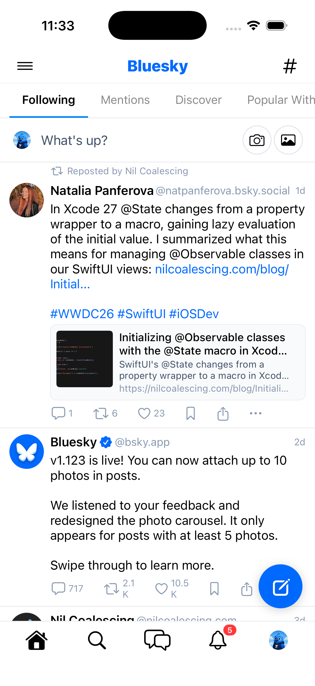
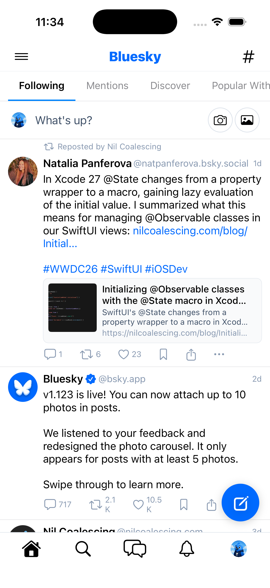

# 0196 — Notifications unread badge is never populated (`getUnreadCount` has no callers)

| | |
|---|---|
| **Status** | resolved |
| **Module** | BlueskyNotifications / Bluesky-SwiftUI |
| **Platform** | All |
| **First seen** | 2026-06-10 |
| **Closed** | 2026-06-10 |
| **Commit** | BlueskyKit `adc1889` · Bluesky-SwiftUI `da40790` |

## Description

The unread badge on the Notifications tab can never appear. The plumbing for it
exists end-to-end — `NotificationsStore.fetchUnreadCount()` calls
`app.bsky.notification.getUnreadCount`, `NotificationsViewModel.fetchUnreadCount()`
forwards to it, `NotificationsScreen.onUnreadCountChange` propagates the count,
and `MainTabView.notificationBadge` renders a red capsule on the bell icon — but
**nothing ever calls `fetchUnreadCount()`**. Found while validating the Module 10
gate (#0031).

Two structural problems compound:

1. `fetchUnreadCount()` has no call sites anywhere in BlueskyKit or the app
   target (only its definitions in `NotificationsStore` / `NotificationsViewModel`).
2. Even if `NotificationsScreen` called it, the screen is only mounted once the
   user selects the Notifications tab (`MainTabView` builds tab content per
   selected tab), so a badge could never show *before* the tab is opened — which
   is the whole point of the badge. The unread count must be fetched (and
   periodically refreshed) at the app-shell level, independent of the screen.

A side effect: `NotificationsScreen.onChange(of: viewModel.unreadCount)` never
fires either, because `unreadCount` only ever transitions 0 → 0 (`markSeen()`
sets it to 0, and it starts at 0). The badge-clearing path is dead code today.

## Steps to reproduce

1. Have unread notifications on the signed-in account (e.g. a new like since
   the last `updateSeen`).
2. Launch the app and stay on the Home tab.
3. Look at the bell icon in the tab bar.

## Expected behavior

The bell shows a red unread-count badge (RN parity: the React Native client
polls the unread count app-wide — `src/state/queries/notifications/unread.tsx`
— and drives the tab badge and app icon badge from it), and the badge clears
when the Notifications screen is opened (`updateSeen`).

## Actual behavior

No badge is ever rendered, regardless of unread state. `notificationBadge` in
`MainTabView` stays `0` forever.

## Notes

- Code locations:
  - `BlueskyKit/Sources/BlueskyNotifications/NotificationsStore.swift` —
    `fetchUnreadCount()` (uncalled).
  - `BlueskyKit/Sources/BlueskyNotifications/NotificationsScreen.swift` —
    `.onChange(of: viewModel.unreadCount)` → `onUnreadCountChange` (never fires;
    screen also only exists after the tab is opened).
  - `Bluesky-SwiftUI/Bluesky-SwiftUI/MainTabView.swift` — `notificationBadge`
    `@State` (line ~30), `onUnreadCountChange: { count in notificationBadge = count }`
    (line ~926), `badge(for:)` (line ~1194).
- Suggested shape of the fix: fetch `getUnreadCount` at the `MainTabView` /
  app-shell level on session start and on a periodic poll (RN polls roughly
  every 30 s while foregrounded), plus on foreground re-entry; keep the
  existing `markSeen()` → zero-the-badge path for when the tab is opened.
  Note the RN reference checkout (`../Bluesky-ReactNative/`) was not present
  on disk on 2026-06-10 — confirm the exact polling interval against the live
  RN source when it is restored.
- Found during #0031 (Module 10 gate). The `updateSeen` half of the gate works
  (verified live); this issue is only about populating the badge.

## Root cause

Two compounding gaps, both as filed. (1) `NotificationsStore.fetchUnreadCount()`
existed end-to-end but had zero call sites — nothing in BlueskyKit or the app
target ever invoked it. (2) Even the badge-clearing path was structurally dead:
each `NotificationsScreen` constructed its *own* `NotificationsViewModel` (and
therefore its own `NotificationsStore`), so even if something had populated a
count, the screen's `markSeen()` would have zeroed a different store than the
one feeding `MainTabView.notificationBadge`, and the screen's
`.onChange(of: viewModel.unreadCount)` only ever saw 0 → 0. RN by contrast
keeps unread state in an app-level Provider
(`src/state/queries/notifications/unread.tsx`) that polls independently of the
Notifications screen.

## Fix

App-shell polling plus a single shared store. `MainTabView` now owns one
`NotificationsViewModel` (lazily created, mirroring `savedStoreOrCreate()`)
and runs `.task(id: session.currentAccount?.did)` on both platform branches:
an immediate `fetchUnreadCount()` once a session exists, then a repeat every
**30 seconds — the confirmed RN interval** (`UPDATE_INTERVAL = 30 * 1e3` in
`src/state/queries/notifications/unread.tsx` at baseline `46b8a58`; RN fires
on Provider init, then `setInterval` ticks, with `checkUnread` early-returning
while the app isn't active). A `scenePhase == .active` handler refetches on
return to foreground. The Notifications tab mounts the screen via a new
`NotificationsScreen(viewModel:)` initializer with that shared view model, so
the existing `markSeen()` on tab open zeroes the same store and the
`onUnreadCountChange` N → 0 transition clears the badge (RN: `markAllRead()`).
RN's poll backoff (skip ~50% of ticks when the count is non-zero, stop at 30+)
was deliberately not copied — it exists because RN derives the count from a
40-item page fetch, whereas `app.bsky.notification.getUnreadCount` is a single
cheap query. `fetchUnreadCount()` also gained a `BLUESKY_FAKE_UNREAD_COUNT`
launch-environment hook (precedent: `BLUESKY_UI_TEST_SCRIPT`) so the badge can
be verified visually without a second account.

## Verification

- `swift test` in `BlueskyKit` — **108 tests passed** (104 pre-existing + 4 new
  in `NotificationsStoreTests`: `fetchUnreadCountPopulatesState`,
  `fetchUnreadCountKeepsCountOnError`, `markSeenZeroesBadge`,
  `pollCycleAfterMarkSeen` — all four named in the run output).
- `xcodebuild -workspace Bluesky.xcworkspace -scheme 'Bluesky (Beta)'
  -destination 'platform=iOS Simulator,id=25FCA843-…' build` — BUILD
  SUCCEEDED; same for `-destination 'platform=macOS'` (build only, no launch).
- Live on the booted iPhone 17 sim (`rnmigration.bsky.social`), via
  `simctl launch` + `log show --predicate 'subsystem CONTAINS[c] "bluesky"'`:
  - **Initial fetch fires:** plain launch logs
    `notifications fetchUnreadCount: 0` immediately (previously this call
    never happened). Account genuinely has 0 unread, so no badge — correct.
  - **Badge renders:** launch with `SIMCTL_CHILD_BLUESKY_FAKE_UNREAD_COUNT=5`
    shows the red "5" capsule on the bell while on the Home tab (screenshot
    below) — the badge now exists before the tab is ever opened.
  - **30 s poll observed:** same process logged faked fetches at 23:33:44 and
    23:34:16 (~32 s apart including fetch latency).
  - **markSeen clears the badge:** `BLUESKY_UI_TEST_SCRIPT` selecting the
    Notifications tab then returning Home logged `loadInitial` →
    `markSeen: updateSeen posted, badge zeroed` (real `updateSeen` POST), and
    the follow-up Home screenshot shows no badge (below).
  - **Foreground refetch:** after backgrounding via the Settings app, re-
    foregrounding fired a fetch within ~1 s (23:35:53), past the suspended
    poll tick.
- Honest limitation: with no second account there is no way to generate a real
  non-zero unread count, so the badge *visual* legs used the fake-count hook;
  the `getUnreadCount` and `updateSeen` network legs ran for real.

## Files changed

- `BlueskyKit/Sources/BlueskyNotifications/NotificationsScreen.swift` — new
  designated `init(viewModel:)` taking an externally-owned view model; the old
  `init(network:)` is now a convenience that delegates to it; dropped the
  unused stored `network` property.
- `BlueskyKit/Sources/BlueskyNotifications/NotificationsStore.swift` —
  `BLUESKY_FAKE_UNREAD_COUNT` launch-environment override in
  `fetchUnreadCount()` for badge verification.
- `BlueskyKit/Tests/BlueskyKitTests/NotificationsStoreTests.swift` — new:
  mock-network store tests for the fetch/markSeen/poll-cycle logic.
- `Bluesky-SwiftUI/Bluesky-SwiftUI/MainTabView.swift` — shared
  `notificationsViewModel` state + `notificationsViewModelOrCreate()`;
  `pollUnreadNotifications()` loop (30 s) and `refreshUnreadBadge()`;
  `.task(id: session.currentAccount?.did)` + `.onChange(of: scenePhase)` on
  both the macOS and iOS body branches; Notifications tab now mounts
  `NotificationsScreen(viewModel:)`.

## Gotchas

- The shared store is the load-bearing part of the badge-*clearing* fix, not
  just an optimization: `NotificationsScreen.onChange(of: unreadCount)` can
  only observe the N → 0 `markSeen()` transition if the shell's poll and the
  screen write the same `unreadCount`. Reverting the screen to
  `init(network:)` in `MainTabView` would silently resurrect the dead
  badge-clear path.
- Under `BLUESKY_FAKE_UNREAD_COUNT`, the badge reappears ~30 s after
  `markSeen()` because the next poll tick re-fakes the count — screenshot
  scripts must capture the cleared state within that window.
- `simctl openurl booted "bluesky://"` from another foreground app pops an
  "Open in Bluesky Beta?" confirmation dialog that can't be tapped headlessly;
  `simctl launch` of the already-running bundle id foregrounds it without a
  dialog and was used for the scenePhase leg instead.
- The iOS custom tab bar badge code (#0156) was not touched — only the value
  feeding `badge(for:)` changed.

## Attachments

