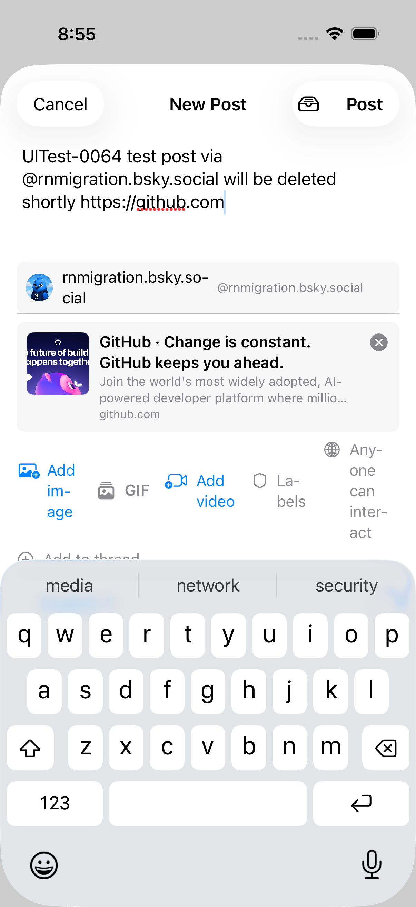
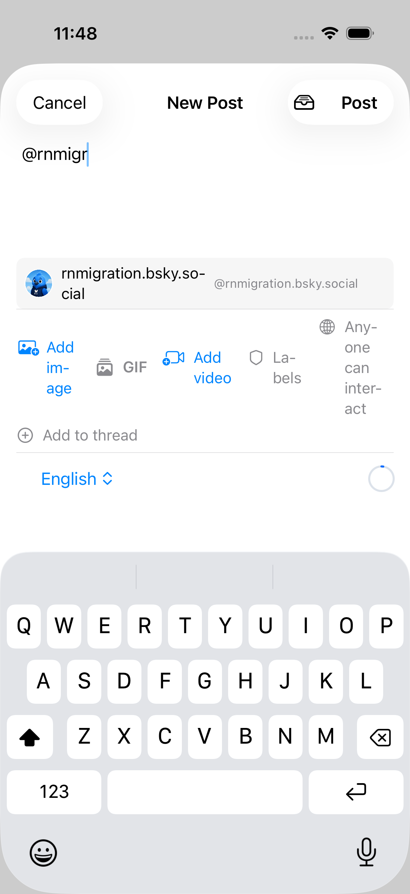
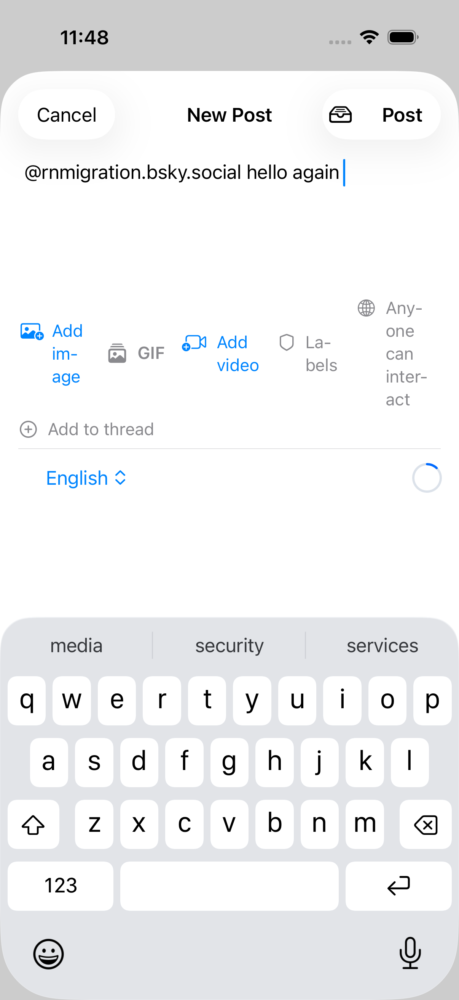

# 0198 — Mention autocomplete overlay lingers after a mention is completed

| | |
|---|---|
| **Status** | resolved |
| **Module** | BlueskyComposer |
| **Platform** | All |
| **First seen** | 2026-06-10 |
| **Closed** | 2026-06-10 |
| **Commit** | 63d7ae8 |

## Description

After picking a mention from the composer's autocomplete overlay, the
suggestion list does not go away. It stays rendered below the text editor for
the rest of the compose session — even while the user types unrelated words or
a URL after the mention — because the detector keys off "the last `@`-prefixed
word anywhere in the text" instead of the word under the caret.

Found during the #0064 composer gate run: after selecting
`@rnmigration.bsky.social` and typing the rest of the sentence plus a URL, the
suggestion row for the already-completed mention was still showing between the
editor and the link-card preview.

## Steps to reproduce

1. Open the composer.
2. Type `@rnmigr`, wait for the suggestion overlay, tap a suggestion.
3. Keep typing any further text (no new `@`).

## Expected behavior

The overlay disappears once the mention is completed (suggestion tapped) and
only reappears when the caret is inside a new partial `@word`. RN's composer
(`TextInput` + autocomplete in `view/com/composer/text-input/`) tracks the
active word at the cursor and hides the list when the mention is resolved.

## Actual behavior

The completed handle still matches the "last `@` word" heuristic, so
`searchMentions` re-runs with the full handle, returns the same actor, and the
overlay stays visible indefinitely.

## Root cause

`ComposerViewModel.onTextChange()` derived the mention prefix from the *whole*
text — `words.last(where: { $0.hasPrefix("@") && $0.count > 1 })` — rather
than the word at the caret. Once any completed `@handle` existed anywhere in
the text, every subsequent keystroke re-matched it, re-set `mentionPrefix`,
and re-ran `searchMentions` with the full handle, which returned the same
actor and kept the overlay rendered. Two aggravating factors: the store had
no way to clear `mentionSuggestions` once populated (the protocol only had
`searchMentions`), and `ComposerSheet` showed the overlay on
`!mentionSuggestions.isEmpty` alone, so even clearing `mentionPrefix` never
hid the list.

## Fix

Implemented the dismissal rule as a trailing-token approximation of RN's
caret tracking. RN (`view/com/composer/text-input/TextInput.tsx`) calls
`getMentionAt(text, cursorPos)` (`lib/strings/mention-manip.ts`, regex
`/(^|\s)@([a-z0-9.-]*)/gi`) on every change and only shows the overlay while
the caret sits inside an `@`-token; picking a suggestion inserts
`"@handle "` with a trailing space, which moves the caret out of the token
and dismisses the list. SwiftUI's `TextEditor` doesn't expose the caret, so
the rule implemented here is: **a mention is active only when the final word
of the text is an in-progress `@token` (at least one body character, body
restricted to RN's `[a-z0-9.-]` charset) and the text does not end in
whitespace.** A trailing space, newline, or punctuation completes the token —
exactly what RN's caret-leaves-the-word check produces while typing at the
end of the text (the overwhelmingly common case). When the token completes,
`mentionPrefix` is cleared and a new `ComposerStoring.clearMentionSuggestions()`
cancels any in-flight typeahead and empties the list. `selectMention` now
clears suggestions itself, replaces the *trailing* occurrence of the token
(`options: .backwards`) so an identical earlier mention isn't rewritten, and
its inserted trailing space (RN's `insertMentionAt` shape) guarantees the
next `onTextChange` finds no active token — no re-trigger for the completed
handle. Defense in depth: `searchMentions` re-checks `Task.isCancelled`
after the network response so a stale result can't resurrect the overlay,
and `ComposerSheet` additionally gates the overlay on `mentionPrefix != nil`.

## Verification

- `swift test` in BlueskyKit: **116 tests passed** (108 pre-existing + 8 new),
  including the new suite "Composer mention autocomplete trigger/dismiss
  rules (#0198)" — partial `@al` shows, `@alice ` (space) dismisses,
  suggestion selection dismisses and doesn't re-trigger, earlier completed
  mention plus plain text stays hidden, second mention later re-triggers,
  punctuation terminates the token, trailing-occurrence replacement.
- iOS Simulator app build: `xcodebuild -workspace Bluesky.xcworkspace -scheme
  "Bluesky (Beta)" -destination "platform=iOS Simulator,name=iPhone 17"
  build` — BUILD SUCCEEDED.
- Visual confirmation on the booted iPhone 17 sim via a temporary one-off
  XCUITest (harness `[.home, .openComposer]` script): typed `@rnmigr`,
  overlay appeared; tapped the `rnmigration.bsky.social` suggestion; overlay
  dismissed and stayed dismissed while typing "hello again" (screenshots
  below). Draft discarded — nothing was posted. The temp test file was
  deleted after the run.

## Files changed

- `BlueskyKit/Sources/BlueskyComposer/ComposerViewModel.swift` — new
  `activeMentionPrefix` trailing-token rule (documented against RN's
  `getMentionAt`); `onTextChange` clears prefix + suggestions when the token
  completes; `selectMention` replaces the trailing occurrence and clears
  suggestions; test-only `init(store:draftsStore:)`.
- `BlueskyKit/Sources/BlueskyComposer/ComposerStore.swift` — added
  `clearMentionSuggestions()` to `ComposerStoring` and `ComposerStore`
  (cancels the debounced typeahead task, empties the list); post-response
  cancellation re-check in `searchMentions`.
- `BlueskyKit/Sources/BlueskyComposer/ComposerSheet.swift` — overlay now
  requires `mentionPrefix != nil` in addition to non-empty suggestions.
- `BlueskyKit/Package.swift` — `BlueskyKitTests` now depends on
  `BlueskyComposer`.
- `BlueskyKit/Tests/BlueskyKitTests/ComposerMentionAutocompleteTests.swift` —
  new 8-test suite with a scriptable `MockComposerStore` (synchronous
  `searchMentions`, call/clear counters).

## Gotchas

- `ComposerStoring` is declared in a module compiled with
  `defaultIsolation(MainActor.self)`, so test-target conformers must be
  explicitly `@MainActor` (same pattern as `MockBookmarkStore` in
  `BlueskyKitTests.swift`).
- `selectMention`'s text mutation re-fires the sheet's
  `.onChange(of: text)` → `onTextChange()`. Any dismissal logic has to
  survive that immediate re-entry — this exact sequence was what re-set
  `mentionPrefix` from the completed handle before the fix.
- Avoid URLs in composer view-model unit tests: `onTextChange` →
  `detectURL()` kicks off a real `LinkMetadataFetcher` network fetch.

## Attachments

## Notes

- `BlueskyKit/Sources/BlueskyComposer/ComposerViewModel.swift`,
  `onTextChange()` (line ~332): `words.last(where: { $0.hasPrefix("@") && $0.count > 1 })`
  scans the whole text, not the word at the caret. `selectMention(_:)` clears
  `mentionPrefix`, but the very next `onTextChange` re-sets it from the
  completed handle.
- Cosmetic/UX only — facets are still built correctly (the #0064 run verified
  the posted mention carried a proper `app.bsky.richtext.facet#mention`).
- Minimal fix without caret tracking: ignore a candidate word that already
  resolves to a selected mention (`mentionDIDs[handle] != nil`), or suppress
  the overlay when the candidate word is followed by whitespace/more text.
