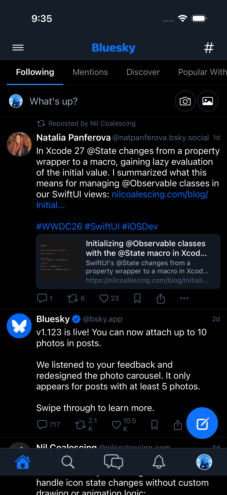
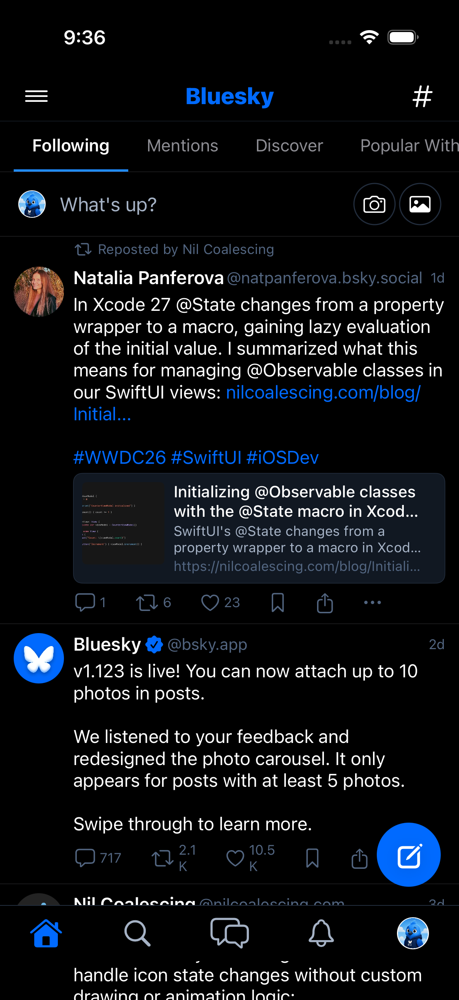
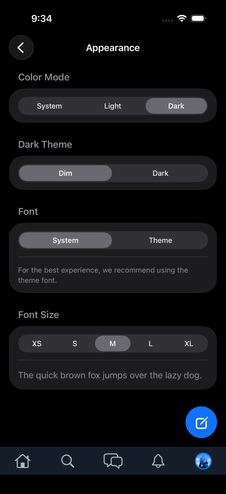
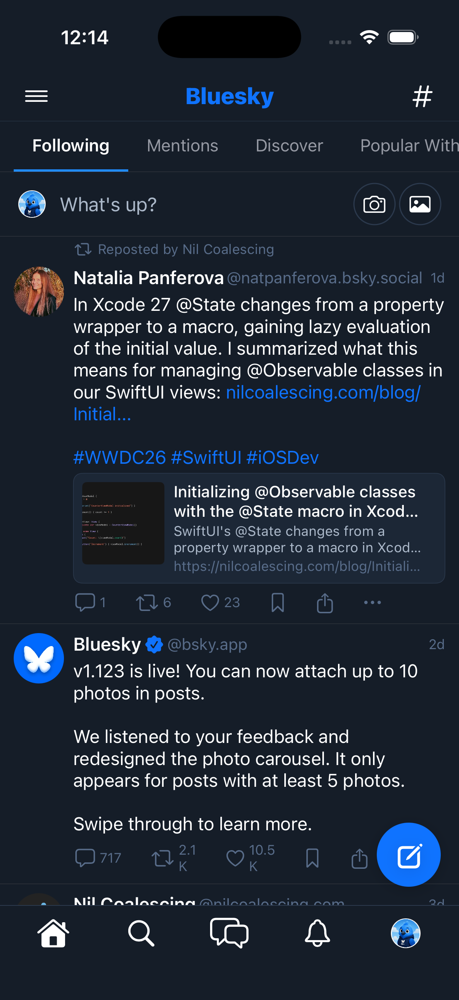
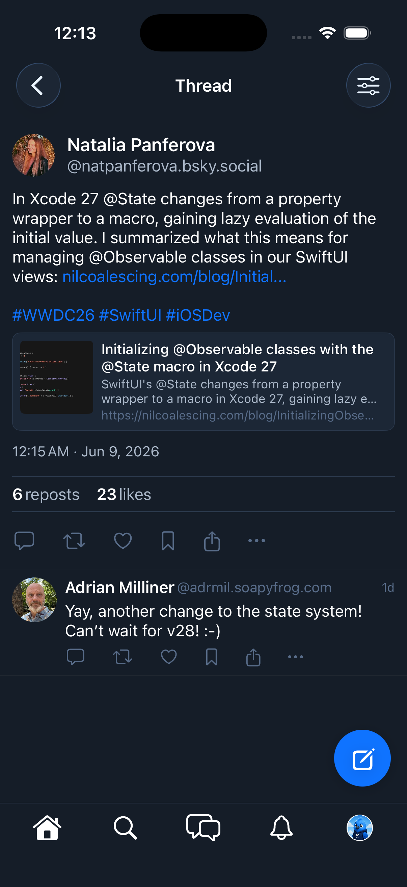
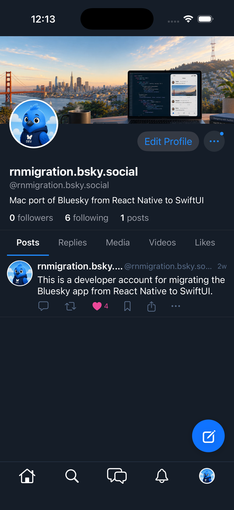
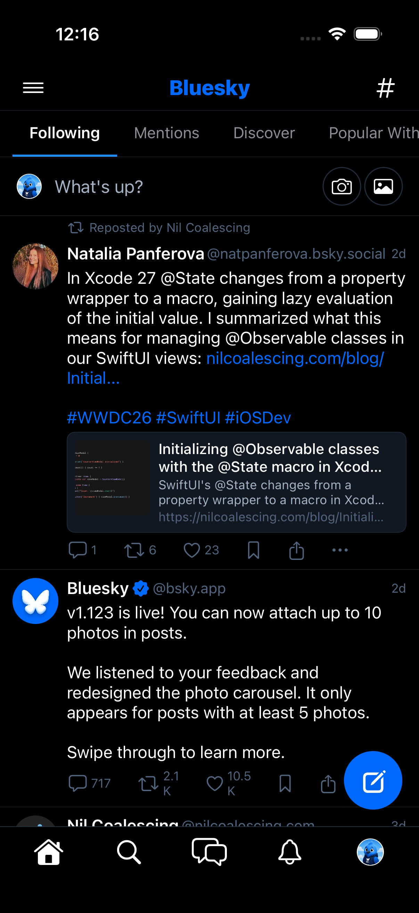

# 0199 — Dim dark-theme variant not applied to feed/thread/profile/search surfaces

| | |
|---|---|
| **Status** | resolved |
| **Module** | BlueskyUI / BlueskyFeed / BlueskyProfile / BlueskySearch |
| **Platform** | All |
| **First seen** | 2026-06-10 |
| **Closed** | 2026-06-10 |
| **Commit** | 33ef599, a450d9c (BlueskyKit) |

## Description

Selecting **Settings → Appearance → Dark Theme → Dim** renders the *Dark* palette, not the *Dim* palette, on the app's main content surfaces. The shell (`AppearanceShellModifier` in `Bluesky_SwiftUIApp.swift`) correctly injects `.blueskyTheme(.dim)` based on `AppearanceStore.darkVariant`, but several screens then **override** that injection with `.adaptiveBlueskyTheme()`, which hardcodes `colorScheme == .dark ? .dark : .light` and discards the user's variant choice:

- `BlueskyKit/Sources/BlueskyFeed/FeedView.swift:192`
- `BlueskyKit/Sources/BlueskyFeed/ThreadView.swift:97`
- `BlueskyKit/Sources/BlueskyFeed/QuotesOfScreen.swift:73`
- `BlueskyKit/Sources/BlueskyProfile/ProfileScreen.swift:99`
- `BlueskyKit/Sources/BlueskySearch/HashtagView.swift:58`

The result is a mixed-theme UI in Dim mode: the tab bar and other shell chrome (which inherit the injected environment) use Dim colors (link `#0F73FF`, tab bar dim navy), while the feed itself renders the Dark palette (background `#000000`, secondary `#111822`, tertiary text `#526580` — Dim expects `#151D28` / `#1C2736` / `#586C89` per the #0040 ALF palettes).

## Steps to reproduce

1. On iPhone, open Settings → Appearance.
2. Set Color Mode to **Dark**; the Dark Theme picker appears with **Dim** selected (the default).
3. Switch to the Home tab and observe the feed background.
4. Pixel-sample the post-card background: it is `#000000` (Dark) instead of `#151D28` (Dim). Toggling Dim ↔ Dark produces no change in the feed body — only the tab-bar accent color changes.

## Expected behavior

With Dim selected, every themed surface uses `BlueskyTheme.dim` (bg `#151D28`, bg-secondary `#1C2736`), matching RN's "Dim" preset. RN reference: `src/alf/themes.ts` (`dim` theme) — the entire app, including feeds and threads, renders dim.

## Actual behavior

Feed, thread, profile, quotes, and hashtag screens render `BlueskyTheme.dark` regardless of the variant preference; only views that don't call `.adaptiveBlueskyTheme()` honor Dim.

## Attachments

Found during the #0065 settings gate. Home feed in Dark+Dim (renders Dark palette, note dim-blue tab bar vs pure-black feed):

Home feed in Dark+Dark for comparison (visually identical feed body):

Appearance screen showing Dark + Dim selected at capture time:

## Notes

- Likely fix: remove the `.adaptiveBlueskyTheme()` calls from the five screens and let the shell's `.blueskyTheme(activeTheme)` environment flow down; or make `AdaptiveBlueskyThemeModifier` variant-aware (it would need access to `AppearanceStore`, which lives in `BlueskyKit`).
- `AdaptiveBlueskyThemeModifier` predates the variant-aware shell (`AppearanceStore` / `AppearanceShellModifier`); these five call sites look like leftovers from before the shell injection landed.
- Persistence of the variant preference itself is fine (`appearance.darkVariant` round-trips relaunch, validated in #0065); this is purely a rendering override bug.
- Found while validating #0065 (Module 14 gate, iOS settings persistence) via `SettingsGateUITests.testThemeImmediateEffectAndPersistence` pixel evidence.

## Root cause

Two stacked problems, both invisible in plain Dark mode because the Dark palette's background (`#000000`) coincides with the system dark background:

1. **Variant override.** `FeedView`, `ThreadView`, `QuotesOfScreen`, `ProfileScreen`, and `HashtagView` each called `.adaptiveBlueskyTheme()` inside their own bodies. That modifier re-injected `colorScheme == .dark ? .dark : .light` *below* the shell's root-level `.blueskyTheme(activeTheme)` injection (`AppearanceShellModifier`), so the user's Dim choice was discarded on every content surface while shell chrome (tab bar, drawer) kept the dim palette. The modifier predates the variant-aware shell — the five call sites were leftovers.
2. **Unpainted screen containers.** Once the override was removed, a second gap surfaced: none of the five screens painted their scroll containers with `theme.colors.background`. Regions the content doesn't cover (below the last thread reply, below a short profile feed, the hashtag screen's hidden `List` background) fell through to the *system* background — black under a dark scheme, visibly wrong (`#000000` instead of `#151D28`) under Dim.

## Fix

Made the shell's environment injection authoritative. Removed `.adaptiveBlueskyTheme()` from all five screens (grep confirmed these were the only call sites in both repos) and deleted the `adaptiveBlueskyTheme()` API + `AdaptiveBlueskyThemeModifier` from `Theme.swift` entirely so the override cannot creep back in; the five screens' previews now inject `.blueskyTheme(.light/.dark)` explicitly, the same pattern every other preview in the package already used (commit `33ef599`). Then added `.background(theme.colors.background)` at the screen-container level in the same five screens — paint-only, no layout change, a no-op in light/dark where the colors already coincided (commit `a450d9c`). The dark-appearance default remains Dim (`AppearanceStore.darkVariant` default, mirroring RN's `darkTheme ?? 'dim'`); nothing in `AppearanceStore` or the shell changed.

## Verification

- `swift test` in BlueskyKit — 116 tests in 21 suites, all green (no new testable logic; the fix removes a SwiftUI environment override and adds paint-only modifiers).
- `xcodebuild build` (`Bluesky (Beta)`, iPhone 17 simulator `25FCA843`) — succeeded.
- `SettingsGateUITests.testThemeImmediateEffectAndPersistence` run twice on the booted iPhone 17 sim against the fixed build (live session `rnmigration.bsky.social`) — passed both times (130s, 0 failures); the test itself drives Settings → Appearance through Dark+Dim → relaunch → Dark+Dark → Light and restores System.
- Pixel-sampled the run's home-feed screenshots (3x device px): **Dim** `0065-home-dark-dim_20260610235850.png` = `#151D28` at (100,1300), (1100,1800), (600,2550) and across chrome — top bar (600,140), (600,300) and tab-bar corners (60,2560), (1150,2560) all `#151D28`; before the fix the same feed points sampled `#000000`. **Dark** `0065-home-dark-dark` = `#000000` (no regression); **Light** `0065-home-light` = `#FFFFFF`. Dim survives relaunch (`#151D28` in the relaunch capture).
- Thread and profile legs (system dark appearance + stored `dim` variant, in-app navigator scripts): `after-thread-dim.png` = `#151D28` at (100,1300), (300,2000), (100,2200), (600,250 nav bar), (600,2560 tab bar); `after-profile-dim.png` = `#151D28` at (100,1600), (600,1700)–(600,2300), (600,2560). Before the container fix the sub-content regions sampled `#000000`.
- Theme restored afterwards: `appearance.colorMode` = `system`, `appearance.darkVariant` = `dim` (the prior values), simulator appearance back to light.

## Files changed

- `BlueskyKit/Sources/BlueskyUI/Theme.swift` — removed `adaptiveBlueskyTheme()` and `AdaptiveBlueskyThemeModifier`; documented on `blueskyTheme(_:)` that the shell's injection is authoritative and re-injection on content screens discards the variant.
- `BlueskyKit/Sources/BlueskyFeed/FeedView.swift` — dropped `.adaptiveBlueskyTheme()`; added theme env + container `.background`; previews inject `.blueskyTheme(.light/.dark)`.
- `BlueskyKit/Sources/BlueskyFeed/ThreadView.swift` — same treatment.
- `BlueskyKit/Sources/BlueskyFeed/QuotesOfScreen.swift` — same treatment.
- `BlueskyKit/Sources/BlueskyProfile/ProfileScreen.swift` — dropped `.adaptiveBlueskyTheme()`; added container `.background` (theme env already present); previews inject explicit themes.
- `BlueskyKit/Sources/BlueskySearch/HashtagView.swift` — same treatment as FeedView.

## Gotchas

- The container-background half of the bug is invisible whenever the active palette's background coincides with the system background — only Dim exposes it. When adding a new content screen, paint the scroll container with `theme.colors.background`; do not rely on the system background and do not re-inject a theme below the shell.
- Editing the app-group preferences plist on disk (`plutil -replace` on `group.co.sstools.bluesky.plist`) does **not** affect the running sim — cfprefsd serves its cached values and the app never sees the edit. Killing the sim's cfprefsd makes things worse (the `simctl ui appearance` mechanism wedged until a sim reboot). The reliable levers are the app's own settings UI (via the gate test) or `xcrun simctl ui <udid> appearance dark` combined with the stored `system` color mode.
- `TEST_RUNNER_…` credential vars must be set in `xcodebuild`'s *environment* (`VAR=… xcodebuild test`), not appended as trailing `KEY=VALUE` arguments — trailing args become build settings and the runner never sees them; the test then silently XCTSkips.

### After-fix captures (Dim)

