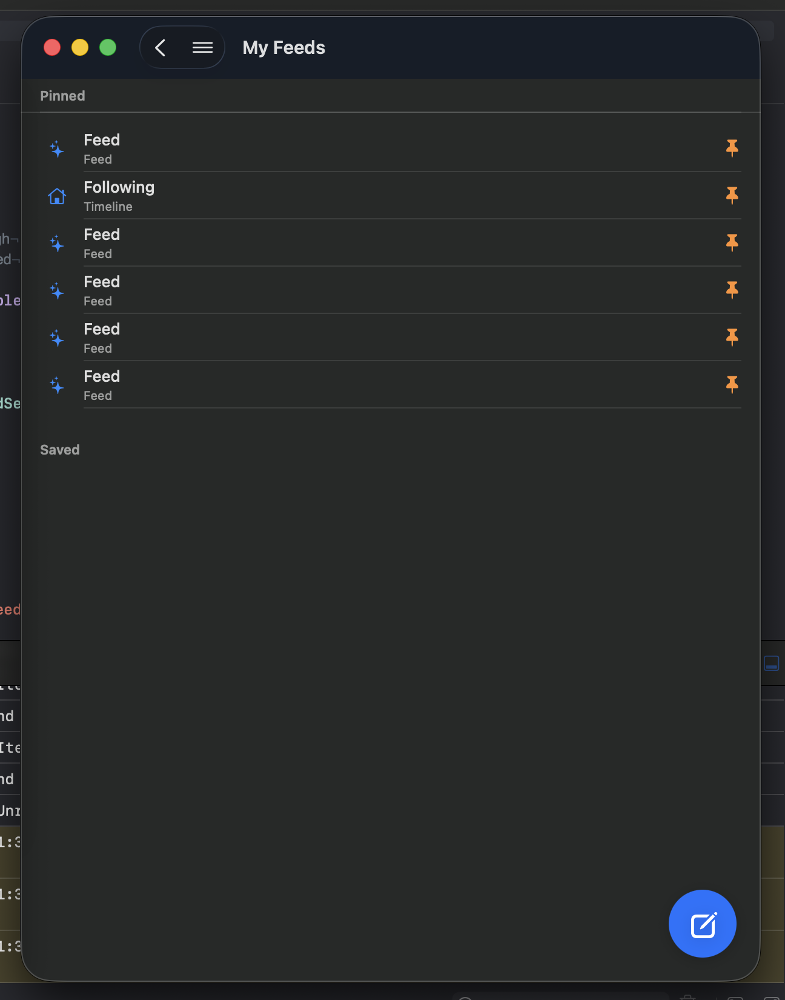

# 0199 — macOS Feeds screen shows placeholder "Feed" rows: `#` button routes to the bare SavedFeedsScreen instead of MyFeedsScreen

| | |
|---|---|
| **Status** | in-progress |
| **Module** | BlueskyFeed / Bluesky-SwiftUI |
| **Platform** | macOS / iPadOS |
| **First seen** | 2026-06-11 |

## Description

On macOS, the `#` toolbar button pushes the bare-bones `SavedFeedsScreen`, which renders every feed-generator row with hardcoded placeholder text — title "Feed" and subtitle "Feed" — instead of real feed names, and shows an empty "Saved" section header. The rich `MyFeedsScreen` (RN `Feeds.tsx` parity: search, resolved feed names, discover section) already exists but is only wired up on iOS.

## Steps to reproduce

1. Launch the Mac app and sign in.
2. Click the `#` button at the trailing edge of the toolbar (or pick Feeds from the hamburger drawer).

## Expected behavior

The Feeds screen matches the RN app and the iPhone build: each pinned/saved feed shows its actual display name (e.g. Discover, Popular With Friends) with avatar/metadata, plus the search bar and "Discover new feeds" section that `MyFeedsScreen` already implements.

## Actual behavior

Every generator feed row reads "Feed / Feed" with a generic sparkles icon; only the timeline row ("Following / Timeline") looks right because it's special-cased. The "Saved" section renders as an empty header when all saved feeds are pinned.

## Attachments

## Notes

Root cause, from reading the code:

- `MainTabView.swift` ~line 1038: the macOS `#` toolbar button sets `showSavedFeeds = true`, whose `navigationDestination` (~line 1048) pushes `SavedFeedsScreen(network:cache:)`. The iPad regular-width `list.star` button (~line 1025) routes to the same place.
- `BlueskyKit/Sources/BlueskyFeed/SavedFeedsScreen.swift:122` — `displayName(for:)` is a stub: `"timeline" → "Following"`, `"list" → "List"`, anything else → literally `"Feed"`. The row subtitle is `feed.type.capitalized` (`SavedFeedsScreen.swift:98`), hence "Feed / Feed". The screen never calls `app.bsky.feed.getFeedGenerators` to hydrate names/avatars.
- iOS instead routes its `#` button through `showMyFeeds` → `MyFeedsScreen` (`MainTabView.swift` ~line 1055), which resolves `GeneratorView` metadata, has the search bar and Discover section, and handles taps into `CustomFeedTimelineView`.

Likely fix: route the macOS `#` button (and the drawer's Feeds row) to `MyFeedsScreen` with the same `onFeedTap`/`onSuggestedTap` wiring iOS uses, rather than teaching `SavedFeedsScreen` to hydrate metadata. Also decide whether `SavedFeedsScreen` is still reachable anywhere once that lands (iPad regular-width toolbar button is the other caller); if not, it may be removable — and its empty-"Saved"-section rendering goes away with it.

## Relation

- Builds on the macOS navigation work in [#0196](0196.md)–[#0198](0198.md) (the `#` button and drawer that expose this screen).
