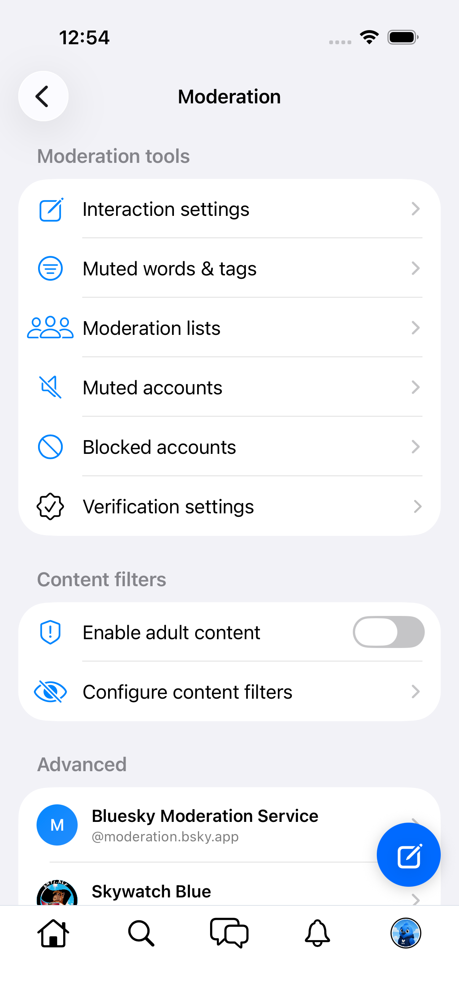
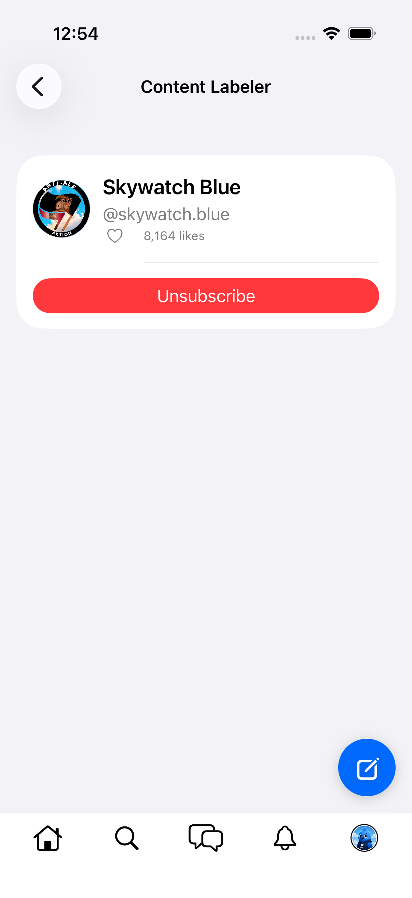
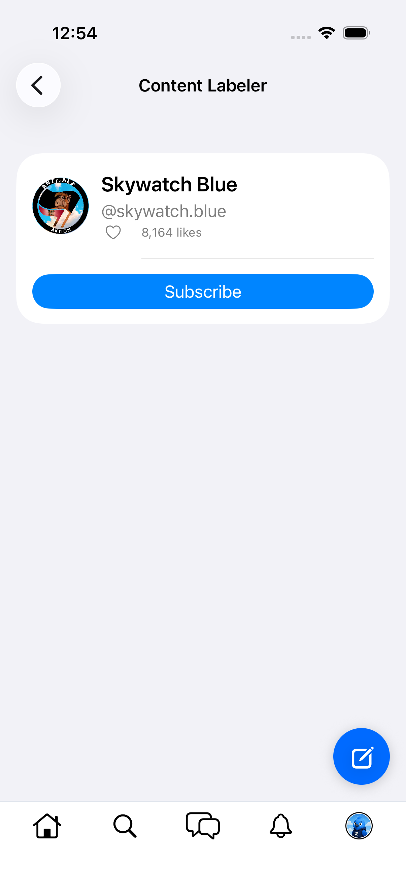

# 0202 — Labeler subscription state tracked in `savedFeeds` instead of `labelersPref`

| | |
|---|---|
| **Status** | resolved |
| **Module** | BlueskyModeration |
| **Platform** | All |
| **First seen** | 2026-06-10 |
| **Closed** | 2026-06-11 |
| **Commit** | a870478 |

## Description

Two screens disagree about where labeler subscriptions live:

- `ModerationScreen` (Moderation hub → Advanced) correctly sources its "Subscribed labelers" rows from `app.bsky.actor.defs#labelersPref` via `ModerationStore` — this matches RN (`preferences.moderationPrefs.labelers`).
- `LabelerProfileStore` (`Sources/BlueskyModeration/LabelerProfileStore.swift`) derives `isSubscribed` from `prefs.savedFeeds` containing an item with `type == "labeler"` (line 53), and `subscribe(labelerDID:)` **appends a `SavedFeed(type: "labeler", value: did)` item to `savedFeedsPrefV2`** (lines 70–78). `unsubscribe` filters the same.

`savedFeedsPrefV2` item types are `feed` / `list` / `timeline`; writing a `type: "labeler"` item pollutes the saved-feeds preference with records other clients don't expect, and the subscription never lands in `labelersPref`, so the Moderation hub will never list a labeler subscribed via its profile screen (and vice versa: a labeler in `labelersPref` shows "Subscribe" on its own profile).

## Steps to reproduce

1. Open a labeler profile (Moderation → Advanced → labeler row) and tap Subscribe.
2. `GET app.bsky.actor.getPreferences`: the labeler DID appears under `savedFeedsPrefV2.items[].type == "labeler"`, not under `labelersPref.labelers`.
3. Return to the Moderation hub: the labeler is not listed under "Subscribed labelers".

## Expected behavior

Subscribe/unsubscribe read and write `labelersPref.labelers` (RN: `addLabeler` / `removeLabeler` on the moderation prefs), and `LabelerProfileScreen`'s button state agrees with the Moderation hub.

## Actual behavior

Subscription state is read from and written to `savedFeedsPrefV2` with a malformed `type: "labeler"` item; hub and profile screen permanently disagree.

## Notes

- Not exercised live during the #0066 gate: tapping Subscribe would have written the malformed item to the live account (and, per #0201, wiped the rest of the preference namespace). Verified by code reading.
- The account's `labelersPref` is currently empty (see #0201), so Moderation → Advanced shows "No subscribed labelers" and `LabelerProfileScreen` is unreachable on iOS ([screenshot](0066/moderation-no-labelers.png)). RN additionally always includes the default Bluesky Moderation Service labeler; consider whether the hub should surface it implicitly.
- Depends on #0201 for a safe write path (`labelersPref` writes must be merged into the full preferences array).
- **#0201 is resolved (2026-06-10, BlueskyKit `2bf2c99`)** — the safe write path now exists. `LabelerProfileStore.subscribe/unsubscribe` already go through `PreferencesWriter.shared.update(network:) { prefs in … }` (read-modify-write, full-array bodies), but deliberately still read/write the `savedFeeds` shape; this issue's remaining work is swapping the closure body + `isSubscribed` derivation to `labelersPref`. `PreferencesMutation.labelers(dids:)` already exists in `BlueskyCore/Moderation.swift` (used by `ModerationStore.removeUnavailableLabelers`).

## Root cause

As filed: `LabelerProfileStore` derived `isSubscribed` from `savedFeedsPrefV2` items with the made-up `type: "labeler"` and wrote the same shape back, so subscriptions never landed in `app.bsky.actor.defs#labelersPref` — the hub (which reads `labelersPref` correctly) and the labeler profile screen could never agree, and the state never round-tripped with other clients. Two RN rules were also unmirrored, confirmed against the RN baseline (`src/state/queries/labeler.ts`, `src/screens/Profile/Header/ProfileHeaderLabeler.tsx`, `src/state/queries/preferences/moderation.ts`, `src/lib/moderation.ts`): the Bluesky Moderation Service (`did:plc:ar7c4by46qjdydhdevvrndac`, `BskyAgent.appLabelers` / `BSKY_LABELER_DID`) is **always-on and never stored in `labelersPref`** — its profile hides the Subscribe button entirely (`isAppLabeler`), `isLabelerSubscribed` short-circuits to `true`, and `useMyLabelersQuery` prepends it to the resolution set — and `MAX_LABELERS` (20) caps `labelersPref` entries. A third latent defect surfaced during live verification: `ModerationStore.loadSubscribedLabelers` comma-joined multiple DIDs into a single `dids` value, which the appview rejects (`InvalidRequest: Invalid DID`) as soon as the resolution set has more than one entry.

## Fix

In BlueskyKit (`a870478`):

- **`AppLabelers`** (new, `BlueskyCore/Moderation.swift`): `blueskyModerationDID`, `dids`, `contains(_:)` (RN `isAppLabeler`), `maxLabelers = 20` (RN `MAX_LABELERS`). The private DID literals in `ReportDialog` and `ContentFilterSettingsScreen` now reference it.
- **`LabelerProfileStore`**: `load` derives `isSubscribed` from `GetPreferencesResponse.subscribedLabelerDIDs` (`labelersPref`), short-circuiting `true` for app labelers. `subscribe` computes `.labelers(dids: current + [did])` from the fresh server state inside the `PreferencesWriter` closure (skip when already present; throws before the write at `maxLabelers`); `unsubscribe` filters the DID out (skip when absent). Both no-op entirely for app labelers.
- **`LabelerProfileViewModel` / `LabelerProfileScreen`**: `isAppLabeler` exposed; the Subscribe/Unsubscribe button is hidden for app labelers (RN `ProfileHeaderLabeler`) and carries `labeler-subscribe-button` for UI tests.
- **`ModerationStore.loadSubscribedLabelers`**: resolution set is now `AppLabelers.dids` + `labelersPref` DIDs (deduped, app labelers first — RN `useMyLabelersQuery`), resolved one `getServices` call per DID because the appview rejects comma-joined `dids` and `NetworkClient.get` can't express repeated query keys. `subscribedLabelerDIDs` still mirrors `labelersPref` verbatim so `removeUnavailableLabelers` can never write an app labeler into the pref. `ModerationScreen`'s "No subscribed labelers" empty state is now effectively unreachable (the implicit Bluesky labeler always resolves).

## Verification

Unit leg (`cd ../BlueskyKit && swift test`): full suite green — **128 tests in 23 suites passed** (120 before, 8 new), new suite `Labeler subscriptions (#0202)`: subscribe appends to `labelersPref` preserving every other pref (incl. unmodeled `$type`s), unsubscribe removes only the targeted DID, subscribe/unsubscribe skip the put when already in the target state, `isSubscribed` derives from `labelersPref`, the app labeler is implicitly subscribed and never written, `MAX_LABELERS` blocks the 21st subscribe without a write, and the hub resolves `appLabelers ∪ labelersPref` in order.

App build: `xcodebuild build -workspace Bluesky.xcworkspace -scheme "Bluesky (Beta)" -destination 'generic/platform=iOS Simulator'` → BUILD SUCCEEDED.

Live leg (booted iPhone 17 sim `25FCA843`, `rnmigration.bsky.social`, via a temporary XCUITest — deleted after the run, not committed). Setup: `labelersPref` seeded with Skywatch Blue (`did:plc:e4elbtctnfqocyfcml6h2lf7`) via an authed full-array merge put (simulating a subscription made by another client). Then:

- **Read path**: Moderation → Advanced listed **Bluesky Moderation Service (implicit) + Skywatch Blue** ([screenshot](0202/hub-implicit-and-subscribed-labelers.png)); Skywatch's profile button read **Unsubscribe** ([screenshot](0202/labeler-unsubscribe-state.png)) — before the fix it read Subscribe (state came from `savedFeeds`).
- **Unsubscribe → subscribe via UI** (test A): button flipped to Subscribe ([screenshot](0202/labeler-after-unsubscribe.png)) and back to Unsubscribe; authed `getPreferences` afterwards: `labelersPref.labelers == [did:plc:e4elbtctnfqocyfcml6h2lf7]` (re-encoded by the app's write) and **savedFeedsPrefV2 + postLanguagesPref byte-identical** to the pre-run state (`diff` of the non-labeler entries: empty).
- **Unsubscribe via UI** (test B): authed `getPreferences` afterwards: `labelersPref.labelers == []`, all other prefs again byte-identical.

Account left with `labelersPref` present but empty (`labelers: []`) — exactly the state RN's `agent.removeLabeler` leaves, and equivalent to a fresh account: the hub still shows the implicit Bluesky Moderation Service, no stored subscriptions.

## Files changed

All in `../BlueskyKit` (commit `a870478`):

- `Sources/BlueskyCore/Moderation.swift` — new `AppLabelers` enum (Bluesky labeler DID, `contains`, `maxLabelers`)
- `Sources/BlueskyModeration/LabelerProfileStore.swift` — read/write swapped from `savedFeeds` to `labelersPref`; app-labeler short-circuits; MAX_LABELERS guard
- `Sources/BlueskyModeration/LabelerProfileViewModel.swift` — `isAppLabeler` exposed
- `Sources/BlueskyModeration/LabelerProfileScreen.swift` — Subscribe button hidden for app labelers; `labeler-subscribe-button` accessibility id
- `Sources/BlueskyModeration/ModerationStore.swift` — implicit app labeler prepended to the resolution set; per-DID `getServices` (comma-join rejected by the appview)
- `Sources/BlueskyModeration/ModerationScreen.swift` — empty state keyed off the resolved views, documented as normally unreachable
- `Sources/BlueskyModeration/ReportDialog.swift`, `Sources/BlueskyModeration/ContentFilterSettingsScreen.swift` — private Bluesky-labeler DID literals replaced with `AppLabelers.blueskyModerationDID`
- `Package.swift` — `BlueskyModeration` added to the test target dependencies
- `Tests/BlueskyKitTests/LabelerSubscriptionTests.swift` — new: 8-test suite (see Verification)

## Gotchas

- `app.bsky.labeler.getServices` (and likely other array-param lexicons) **rejects comma-joined values** — `dids=a,b` fails with `InvalidRequest: Invalid DID`; only the repeated-key form `dids=a&dids=b` parses. The old `ModerationStore` comment claiming the appview parses both forms was wrong but never bit because the set had at most one DID until the implicit app labeler joined it. `NetworkClient.get`'s `[String: String]` params can't express repeated keys; if more batched array-param calls show up, the protocol needs a `[(String, String)]` overload.
- RN's `removeLabeler` (and now ours) leaves the `labelersPref` entry in place with `labelers: []` rather than deleting the entry — don't read "pref exists" as "has subscriptions".
- The fix to `ContentFilterSettingsScreen` is free: it renders one section per resolved labeler, so the implicit Bluesky labeler now restores the built-in porn/sexual/nudity/graphic-media rows even with an empty `labelersPref` (they were missing entirely on a fresh account before).

## Attachments

