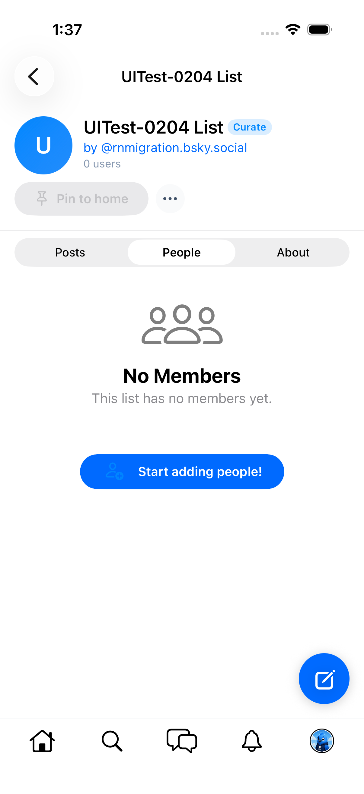
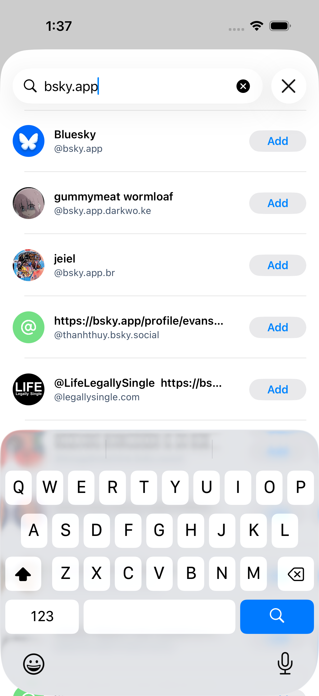
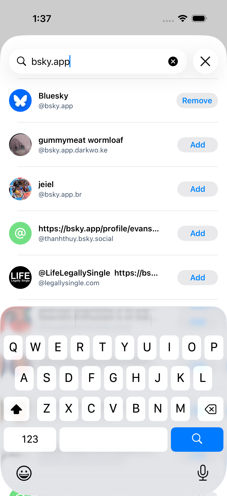
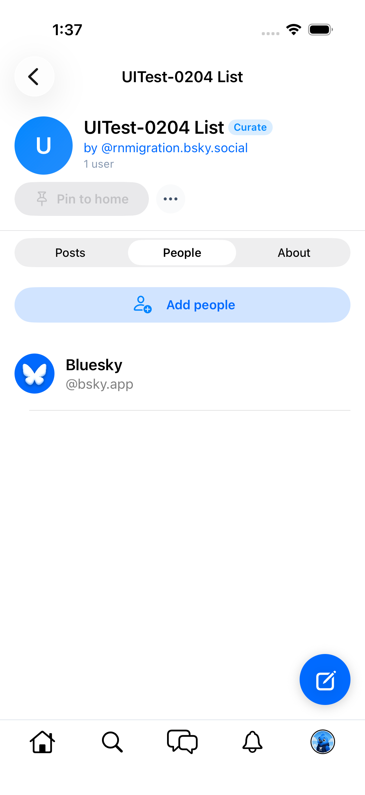
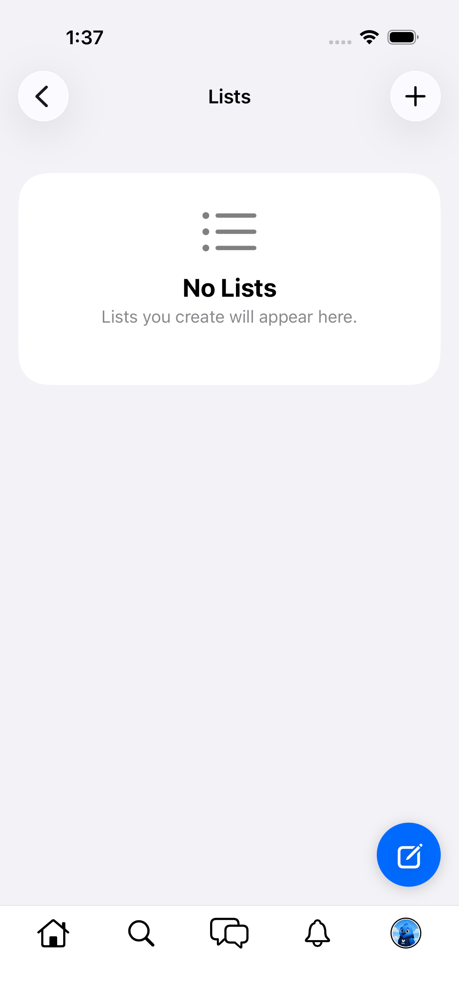

# 0204 — List member management UI missing (add / remove members)

| | |
|---|---|
| **Status** | resolved |
| **Module** | BlueskyLists |
| **Platform** | All |
| **First seen** | 2026-06-10 |
| **Closed** | 2026-06-11 |
| **Commit** | BlueskyKit `3f668ce`, Bluesky-SwiftUI `4484123` |

## Description

There is no UI anywhere to add a profile to a list or remove one. The data layer is complete — `ListsStore.addMember(listURI:subjectDID:repo:)` and `removeMember(itemURI:repo:)` (createRecord/deleteRecord on `app.bsky.graph.listitem`) plus the `ListsViewModel` wrappers exist — but nothing calls them:

- `ListDetailScreen`'s People tab is display-only: it lists members and shows the "No Members" empty state with no add affordance ([screenshot](0066/list-detail-people.png)).
- Profile screens have no "Add to Lists" action in the overflow menu (RN: `ProfileMenu` → "Add to Lists" → `UserAddRemoveLists` dialog with per-list checkboxes).
- Member rows have no swipe-to-remove or edit mode.

This blocks the #0066 / #0038 Module 15 gate check "create a list; **add a member**; open the list feed" — a fresh list can never acquire members, so the list feed can only ever render the "No posts from list members yet" empty state.

## Steps to reproduce

1. Create a list; open it; switch to the People tab — no way to add anyone.
2. Open any profile → overflow menu — no "Add to Lists" item.

## Expected behavior

RN parity: profile overflow menu offers "Add to Lists" (checkbox dialog across the user's lists), and the list's member view supports removal.

## Actual behavior

Members can neither be added nor removed from the UI; `addMember`/`removeMember` are dead code.

## Notes

- `BlueskyKit/Sources/BlueskyLists/ListsStore.swift:157-176`, `ListsViewModel.swift:63`.
- RN reference: `src/components/dialogs/UserAddRemoveLists.tsx`, profile menu `AddToLists` entry.
- Found during the #0066 Module 15 iOS gate.

## Root cause

The data layer was started but never surfaced: `ListsStore.addMember`/`removeMember` (and their `ListsViewModel` wrappers) existed with zero callers, took a raw `repo:` argument with no owner gating, performed no optimistic state updates, and lived on the *hub* store — while the screen that renders members (`ListDetailScreen`) observes `ListDetailStore`, which had no member mutations at all. No view ever offered an add or remove affordance, so a fresh list could never acquire members.

At the RN baseline (`46b8a58`) the list screen's members section (`src/screens/ProfileList/AboutSection.tsx`) gives owners an "Add people" button plus a "Start adding people!" empty-state CTA, both opening `ListAddRemoveUsersDialog` (`src/components/dialogs/lists/`) — a typeahead-searchable people list whose rows toggle Add/Remove based on membership, mutating via `app.bsky.graph.listitem` create/delete in the viewer's repo (`src/state/queries/list-memberships.ts`).

## Fix

Member management implemented on `ListDetailStore` (the store the detail screen observes), mirroring the RN flow and the #0203 optimistic-reconciliation pattern (BlueskyKit `3f668ce`):

- **Store:** `searchMembers(query:)` — debounced (200 ms) `app.bsky.actor.searchActorsTypeahead`, called directly through the list store's `NetworkClient` (no Layer-3→Layer-3 dependency on BlueskySearch). `addMember(_:)` — `createRecord` of an `app.bsky.graph.listitem` (subject DID + list URI) in the viewer's repo, then an optimistic `ListItemView` insert built from the response URI. `removeMember(itemURI:)` — optimistic removal + `deleteRecord` of the listitem rkey, reverted on failure. Both owner-gated (`listitem` records must live in the same repo as the list), so non-owned lists expose no mutation; the header member count tracks both directions. Re-fetch reconciliation mirrors #0203: optimistic adds survive stale `getList` pages and de-dupe (by record URI / subject DID) once the indexed copy arrives; removals are tombstoned so stale pages can't resurrect them.
- **UI:** new `ListAddMemberSheet` (searchable people list, per-row Add/Remove toggle with busy state — RN's `ListAddRemoveUsersDialog`); `ListDetailScreen`'s People tab gets an owner-only "Add people" header button, a "Start adding people!" empty-state CTA, and swipe-to-remove on member rows.
- The dead `ListsStore.addMember`/`removeMember` and `ListsViewModel` wrappers were removed.
- Live gate test `RemainingScreensGateUITests.testListMemberAddRemove0204` (Bluesky-SwiftUI `4484123`) covers the full round-trip, fully reversed and resumable after an interrupted run.

## Verification

- `swift test` in BlueskyKit: **137 tests in 25 suites, all green** (132 pre-existing + 5 new `ListDetailStore member management (#0204)` tests: add builds the right listitem record and inserts optimistically, optimistic adds survive stale re-fetches and de-dupe against the indexed copy, remove deletes the right rkey and tombstones against stale pages, remove reverts on failure, non-owned list exposes no mutation).
- iOS Simulator app build: `xcodebuild -workspace Bluesky.xcworkspace -scheme "Bluesky (Beta)" -destination 'platform=iOS Simulator,id=25FCA843-…'` — **BUILD SUCCEEDED**.
- Live leg on the booted iPhone 17 sim (`rnmigration.bsky.social`, starting from 0 lists / 0 listitems on the PDS): `testListMemberAddRemove0204` **passed in 51 s** as a single clean pass — created "UITest-0204 List", People tab showed the empty-state CTA ([screenshot](0204/people-empty-with-cta.png)), the Add people sheet's typeahead surfaced `bsky.app` ([results](0204/add-sheet-results.png)), Add flipped to Remove on tap ([added](0204/add-sheet-added.png)), the member rendered in the People tab with the owner header affordance and the count at "1 user" ([member](0204/people-with-member.png)), swipe-Remove returned the empty state ([after](0204/people-after-remove.png)), and the list was swipe-deleted from the hub ([cleanup](0204/lists-after-cleanup.png)).
- Cleanup confirmed clean account state: public `com.atproto.repo.listRecords` returns **0 records** for both `app.bsky.graph.list` and `app.bsky.graph.listitem` after the run. (Two earlier runs failed at sheet dismissal after the add had landed; the resumable test cleaned its own leftovers through the UI on the following run, re-verified at 0/0 each time.)

## Files changed

- `BlueskyKit/Sources/BlueskyLists/ListsStore.swift` — member mutations + typeahead search + reconciliation on `ListDetailStore`; dead `ListsStore.addMember`/`removeMember` removed.
- `BlueskyKit/Sources/BlueskyLists/ListAddMemberSheet.swift` — new search-based add/remove sheet.
- `BlueskyKit/Sources/BlueskyLists/ListDetailScreen.swift` — owner "Add people" button, empty-state CTA, swipe-to-remove, sheet presentation.
- `BlueskyKit/Sources/BlueskyLists/ListDetailViewModel.swift` — wrappers (`searchMembers`, `addMember`, `removeMember`, `membershipItemURI(for:)`).
- `BlueskyKit/Sources/BlueskyLists/ListsViewModel.swift` — dead member wrappers removed.
- `BlueskyKit/Tests/BlueskyKitTests/ListMembershipTests.swift` — new suite (5 tests).
- `Bluesky-SwiftUI/Bluesky-SwiftUIUITests/RemainingScreensGateUITests.swift` — live gate test `testListMemberAddRemove0204`.

## Gotchas

- While `.searchable` is active inside a sheet, the collapsed navigation bar hides **all** toolbar items (including a `.confirmationAction` Done) and renders the search-cancel affordance as an X button labeled **"Close"** — `app.buttons["Cancel"]` matches nothing, and `buttons["Done"]` only matches keyboard keys (XCUITest logs "Automation type mismatch … UIAccessibilityElementKBKey"). Tap "Close" to exit search first; only then does the Done toolbar item come back.
- Mutation UI tests against live AppView state should be **resumable**: a failure after the `createRecord` leaves real records behind, and the next run must detect and reverse them through the UI (the test account has no stored credentials for API cleanup). `testListMemberAddRemove0204` skips creation/add when the marker list/member already exist.
- Deleting a list does **not** delete its `listitem` records from the PDS (`com.atproto.repo.listRecords` still returns them) — remove members before deleting the list when a clean end state matters.
- `ProfileBasic` → `ListItemView.subject` requires a `ProfileView`; the optimistic member is built from the typeahead profile with `description`/`indexedAt`/`viewer` nil and is replaced by the server copy on the next indexed re-fetch (matched by record URI or subject DID).

## Attachments

