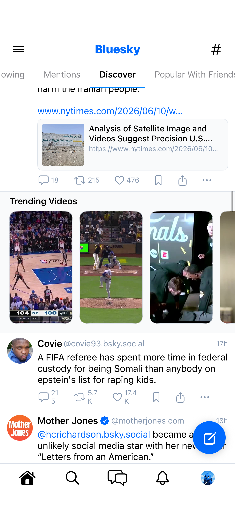
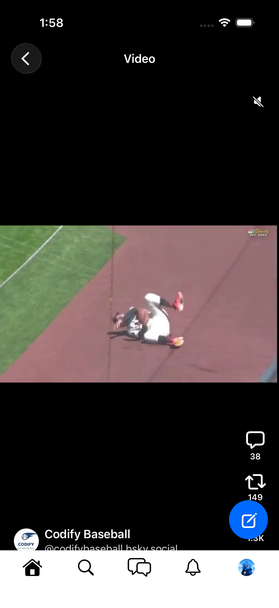
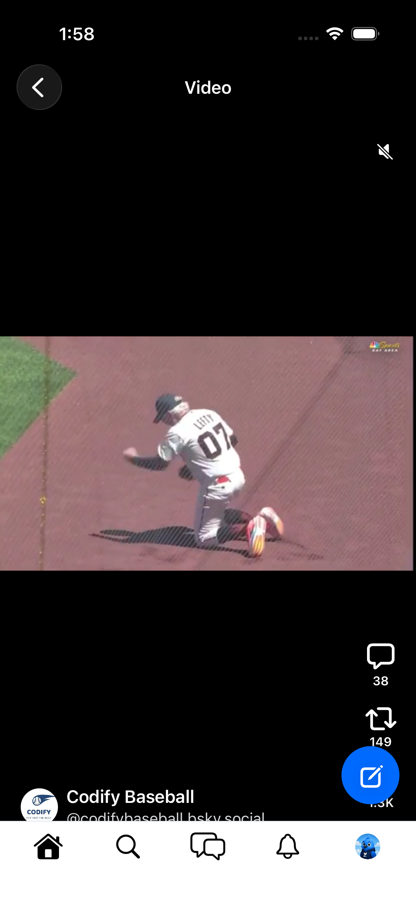

# 0205 — Video Feed screen unreachable: `VideoFeedView` has no entry point

| | |
|---|---|
| **Status** | resolved |
| **Module** | BlueskyFeed / Bluesky-SwiftUI |
| **Platform** | All |
| **First seen** | 2026-06-10 |
| **Closed** | 2026-06-11 |
| **Commit** | BlueskyKit `fbb6fc2` — interstitial, FeedView wiring, VideoFeedView seeding, vm-cache observability |
| **Commit** | Bluesky-SwiftUI `c874f5b` — MainTabView push, openVideoFeed intent, gate UI test |

## Description

`BlueskyFeed/VideoFeedView.swift` (the TikTok-style vertical video feed, including the #0130 interactive overlays) is never mounted. A repo-wide search finds no `VideoFeedView(` constructor call in either `Bluesky-SwiftUI` or any other BlueskyKit module — the screen is dead code, so the Module 15 gate item "Video Feed" cannot be exercised on iOS (#0066) or macOS (#0038).

## Steps to reproduce

1. `grep -rn "VideoFeedView(" Bluesky-SwiftUI/ BlueskyKit/Sources/` → only the definition and its previews.
2. In the running app there is no navigation path that opens a vertical video feed.

## Expected behavior

RN parity: the `VideoFeed` screen opens when a video post's embed is tapped from feeds configured as video feeds (e.g. Explore's "Videos" module / trending videos interstitial), presenting the full-screen vertical pager with auto-play, mute toggle, and swipe-driven pagination.

## Actual behavior

No entry point exists; the screen is unreachable on every platform.

## Root cause

`VideoFeedView` was built (#0130 overlays, #0147/#0195 players) but never mounted: no navigation state, destination, or entry-point UI referenced it in any module or in the app shell, so the Module 15 "Video Feed" gate item was unreachable on every platform.

While wiring the entry a second latent defect surfaced: `FeedViewModelCache` (FeedView's per-tab view-model box, #0049) was a plain reference type. `feedListContainer` reads `vmCache[selection]` during body evaluation and the per-tab `.task` *writes* the slot after creating the view model — without observation that write never invalidated the view, so any freshly selected non-timeline home tab (Discover, Mentions, pinned feeds) sat on its placeholder spinner until an unrelated re-render (up to 30 s via the unread-badge poll) even though the feed had already loaded. That stuck spinner blocked the new entry point from ever being reachable promptly.

## Fix

RN baseline survey (`46b8a58`): the active entry points into the `VideoFeed` route are (a) the **Trending Videos interstitial** pushed into the Discover feed before its 16th slice (`view/com/posts/PostFeed.tsx`, `sliceIndex === 15`, native only; cards are `CompactVideoPostCard`s from the `thevids` feedgen — `components/interstitials/TrendingVideos.tsx`), and (b) **video-mode feed grids** (`PostFeedVideoGridRow` when a feed's URI is in `VIDEO_FEED_URIS` or its content mode is video — FeedPage / ProfileFeed / Profile Videos section). The Explore `ExploreTrendingVideos` module exists in RN but is *not* mounted in the Explore items list at the baseline commit. Each card navigates with `{type:'feedgen', uri: VIDEO_FEED_URI, initialPostUri: post.uri}`.

Implemented entry (a), the active RN-native one:

- **`TrendingVideosInterstitial`** (new, `BlueskyFeed`): "Trending Videos" header + horizontal rail of 9:16 compact video cards (width 108, author avatar top-left, like-count footer omitted to match RN's `showLikeCount = false`) sourced from the `thevids` feed via its own `FeedViewModel` (first 8 video-embed posts), plus the trailing "View more" card. Collapses entirely on error/no-videos like RN.
- **`FeedView`**: renders the interstitial after the 15th post of the **Discover** tab only, gated on the new optional `onTrendingVideoTap` / `onTrendingVideosViewMore` callbacks (parent owns navigation).
- **`VideoFeedView`**: new `public static let videoFeedURI` (`at://did:plc:z72i7hdynmk6r22z27h6tvur/app.bsky.feed.generator/thevids`, RN `VIDEO_FEED_URI`), new `initialPostURI:` init param that seeds the pager at the tapped post (RN `initialPostUri`), `video-feed-screen` accessibility anchor. Still renders via `BlueskyVideoView` (#0195) — no `VideoPlayer`.
- **`MainTabView`**: new `VideoFeedEntry` state + `navigationDestination` on the Home tab pushing `VideoFeedView` (profile/thread taps route into the shared `feedProfileDID`/`threadURI` stack); "View more" routes to the feed's `CustomFeedTimelineView` (the `openCustomFeedURI` destination is now registered on macOS too, previously iOS-only).
- **`UITestNavigator`**: new `openVideoFeed` intent (Home tab + settle + flag), mirrored by `UITestDriverModifier`.
- **`FeedViewModelCache`** is now `@Observable`, fixing the stuck-spinner defect above.

Entry (b) — video-mode rendering of the `thevids` feed page itself as a card grid — is not ported; opening the feed (e.g. via "View more") shows the regular `CustomFeedTimelineView` list. Follow-up candidate if grid parity is wanted.

## Verification

- `swift build` + `swift test` in BlueskyKit: **137 tests green** (no new unit tests — wiring + view-only changes carry no new testable logic).
- App builds for iOS Simulator (default signing) and compiles for macOS.
- Live on the booted iPhone 17 sim (`25FCA843`):
  - `openVideoFeed` driver intent → Video Feed pushes from Home, plays a real `thevids` HLS video (frames advance between captures), mute toggle / comments / reposts overlay and author row render (`video-feed-intent.png`, `video-feed-intent-2.png`).
  - New gate UI test `RemainingScreensGateUITests.testVideoFeedFromTrendingVideosInterstitial0205` (read-only) **passed**: Discover tab → scroll to the Trending Videos rail (`trending-videos-interstitial.png`) → tap a card → `video-feed-screen` mounts seeded at the tapped post and plays (`video-feed-from-card.png`). No likes/reposts performed.

## Files changed

- `BlueskyKit/Sources/BlueskyFeed/TrendingVideosInterstitial.swift` (new)
- `BlueskyKit/Sources/BlueskyFeed/FeedView.swift`
- `BlueskyKit/Sources/BlueskyFeed/VideoFeedView.swift`
- `Bluesky-SwiftUI/Bluesky-SwiftUI/MainTabView.swift`
- `Bluesky-SwiftUI/Bluesky-SwiftUI/UITestNavigator.swift`
- `Bluesky-SwiftUI/Bluesky-SwiftUIUITests/RemainingScreensGateUITests.swift`

## Gotchas

- RN's interstitial has a dismiss (X) button backed by a `trendingVideoDisabled` setting; that setting tree isn't ported, so the SwiftUI section has no dismiss control yet.
- The iOS custom tab bar + compose FAB remain visible over the pushed video feed (consistent with every pushed screen in this shell, e.g. ThreadView); RN hides its bottom bar on `VideoFeed`. Cosmetic parity gap, not a navigation defect.
- TEST_RUNNER_-prefixed env vars do not reach the UI-test runner for this scheme (test plan in use) — pass `BLUESKY_TEST_HANDLE=… BLUESKY_TEST_PASSWORD=…` as xcodebuild build settings; the `Screenshots.xctestplan` expands them.

## Attachments

## Notes

- RN reference: `src/screens/VideoFeed/` and the `VideoFeed` route wiring in `src/Navigation.tsx` (opened via `navigation.navigate('VideoFeed', …)` from video embeds/feeds).
- #0130 (overlays) and #0147/#0195 (players) built the internals; this issue is only about wiring the screen into navigation.
- Found during the #0066 Module 15 iOS gate; the gate's Video Feed check fails until this is wired and validated live.
