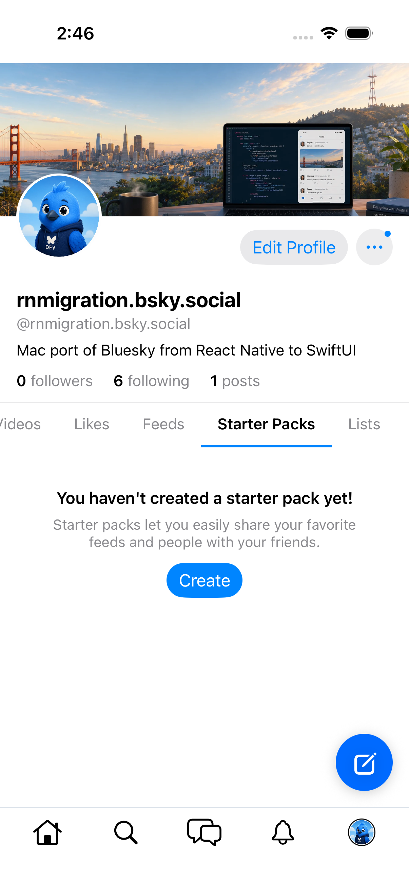
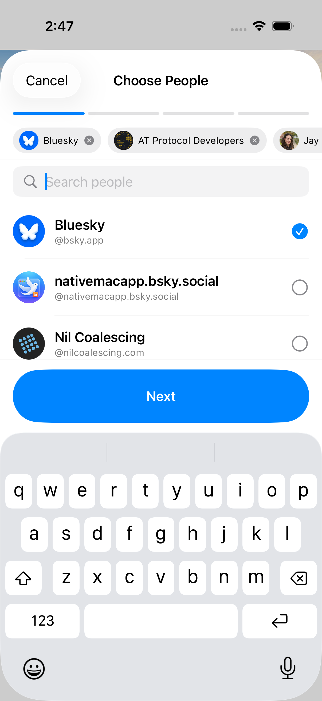
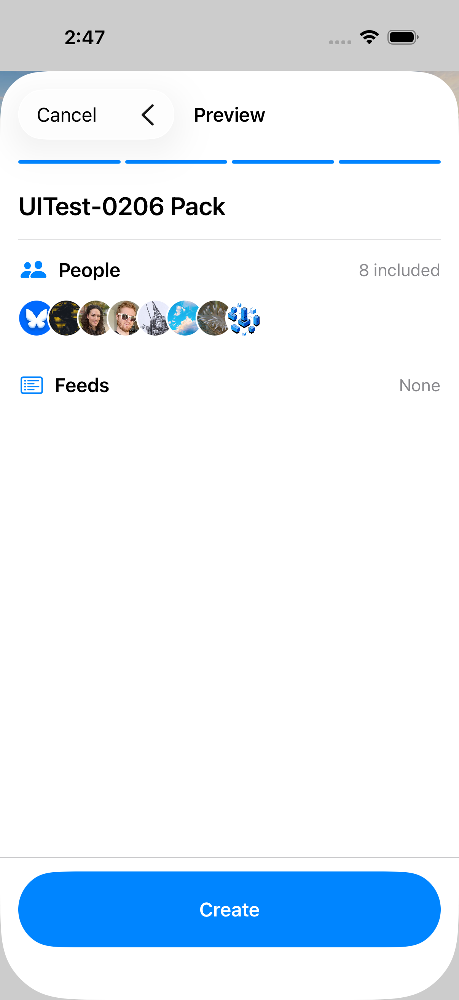
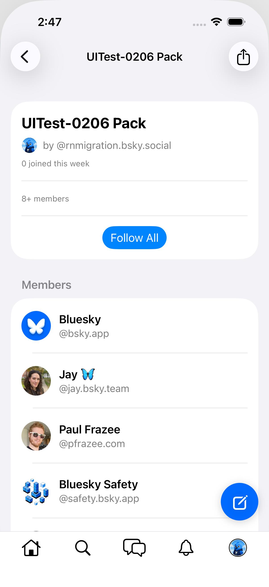
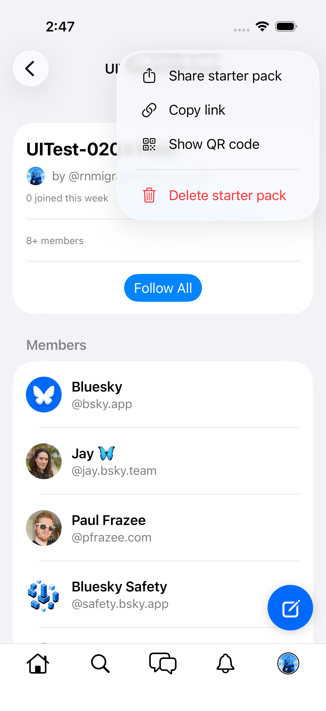
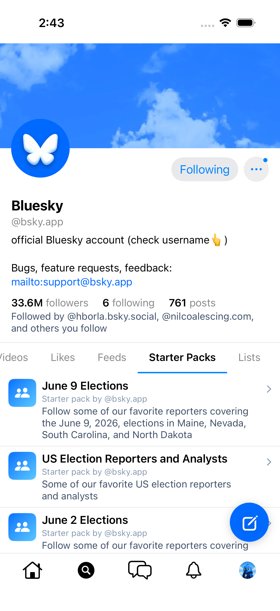
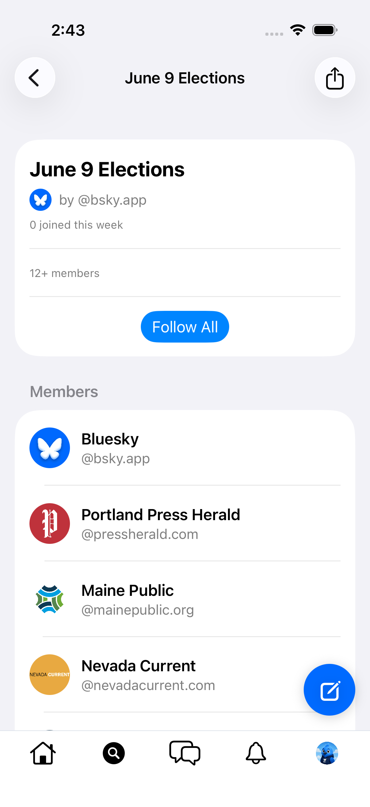

# 0206 — Starter packs unreachable: no browse/create entry; screen only mounts from a notification

| | |
|---|---|
| **Status** | resolved |
| **Module** | BlueskyLists / BlueskyProfile / Bluesky-SwiftUI |
| **Platform** | All |
| **First seen** | 2026-06-10 |
| **Closed** | 2026-06-11 |
| **Commit** | BlueskyKit `ec4022f`, Bluesky-SwiftUI `644d258` |

## Description

The starter-pack surfaces built for #0128/#0129 are orphaned:

- `StarterPackScreen` is mounted in exactly one place: `MainTabView.swift:1019`, the `navigationDestination` for a `starterpack-joined` **notification**. An account with no such notification (e.g. the gate account) has no way to ever open a starter pack.
- `StarterPackCreateSheet` (and the #0128 multi-step wizard behind it) has **no callers** — starter packs cannot be created from the UI at all.
- Profile screens have no "Starter Packs" tab (`grep StarterPack Sources/BlueskyProfile` → no matches), so neither your own packs nor another user's are browsable.

This blocks the Module 15 gate item "Starter Packs — open a starter pack; view members; Follow All" on both #0066 (iOS) and #0038 (macOS).

## Steps to reproduce

1. Sign in with an account that has no `starterpack-joined` notification.
2. Try to find any navigation path to a starter pack or its creation flow — none exists (profile tabs, drawer, lists hub, search).

## Expected behavior

RN parity: profiles with starter packs show a "Starter Packs" tab; your own profile offers creation (`StarterPackWizard`); starter-pack links/embeds open `StarterPackScreen`.

## Actual behavior

`StarterPackScreen` is reachable only via one notification type; the create sheet/wizard is dead code; profile tabs omit starter packs.

## Notes

- RN reference: `src/screens/StarterPack/` (`StarterPackScreen`, `Wizard/`), profile tab wiring in `src/view/screens/Profile.tsx` (`ProfileStarterPacks`).
- Mutation-policy note for whoever validates after wiring: do **not** tap "Follow All" against a live account during gates — it mass-creates follow records; validate rendering and assert the button exists instead.
- Found during the #0066 Module 15 iOS gate.

## Root cause

The starter-pack surfaces shipped for #0128/#0129 were built bottom-up and never attached to navigation. `StarterPackScreen`'s only mount was the `starterpack-joined` notification destination; `StarterPackCreateSheet` had zero callers; `ProfileScreen` had no Starter Packs tab (and the data layer had nothing to feed one — `GetActorStarterPacksResponse` even decoded the wrong shape: the lexicon's `starterPackViewBasic` keeps `name`/`description` inside the raw `record` field, while the Swift model expected a full `starterPackView`, so an actor-listing fetch would have produced nameless rows). `ProfileDetailed` also lacked `associated`, the field RN uses to gate the tab.

## Fix

RN entry points at baseline `46b8a58` and what was ported:

- **Profile → Starter Packs tab** (`Profile.tsx`: `showStarterPacksTab = isMe || starterPackCount > 0`, tab ordered between Feeds and Lists) — **ported**. `ProfileDetailed.associated` (`profileAssociated`) gates the tab; `ProfileStore.loadStarterPacks` fetches `app.bsky.graph.getActorStarterPacks` (always re-fetches with an in-flight guard so creates/deletes surface on re-entry or pull-to-refresh); new `StarterPackCard` in BlueskyUI mirrors RN's card (gradient icon, `record.name`, "Starter pack by you/@handle", description, "N users have joined!" at ≥ 50). Row taps and creation hand callbacks up to the app target (`onStarterPackTap` / `onCreateStarterPack`) — BlueskyProfile cannot import BlueskyLists (Layer-3 cycle), same pattern as the Notifications tab.
- **Creation from the own profile tab** (`ProfileStarterPacks.tsx`: empty-state "Create" + list-footer "Create another" → `StarterPackWizard`) — **ported**, opening the existing #0128 wizard from the Profile tab; on success the app pushes the created pack's `StarterPackScreen` (RN: `navigation.replace('StarterPack', …)`), with the URI parked until the sheet finishes dismissing.
- **Owner Delete** (`StarterPackScreen.tsx` overflow → "Delete" with the "Delete starter pack? / Are you sure…" prompt; `useDeleteStarterPackMutation` deletes the pack record + backing list) — **ported**, plus a `com.atproto.repo.listRecords` sweep of the backing list's `listitem` rows (RN orphans those on the PDS — the #0204 gotcha) so a delete leaves the repo clean.
- **Pushed profiles** on the Home / Search / Saved / Notifications stacks got the same tab + row navigation, so other users' packs are browsable (read-only).

Deliberately **not** ported (recorded for follow-up): the "Make one for me" auto-generated pack flow (requires email-verification gating + the suggestions dialog), the wizard **Edit** mode and "Create list from members" menu entries, `bsky.app/starter-pack|start/...` **deep links** (the app's `handleDeepLink` only routes tab-level paths today, #0052 territory), onboarding-time starter-pack joins, and starter-pack **post embeds**.

## Verification

- `swift build` + `swift test` in BlueskyKit: **142 tests in 27 suites green** (137 pre-existing + 5 new `StarterPackTests`: basic-view decoding lifts `record.name`/`description`, recordless fallback, `associated` decoding, delete sweeps exactly the backing list's listitems then list then pack, creator-only delete gating).
- iOS Simulator app build (`Bluesky (Beta)`, iPhone 17 sim `25FCA843`): **BUILD SUCCEEDED**.
- Live leg on the booted iPhone 17 sim (`rnmigration.bsky.social`, starting from 0 starterpack/list/listitem records):
  - `testStarterPackPublicReadOnly0206` **passed (23 s)** — Search → `bsky.app` → its Starter Packs tab renders 11 RN-style cards ([tab](0206/public-bskyapp-tab.png)), "June 9 Elections" opens read-only with Follow All present and **never tapped** ([screen](0206/public-pack-readonly.png)); the non-owner menu has no Delete entry.
  - `testStarterPacksProfileTabCreateOpenDelete0206` **passed (65 s)** — own profile shows the tab with RN's empty-state copy + Create ([empty](0206/starter-packs-tab-empty.png)); the wizard created "UITest-0206 Pack" (8 stable handles via typeahead, feeds skipped — [people](0206/wizard-people-selected.png), [preview](0206/wizard-preview.png)); the created pack opened in `StarterPackScreen` with creator/members/Follow All ([created](0206/created-pack-screen.png), Follow All asserted but not tapped per the #0066 policy); owner Delete ([menu](0206/owner-delete-menu.png)) → confirm popped back and the tab emptied after refresh ([after](0206/tab-after-delete.png)).
- **End state confirmed clean**: public `com.atproto.repo.listRecords` returns **0 records** for `app.bsky.graph.starterpack`, `app.bsky.graph.list`, **and** `app.bsky.graph.listitem` (the in-app delete swept all 8 listitem rows too).
- No macOS GUI launches; no macOS xcodebuild test (per scope). The package builds the macOS slice via `swift build`.

## Files changed

- `BlueskyKit/Sources/BlueskyCore/Profile.swift` — `ProfileAssociated` + `ProfileDetailed.associated`.
- `BlueskyKit/Sources/BlueskyCore/StarterPack.swift` — `StarterPackBasic` decodes the real basic-view shape; `GetActorStarterPacksResponse` uses it.
- `BlueskyKit/Sources/BlueskyCore/Repo.swift` — generic `ListRecordsResponse`/`ListedRecord` for `com.atproto.repo.listRecords`.
- `BlueskyKit/Sources/BlueskyCore/Graph.swift` — `ListItemRecordValue` (decodable listitem).
- `BlueskyKit/Sources/BlueskyUI/StarterPackCard.swift` — new card component.
- `BlueskyKit/Sources/BlueskyProfile/ProfileStore.swift` / `ProfileViewModel.swift` / `ProfileScreen.swift` — `starterPacks` tab, store/VM plumbing, gated tab strip, tab content + callbacks; `associated` carried through the optimistic-profile helpers.
- `BlueskyKit/Sources/BlueskyLists/ListsStore.swift` / `ListsViewModel.swift` — create returns the pack URI; `deleteStarterPack`.
- `BlueskyKit/Sources/BlueskyLists/StarterPackCreateSheet.swift` — `onCreated` callback.
- `BlueskyKit/Sources/BlueskyLists/StarterPackScreen.swift` / `StarterPackViewModel.swift` — owner Delete menu entry + confirmation + dismiss; `starter-pack-menu` test id.
- `BlueskyKit/Tests/BlueskyKitTests/StarterPackTests.swift` — new suite (5 tests).
- `Bluesky-SwiftUI/Bluesky-SwiftUI/MainTabView.swift` — `starterPackURI` destinations, profile-mount callbacks, create-sheet presentation with parked push.
- `Bluesky-SwiftUI/Bluesky-SwiftUIUITests/RemainingScreensGateUITests.swift` — the two #0206 gate tests + tab-strip helpers.

## Gotchas

- The profile tab strip is a `LazyHStack` inside a horizontal `ScrollView`: offscreen tabs aren't in the accessibility tree, and `isHittable` **throws** ("activation point invalid") for realized-but-unlaid-out elements — gate on frame containment and swipe the strip by coordinate instead.
- The wizard's people list is equally lazy (≈7 cells exist on an iPhone), so a "tap the first 8 rows" approach can't work; the gate test selects 8 stable handles through the typeahead instead. `dholms.xyz` no longer resolves in `searchActorsTypeahead` — handle lists in tests need a live pre-check.
- `getStarterPack`/`getActorStarterPacks` are AppView queries and can lag a fresh `createRecord`; the post-create push usually wins the race (record + list were written seconds earlier) but the gate test carries a dismiss-refresh-reopen fallback. The delete sweep instead reads `com.atproto.repo.listRecords` (PDS truth, no lag).
- Deleting a list does not delete its `listitem` rows (#0204) — RN's starter-pack delete leaves them orphaned; `deleteStarterPack` sweeps them deliberately.

## Attachments

